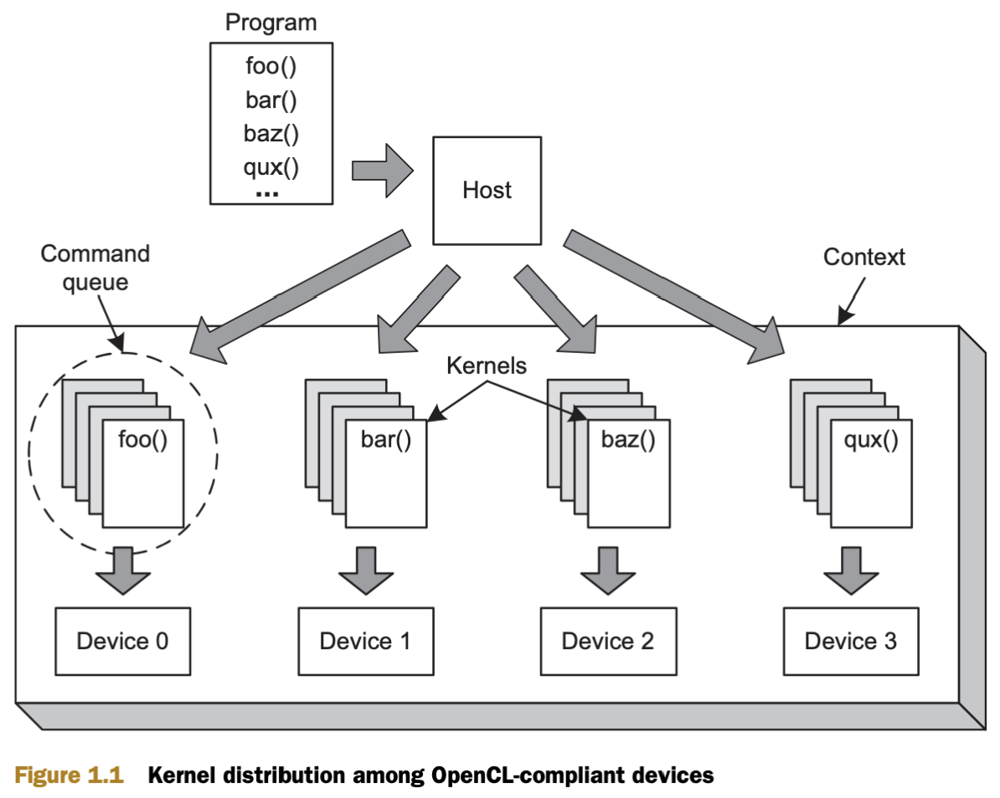

[]()

# Introducing OpenCL

- Abbreviation of Open computing language

- Parallel programming assigns computational tasks to multiple processing elements to be performed at the same time.

    - Parallel programming assigns computational **tasks** to multiple processing elements to be performed at the same time.

    - These **tasks** are called **kernels**. A **kernel** is a specially coded function that’s intended to be executed by one or more OpenCL-compliant devices.

    - **Kernels** are sent to their intended device or devices by **host applications**. A **host application** is a regular **C/C++ application** running on the user’s development system.

    - **Hosts applications** manage their **connected devices** using a **container** called a **context**.

    - To create a **kernel**, the **host** selects a function from a **kernel container** called a **program**. Then it **associates** the **kernel** with **argument data** and dispatches it to a structure called a **command queue**. The **command queue** is the mechanism through which the host **tells devices what to do**, and when a **kernel** is **enqueued**, the device will execute the corresponding function.

    - An OpenCL application can configure different **devices** to perform different **tasks**, and each **task** can operate on **different data**. In other words, OpenCL provides **full task-parallelism**. This is an important advantage over many other **parallel-programming** toolsets, which only enable **data-parallelism**. In a data-parallel system, each device receives the same instructions but operates on different sets of data.

- Strange data structure:

    - platforms
    - contexts
    - devices
    - programs
    - kernels
    - command queues

[]()

OpenCL (Open Computing Language) is a framework for writing programs that execute across heterogeneous platforms, which can include CPUs, GPUs, DSPs, and other processors. To manage and execute these programs, OpenCL provides a set of data structures. Here is a detailed explanation of each of these data structures:

### 1. Platforms

**Description:**
A platform represents a host plus a collection of devices managed by the OpenCL runtime. Typically, a platform corresponds to a specific vendor's implementation of OpenCL.

**Use:**
To get the list of available platforms, you use `clGetPlatformIDs`.

**Example:**
```c
cl_uint numPlatforms;
cl_platform_id *platforms;

// Get the number of platforms
clGetPlatformIDs(0, NULL, &numPlatforms);

// Allocate memory for platforms
platforms = (cl_platform_id*) malloc(numPlatforms * sizeof(cl_platform_id));

// Get the platform IDs
clGetPlatformIDs(numPlatforms, platforms, NULL);
```

### 2. Devices

**Description:**
Devices are the individual compute units available within a platform, such as CPUs, GPUs, and other accelerators.

**Use:**
To get the list of devices for a platform, you use `clGetDeviceIDs`.

**Example:**
```c
cl_uint numDevices;
cl_device_id *devices;

// Get the number of devices for a given platform
clGetDeviceIDs(platforms[0], CL_DEVICE_TYPE_ALL, 0, NULL, &numDevices);

// Allocate memory for devices
devices = (cl_device_id*) malloc(numDevices * sizeof(cl_device_id));

// Get the device IDs
clGetDeviceIDs(platforms[0], CL_DEVICE_TYPE_ALL, numDevices, devices, NULL);
```

### 3. Contexts

**Description:**
A context is an environment within which OpenCL objects such as command-queues, memory objects, program objects, and kernel objects are created and managed.

**Use:**
To create a context, you use `clCreateContext` or `clCreateContextFromType`.

**Example:**
```c
cl_context context;
cl_int err;

// Create a context for all devices in the platform
context = clCreateContext(NULL, numDevices, devices, NULL, NULL, &err);
```

### 4. Programs

**Description:**
A program is a container for one or more kernels. Programs can be created from source code or binaries, and they must be built before they can be executed.

**Use:**
To create and build a program, you use `clCreateProgramWithSource` and `clBuildProgram`.

**Example:**
```c
const char *source = "__kernel void hello() { }";
cl_program program;
cl_int err;

// Create a program from source
program = clCreateProgramWithSource(context, 1, &source, NULL, &err);

// Build the program
err = clBuildProgram(program, numDevices, devices, NULL, NULL, NULL);
```

### 5. Kernels

**Description:**
A kernel is a function declared in a program and executed on an OpenCL device. Each kernel can be executed over a range of work items, which are organized into work groups.

**Use:**
To create a kernel, you use `clCreateKernel`.

**Example:**
```c
cl_kernel kernel;
cl_int err;

// Create a kernel from a program
kernel = clCreateKernel(program, "hello", &err);
```

### 6. Command Queues

**Description:**
A command queue is used to schedule commands to a specific device. Commands include tasks like kernel execution, memory copy operations, and synchronization.

**Use:**
To create a command queue, you use `clCreateCommandQueueWithProperties`.

**Example:**
```c
cl_command_queue commandQueue;
cl_int err;

// Create a command queue for a specific device
commandQueue = clCreateCommandQueueWithProperties(context, devices[0], 0, &err);
```

### Example Workflow

Here's how these data structures might typically be used together in a simple OpenCL program:

1. **Initialize OpenCL:**
   - Get platform and device IDs.
   - Create a context.

2. **Build Program:**
   - Create a program object with source code.
   - Build the program.

3. **Create Kernel:**
   - Create a kernel object from the program.

4. **Setup Command Queue:**
   - Create a command queue.

5. **Execute Kernel:**
   - Set kernel arguments.
   - Enqueue kernel for execution in the command queue.
   - Wait for the execution to finish.

6. **Cleanup:**
   - Release all OpenCL objects.

This framework allows for efficient parallel execution on heterogeneous computing platforms, making it a powerful tool for high-performance computing applications.