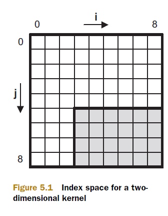
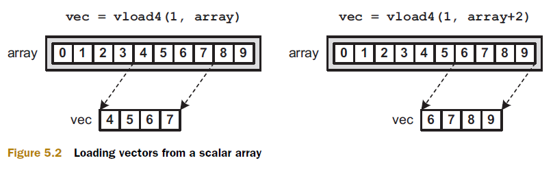
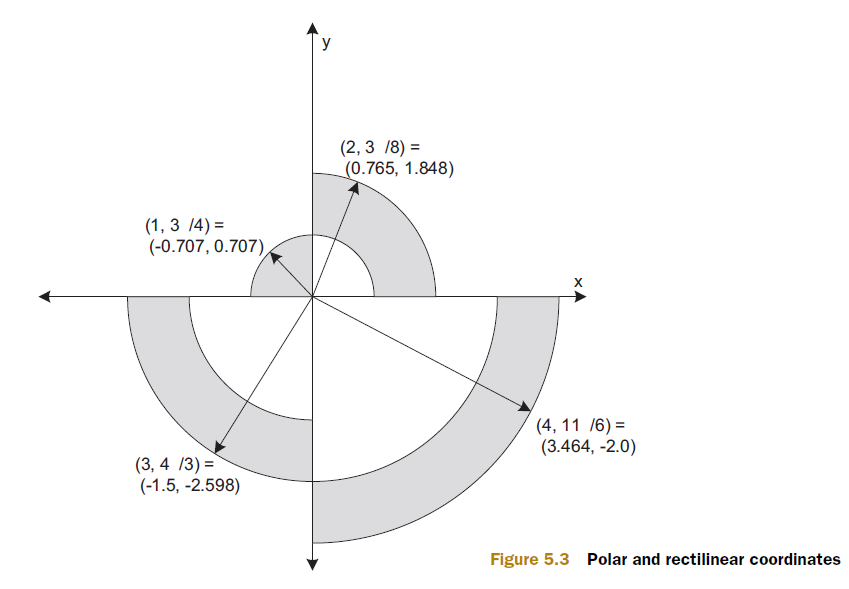
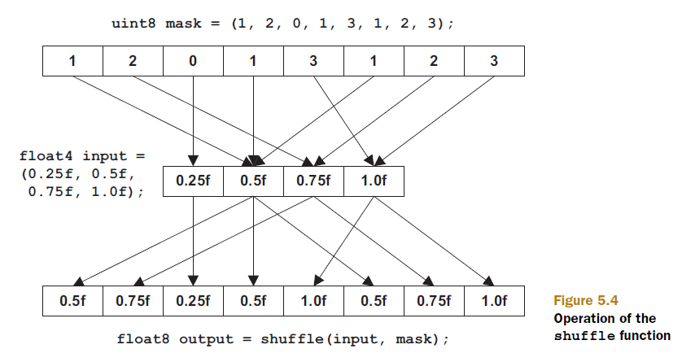
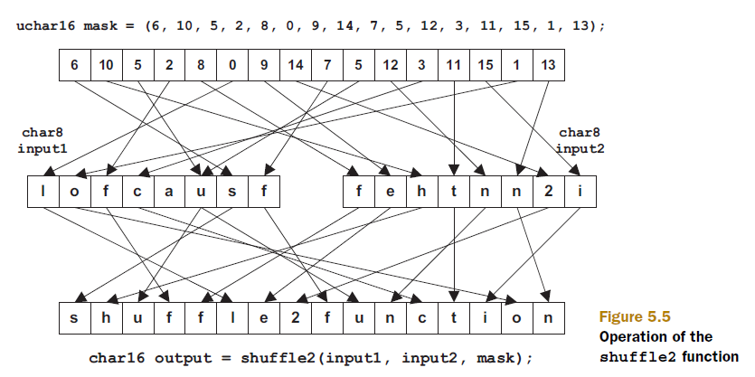
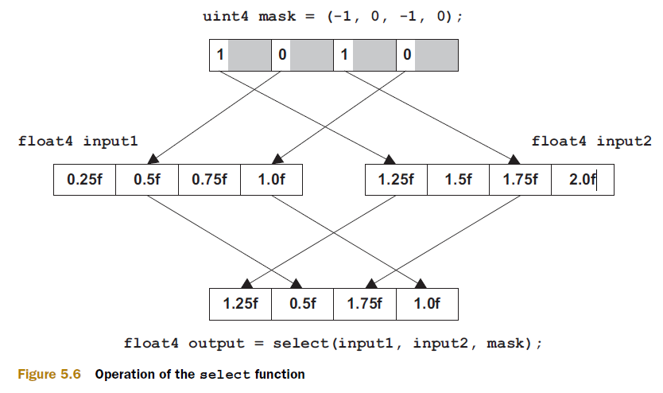
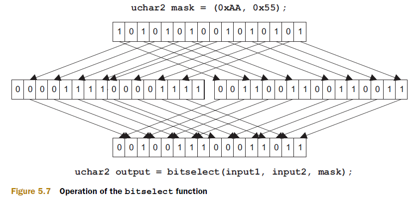

# Chapter 5: Kernel programming: operators and functions

This passage provides an overview of OpenCL vector types, operators, and functions, emphasizing their significance in improving application performance. Here's a breakdown of the key points:

- Vectors in OpenCL

    - **Vectors** allow operations on multiple values simultaneously, enhancing performance.

    - Understanding the **operators and functions** available for vectors is crucial for practical application.

- Operators and Functions

    - OpenCL operators and functions often follow conventions set by `math.h` (e.g., `sqrt` for square root, `pow` for exponentiation).

    - OpenCL introduces new functions like `mad_sat` and `mad_hi` for efficient and accurate mathematical operations.

- Categories of Built-in Functions

    1. **Work-item and work-group functions**: Identify data dimensionality, work-group participation, and obtain IDs.

    2. **Data transfer functions**: Load and store data between memory regions.
    3. **Floating-point functions**: Perform arithmetic, rounding, component comparison, exponential, logarithmic, trigonometric, and miscellaneous operations.
    4. **Integer functions**: Handle arithmetic and comparison of integer vectors.
    5. **Shuffle and select functions**: Create vectors from bits or components of other vectors.
    6. **Vector test/comparison functions**: Test and compare vector components.
    7. **Geometric functions**: Calculate dot products, cross products, lengths, and normalization.

- Function Implementations

    - Functions often have multiple implementations for different argument types (e.g., `min` and `max` can take a float vector or a single float).

    - Many functions accept pointers to specific address spaces (e.g., `vloadn` for global, local, and private memory but not constant memory).

- Conventions for Function Usage

    - **type/n**: Argument can be a scalar type or a vector type of size n (e.g., 2, 3, 4, 8, 16).

    - **__(g|c|l|p)**: Pointer can reference memory in global (g), constant (c), local (l), or private (p) address spaces.

    - **all**: Argument can be any scalar or vector type.

    - **integer**: Argument can be any integer type (e.g., `uchar`, `char`, `ushort`, `short`, `uint`, `int`, `ulong`, `long`).

    - **uinteger**: Argument can be any unsigned integer type (e.g., `uchar`, `ushort`, `uint`, `int`, `ulong`).

- Operators in OpenCL

    - Similar to traditional C operators but applicable to vectors as well as scalars.

    - This chapter focuses on explaining these operators and functions, providing example code to illustrate their use.

## 5.1 Operators

This passage elaborates on the use of operators in OpenCL, highlighting their convenience and functionality for vector operations. Here are the key points:

1. OpenCL Operators

    - OpenCL allows basic vector operations using regular C operators, making it more straightforward compared to other technologies like SSE (`_mm_addps`) or AltiVec (`vec_add`).

    - Example: Adding two `float4` vectors `a` and `b` in OpenCL can be done with `a + b`.

2. Table of OpenCL Operators

    |Category|Operator|Purpose|
    |:---:|:----:|---|
    |**Arithmetic Operators**|`+`|Addition|
    ||`-`|Subtraction|
    ||`*`|Multiplication|
    ||`/`|Division (quotient)|
    ||`%`|Division (modulus)|
    ||`++`|Increment|
    ||`--`|Decrement|
    |**Relational Operators**|`==`|Equal to|
    ||`!=`|Not equal to|
    ||`>` |Greater than|
    ||`>=`|Greater than or equal to|
    ||`<` |Less than|
    ||`<=`|Less than or equal t|
    |**Logical Operators**|`&&`|Logical AND|
    ||`\|\|`|Logical OR|
    ||`!`|Logical NOT|
    |**Bitwise Operators**|`&` |Bitwise AND|
    ||`\|` |Bitwise OR|
    ||`^` |Bitwise XOR|
    ||`~` |Bitwise NOT|
    ||`>>`|Right-shift|
    ||`<<`|Left-shift|
    |**Ternary Operator**|`?` `:`|Ternary selection|

3. Rules for Operators

    - If operands have the same type, the result will have the same type.

    - Operations involving a vector with integers and a vector with floating-point values result in a floating-point vector.

    - Bitwise operators cannot be used on floating-point values or vectors containing them.

    - Operations can often be performed on a vector and a scalar.

    - Example: Adding 5 to every component in a `short8` vector: 
        ```c
        short8 s = (short8)(1, 2, 3, 4, 5, 6, 7, 8);
        s = s + 5;  // or s += 5;
        ```

4. Relational Operators and Vectors

    - For scalars, relational operators return 1 if the condition is true and 0 if false.

    - For vectors, the operation tests all components, with results for each component:

    - True is represented by all 1s (e.g., `0xFF`, `0xFFFF`, `0xFFFFFFFF`), which is -1 in two's complement.

    - False is represented by 0.

    - Example:
        ```c
        vec.s01 = vec.s23 < 7;
        ```
        - Tests the third and fourth components of `vec`. If `vec.s2` is less than 7, `vec.s0` is set to `0xFFFFFFFF` (-1). If not, `vec.s1` is set to 0.

5. Using Relational Operators in Control Statements

    - Vector relational operations cannot be directly used in `if` and `while` statements.

    - Example (invalid):

        ```c
        if (x > 2) // x is a vector, this will produce a compiler error.
        ```

    - Instead, use:

        ```c
        while (x.s0 > 2 && x.s1 > 2 && x.s2 > 2 && x.s3 > 2)
        ```

    - Alternatively, use the `all` or `any` functions:

        ```c
        while (all(x > 2))
        ```

6. Functions `all` and `any`

    - `all`: Returns 1 if all components' most significant bits (MSBs) are 1.

    - `any`: Returns 1 if any component's MSB is 1.

    - These functions help test all components of a vector.

## 5.2 Work-item and work-group functions

This passage introduces work-item and work-group functions in OpenCL, essential for data partitioning and execution within kernels. Here are the key points:

- **Data Partitioning**: 

    - Defined by the host application using `clEnqueueNDRangeKernel`.

    - Specifies the number of dimensions, the number of work-items per dimension, and the number of work-items in a work-group per dimension.

- **Accessing Data**: 

    - Work-items need to access data specific to them, requiring knowledge of their unique IDs.

    - IDs are needed both among all executing work-items and within their respective work-groups.

- **Key Functions**: 

    - Functions providing work-item and work-group IDs are often among the first invoked in kernel functions.

### 5.2.1 Dimensions and work-items

This section discusses dimensions and work-items in OpenCL, focusing on how work-items identify their specific tasks within the overall kernel execution.


1. Dimensions and Work-items

- **Number of Dimensions**:

    - Corresponds to the number of indices used to access elements in an array.

    - Example:

        - For `point[x][y]`, the number of dimensions is two.

        - For `point[x][y][z]`, the number of dimensions is three.

- **Work-item**:

    - A single instance of a kernel execution.

    - Identified by a unique global ID, which is an array of unsigned integers (one per dimension).

- **Key Functions for Work-items**:

    - `get_work_dim()`: Returns the number of dimensions in the kernel's index space.

    - `get_global_size(uint dim)`: Returns the number of work-items for a given dimension.

    - `get_global_id(uint dim)`: Returns the work-item's global ID for a given dimension.

    - `get_global_offset(uint dim)`: Returns the initial offset used to compute global IDs.

2. Example and Explanation

- Processing a portion of data in a 9x9 image without OpenCL might use a nested loop:

    ```c
    for (i = 3; i < 9; i++) {
        for (j = 5; j < 9; j++) {
            process(data(i, j));
        }
    }
    ```

    <p align="center">
    
    </p>

- In OpenCL, the loop iterations correspond to work-items, and the loop indices correspond to the work-item's global ID.

    - A work-item can obtain its global ID using `get_global_id(0)` and `get_global_id(1)`.

    - It can determine the number of work-items per dimension using `get_global_size(0)` and `get_global_size(1)`.

    - The initial index pair of the loop (3, 5) corresponds to the global offset in OpenCL.

    - A work-item can access its global offset using `get_global_offset(0)` and `get_global_offset(1)`.

3. Functions Related to Work-items (Table 5.2)

    | Function                    | Purpose                                                     |
    |-----------------------------|-------------------------------------------------------------|
    | `uint get_work_dim()`       | Returns the number of dimensions in the kernel’s index space|
    | `size_t get_global_size(uint dim)` | Returns the number of work-items for a given dimension  |
    | `size_t get_global_id(uint dim)`   | Returns the element of the work-item’s global ID for a given dimension |
    | `size_t get_global_offset(uint dim)` | Returns the initial offset used to compute global IDs |


### 5.2.2 Work-groups

This section provides an overview of work-groups in OpenCL, focusing on their role in synchronization and the functions used to manage them.

1. Work-groups in OpenCL

- **Synchronization**: 

    - Work-groups are crucial when work-items need to synchronize their execution.

    - Chapter 7 will detail OpenCL's synchronization mechanisms.

- **Functions Related to Work-groups (Table 5.3)**:

    - These functions provide local information about work-groups, contrasting with the global information provided by functions related to work-items (from Table 5.2).

2. Table 5.3: Functions Related to Work-groups

    | Function                            | Purpose                                                                      |
    |-------------------------------------|------------------------------------------------------------------------------|
    | `size_t get_num_groups(uint dim)`    | Returns the number of work-groups for a given dimension                      |
    | `size_t get_group_id(uint dim)`      | Returns the ID of the work-item’s work-group for a given dimension            |
    | `size_t get_local_id(uint dim)`      | Returns the ID of the work-item within its work-group for a given dimension   |
    | `size_t get_local_size(uint dim)`    | Returns the number of work-items in the work-group for a given dimension      |

- **Difference Between Global and Local Functions**:

    - `get_global_id`: Identifies a work-item among all work-items executing the kernel.

    - `get_local_id`: Identifies a work-item only among work-items in the same work-group.

    - Work-items in different work-groups can have the same local ID but will never have the same global ID.

- **Additional Information**:

    - `get_global_size`: Indicates how many work-items are executing the same kernel.

    - `get_local_size`: Indicates how many work-items are in the same work-group as the calling work-item.

### 5.2.3 An example application

1. Kernel Code: `id_check.cl`

    ```c
    __kernel void id_check(__global float *output) {
        size_t global_id_0 = get_global_id(0);
        size_t global_id_1 = get_global_id(1);
        size_t global_size_0 = get_global_size(0);
        size_t offset_0 = get_global_offset(0);
        size_t offset_1 = get_global_offset(1);
        size_t local_id_0 = get_local_id(0);
        size_t local_id_1 = get_local_id(1);
        
        int index_0 = global_id_0 - offset_0;
        int index_1 = global_id_1 - offset_1;
        int index = index_1 * global_size_0 + index_0;
        
        float f = global_id_0 * 10.0f + global_id_1 * 1.0f;
        f += local_id_0 * 0.1f + local_id_1 * 0.01f;
        
        output[index] = f;
    }
    ```

2. Host Application (`id_check.c`)

- Configures processing using `clEnqueueNDRangeKernel`:

    ```c
    size_t dim = 2;
    size_t global_offset[] = {3, 5};
    size_t global_size[] = {6, 4};
    size_t local_size[] = {3, 2};

    err = clEnqueueNDRangeKernel(queue, kernel, dim, global_offset,
                                global_size, local_size, 0, NULL, NULL);
    ```

3. Output Explanation

- Each work-item's identification data is printed as a float:

    - The two digits before the decimal point correspond to the global ID.

    - The two digits after the decimal point correspond to the local ID.

4. Sample Output

    On my system, the output results are as follows:

    ```
    35.00 45.10 55.20 65.00 75.10 85.20
    36.01 46.11 56.21 66.01 76.11 86.21
    37.00 47.10 57.20 67.00 77.10 87.20
    38.01 48.11 58.21 68.01 78.11 88.21
    ```

5. Summary

    This example clarifies how `clEnqueueNDRangeKernel` configures local and global IDs for work-items. It demonstrates the relationship between global IDs (used to access data in the index space) and local IDs (used within work-groups). Experimenting with such examples helps in understanding these complex concepts better.

## 5.3 Data transfer operations

1. Overview

    In OpenCL, efficiently transferring data between different memory regions is crucial for optimizing kernel performance. This section discusses various methods for transferring data, including loading vectors from scalar arrays and storing vectors to scalar arrays.

2. Types of Data Transfer

    - **Transferring Data of the Same Type**: 

        - Involves moving data between memory regions where the data type remains consistent.

        - Example: Loading a `float4` from one memory region into another `float4` region.

    - **Loading Vectors from Scalar Arrays**: 

        - When data is stored in scalar arrays but needs to be loaded into vector types (like `float4`).

        - Requires appropriate handling to ensure correct alignment and extraction of vector elements from scalar arrays.

    - **Storing Vectors to Scalar Arrays**: 

        - Involves the reverse operation of storing vector data back into scalar arrays.

        - Ensures that vector components are correctly placed into corresponding elements of the scalar array.

3. Code Considerations

    - **Code Complexity**: 

        - The complexity of data transfer operations varies based on the types involved (scalar vs. vector) and the alignment requirements.

    - **Optimization**: 

        - Efficient data transfer contributes significantly to overall kernel performance.

        - Proper use of OpenCL functions for data transfer ensures alignment and type consistency across memory regions.

4. Importance of Data Transfer

    - **Memory Management**: 

        - Efficient data transfer minimizes memory access times and enhances overall computational efficiency.

        - Understanding and implementing appropriate data transfer methods are essential for achieving optimal kernel execution.

5. Conclusion

    Mastering data transfer operations in OpenCL involves understanding how to handle different data types and efficiently manage memory access. These operations are critical for optimizing performance and ensuring correct execution of computational tasks within kernels.

### 5.3.1 Loading and storing data of the same type

1. Overview

    When transferring data of the same type in OpenCL, such as loading `int4` from `int4`, the assignment operator (`=`) plays a crucial role. This section explains how data can be transferred between different memory regions using the assignment operator, enhancing understanding with practical code examples.

2. Example Kernel Code: `test.cl`

    ```c
    __kernel void test(__global int4 *in_data, __global int4 *out_data) {
        __local int4 local_data;
        int id = get_local_id(0);
        
        // Load data from global memory to local memory
        local_data = in_data[id];
        
        // Process data in local memory (omitted for brevity)
        
        // Store processed data back to global memory
        out_data[id] = local_data;
    }
    ```

3. Explanation

- **Data Transfer using `=`**: 
  
    - The assignment operator not only assigns values to variables but also transfers data between different memory regions.
  
    - In the example, `local_data = in_data[id];` transfers the `int4` data from `in_data` array in global memory to `local_data` in local memory for each work-item.
  
    - Similarly, `out_data[id] = local_data;` transfers the processed `local_data` back to `out_data` in global memory.

- **Flexibility with Data Types**:
  
    - The example supports `int4` types, but the concept applies equally to other data types (e.g., `int`, `float4`, etc.).

- **Memory Management**:

    - Changing from local memory (`__local`) to private memory (`__private`) involves simply removing the `__local` specifier. Variables without specifiers default to `__private` memory, managed by the compiler.

4. Importance of Assignment Operator

- **Efficiency**: 
  
    - Efficient data transfer is crucial for optimizing kernel performance.
  
    - Proper use of the assignment operator ensures seamless movement of data between different memory spaces (global, local, private).

5. Conclusion

    Understanding how to transfer data of the same type using the assignment operator (`=`) in OpenCL is fundamental for effective kernel development. This knowledge enables efficient management of memory resources and contributes to achieving optimal computational performance.

### 5.3.2 Loading vectors from a scalar array

1. Overview

    When processing data with vector operations in OpenCL, there are scenarios where the input data is provided as a scalar array. Direct assignment (`=`) won't suffice in such cases, and casting data between different address spaces isn't feasible. OpenCL offers `vloadn` to efficiently load scalar data into vectors, enabling seamless integration of scalar data into vector operations.

2. `vloadn` Function Signature

    ```c
    vector vloadn(size_t offset, const __(g|c|l|p) scalar *mem)
    ```

- **Parameters**:

    - `offset`: Specifies the offset in terms of vector size (not scalar size) to determine which elements of the array are loaded into the vector.

    - `scalar *mem`: Pointer to the scalar array from which data is loaded.

    - `n`: Number of components in the returned vector (`2`, `3`, `4`, `8`, or `16`).

    - `vector`: Any vector type (`float4`, `int8`, etc.).

    - `scalar`: Data type of the scalar components inside the vector.

    - Memory containing `vector` and `scalar` can reside in different address spaces (`global`, `constant`, `local`, `private`).

3. Example Usage

```c
float4 float_vec;
float float_array[8] = { 1.0f, 2.0f, 3.0f, 4.0f, 5.0f, 6.0f, 7.0f, 8.0f };

// Load the first four floats from float_array into float_vec
float_vec = vload4(0, float_array);
```

- **Explanation**:

    - `vload4(0, float_array)`: Loads the first four floats (`float_array[0]` to `float_array[3]`) into `float_vec`.

    - The offset (`0` in this case) specifies the starting index in the scalar array from where elements are loaded into the vector.

    <p align="center">
    
    </p>

4. Handling Unaligned Data

- **Pointer Operations**:

    - `vloadn` allows loading unaligned data from scalar arrays into vectors using pointer operations.

    - Note that unaligned data transfers may incur memory access delays, impacting performance in some cases.

5. Conclusion

    Understanding and effectively using `vloadn` in OpenCL is essential for efficiently processing scalar data with vector operations. By leveraging `vloadn`, developers can seamlessly integrate scalar data into vector computations, optimizing performance and enhancing the capabilities of OpenCL kernels.

### 5.3.3 Storing vectors to a scalar array

1. Overview

    In OpenCL programming, when you need to store vector data back into a scalar array after processing, you can utilize the `vstoren` function. Similar to `vloadn`, which loads scalar data into vectors, `vstoren` facilitates storing vector data back into a scalar array. This functionality is crucial for efficiently managing and manipulating data across different memory regions within OpenCL kernels.

2. `vstoren` Function Signature

    ```c
    void vstoren(vector vec, size_t offset, __(g|l|p) scalar *mem)
    ```

- **Parameters**:

    - `vec`: The vector containing data to be stored.

    - `offset`: Specifies the offset in terms of vector size (not scalar size) where the vector data should be stored in the scalar array.

    - `scalar *mem`: Pointer to the scalar array where data from `vec` will be stored.

    - `n`: Number of components in the `vec` vector (`2`, `3`, `4`, `8`, or `16`).

    - `vector`: Any vector type (`float4`, `int8`, etc.).

    - `scalar`: Data type of the scalar components inside the vector.

    - Memory containing `mem` can reside in `global`, `local`, or `private` address spaces.

3. Example Usage

    ```c
    int4 int_vec = (int4)(1, 2, 3, 4);
    int int_array[8] = { 0 };

    // Store the int4 vector int_vec at the start of int_array
    vstore4(int_vec, 0, int_array);
    ```

- **Explanation**:

    - `vstore4(int_vec, 0, int_array)`: Stores the components of `int_vec` into the scalar array `int_array`.

    - The offset (`0` in this case) specifies the starting index in the scalar array where the vector elements will be stored.

4. Handling Unaligned Data

- **Pointer Operations**:

    - `vstoren` allows storing vector data at unaligned offsets within the scalar array using pointer arithmetic.

    - This flexibility enables efficient management of vector data across different memory regions.

5. Limitations

- **Constant Address Space**:

    - Unlike `vloadn`, the scalar array in `vstoren` cannot reside in the constant address space.

6. Conclusion

    Mastering `vstoren` is essential for efficiently managing vector data in OpenCL kernels, particularly when you need to store processed vector data back into scalar arrays. By understanding and effectively using `vstoren`, developers can optimize memory access and manipulation operations, enhancing the performance and versatility of their OpenCL applications.

## 5.4 Floating-point functions

If you need to process real-world quantities like temperature or pressure values, you’re probably going to model your data using floating-point values. Section 5.1 presented the basic operators available for floating-point processing, but now we’re going to look at functions. This section divides OpenCL’s floating-point functions into five categories: arithmetic and rounding, comparison, exponential and logarithmic, trigonometric, and miscellaneous.

### 5.4.1 Arithmetic and rounding functions

1. Overview

    OpenCL provides a variety of arithmetic and rounding functions for manipulating floating-point values. These functions are essential for performing basic arithmetic operations, handling remainders, and rounding numbers to different precision levels. Understanding their behavior and usage is crucial for developing efficient and accurate OpenCL kernels.

2. Table of Arithmetic and Rounding Functions

    | Function               | Purpose                                                                                              |
    |------------------------|------------------------------------------------------------------------------------------------------|
    | `floatn fabs(floatn x)` | Returns the absolute value of `x`, i.e., `|x|`.                                                       |
    | `floatn fma(floatn a, floatn b, floatn c)` | Computes `a * b + c` with precision.                                                               |
    | `floatn fmod(floatn x, floatn y)` | Returns the floating-point modulus of `x` and `y`: `x - (y * trunc(x/y))`.                             |
    | `floatn mad(floatn a, floatn b, floatn c)` | Computes `a * b + c`, intended for speed over accuracy.                                              |
    | `floatn remainder(floatn x, floatn y)` | Returns the remainder of `x` and `y`: `x - n * y`, where `n` is the integer closest to `x/y`.         |
    | `floatn remquo(floatn x, floatn y, __(g\|l\|p) *quo)` | Returns the remainder of `x` and `y`, and places the quotient in `quo`.                              |
    | `floatn rint(floatn x)` | Returns the closest integer to `x`. If two integers are equally close, returns the even integer.      |
    | `floatn round(floatn x)` | Returns the integer closest to `x`. If two integers are equally close, returns the integer further from zero. |
    | `floatn ceil(floatn x)` | Returns the smallest integer value greater than or equal to `x`.                                       |
    | `floatn floor(floatn x)` | Returns the largest integer value less than or equal to `x`.                                            |
    | `floatn trunc(floatn x)` | Returns `x` rounded to the nearest integer towards zero.                                               |

3. Explanation and Usage

- **Absolute Value (`fabs`)**: Computes the absolute value of a floating-point number.

- **Fused Multiply-Add (`fma`)**: Calculates `a * b + c` with precision, useful for performance-critical operations.

- **Modulus (`fmod`)**: Computes the floating-point remainder of `x/y`.

- **Multiply-Add (`mad`)**: Similar to `fma`, but optimized for speed over accuracy.

- **Remainder (`remainder`)**: Computes the remainder of `x/y`, where the result has the same sign as `x`.

- **Rounding (`rint`, `round`, `ceil`, `floor`, `trunc`)**: Functions to round floating-point numbers:

    - `rint` rounds to the nearest even integer.

    - `round` rounds to the nearest integer, with ties rounding away from zero.

    - `ceil` rounds up to the nearest integer.

    - `floor` rounds down to the nearest integer.

    - `trunc` removes the fractional part of the number.

4. Example Usage

    ```c
    __kernel void mod_round(__global float *mod_input,
                            __global float *mod_output,
                            __global float4 *round_input,
                            __global float4 *round_output) {
        mod_output[0] = fmod(mod_input[0], mod_input[1]);
        mod_output[1] = remainder(mod_input[0], mod_input[1]);
        
        round_output[0] = rint(*round_input);
        round_output[1] = round(*round_input);
        round_output[2] = ceil(*round_input);
        round_output[3] = floor(*round_input);
        round_output[4] = trunc(*round_input);
    }
    ```

    In the above example kernel (`mod_round.cl`), `fmod` and `remainder` are used to compute the modulus and remainder of `mod_input`, while `rint`, `round`, `ceil`, `floor`, and `trunc` demonstrate different rounding behaviors on `round_input`.

5. Conclusion

    Mastering arithmetic and rounding functions in OpenCL is essential for manipulating floating-point data accurately and efficiently. These functions provide precise control over mathematical operations and numerical representation, enabling developers to implement sophisticated algorithms in their OpenCL kernels with confidence. Understanding their nuances helps optimize performance and ensure correct computation in diverse computational tasks.

### 5.4.2 Comparison functions

1. Overview

    OpenCL provides a set of comparison functions that allow developers to compare components of floating-point vectors and perform operations based on these comparisons. These functions are crucial for conditional logic and data manipulation within OpenCL kernels. Here’s an overview and explanation of each comparison function listed in Table 5.5.

2. Table of Comparison Functions

    | Function                | Purpose                                                                                           |
    |-------------------------|---------------------------------------------------------------------------------------------------|
    | `floatn clamp(floatn x, float/n min, float/n max)` | Returns `min` if `x < min`; returns `max` if `x > max`; otherwise returns `x`.                   |
    | `floatn fdim(floatn x, floatn y)` | Returns `x - y` if `x > y`; returns `0` if `x <= y`.                                              |
    | `floatn fmax(floatn x, float/n y)` | Returns `x` if `x >= y`; returns `y` if `y > x`.                                                   |
    | `floatn fmin(floatn x, float/n y)` | Returns `x` if `x <= y`; returns `y` if `y < x`.                                                   |
    | `floatn max(floatn x, float/n y)` | Returns `x` if `x >= y`; returns `y` if `y > x`.                                                   |
    | `floatn min(floatn x, float/n y)` | Returns `x` if `x <= y`; returns `y` if `y < x`.                                                   |
    | `floatn mix(floatn x, floatn y, float/n a)` | Interpolates between `x` and `y` using the equation `x + (y – x) * a`, where `0.0 < a < 1.0`.    |
    | `floatn maxmag(floatn x, floatn y)` | Returns `x` if `|x| >= |y|`; returns `y` if `|y| > |x|`.                                           |
    | `floatn minmag(floatn x, floatn y)` | Returns `x` if `|x| <= |y|`; returns `y` if `|y| < |x|`.                                           |
    | `floatn step(float/n edge, floatn x)` | Returns `0.0` if `x < edge`; returns `1.0` if `x >= edge`.                                         |
    | `floatn smoothstep(float/n edge1, float/n edge2, floatn x)` | Returns `0.0` if `x <= edge1`; returns `1.0` if `x >= edge2`; uses smooth interpolation between `edge1` and `edge2` if `edge1 < x < edge2`. |

3. Explanation and Usage

- **Clamp (`clamp`)**: Restricts the value `x` to lie within the range `[min, max]`. If `x` is outside this range, it is clamped to the nearest boundary (`min` or `max`).

- **Floating-Point Difference (`fdim`)**: Computes `x - y` if `x > y`, otherwise returns `0.0`. Useful for computing positive differences.

- **Maximum (`fmax`, `max`)**: Returns the maximum of `x` and `y`.

- **Minimum (`fmin`, `min`)**: Returns the minimum of `x` and `y`.

- **Mix (`mix`)**: Linearly interpolates between `x` and `y` based on the scalar `a`.

- **Maximum Magnitude (`maxmag`)**: Returns the vector with the larger magnitude.

- **Minimum Magnitude (`minmag`)**: Returns the vector with the smaller magnitude.

- **Step (`step`)**: Returns `0.0` if `x` is less than `edge`, and `1.0` otherwise. Useful for creating step functions.

- **Smoothstep (`smoothstep`)**: Performs smooth interpolation between `0.0` and `1.0` based on whether `x` lies between `edge1` and `edge2`.

4. Example Usage

    ```c
    __kernel void comparison_example(__global float4 *input,
                                    __global float4 *output,
                                    float min_threshold,
                                    float max_threshold) {
        float4 x = input[0];
        float4 y = input[1];
        
        // Clamp x within the range [min_threshold, max_threshold]
        output[0] = clamp(x, min_threshold, max_threshold);
        
        // Compute the difference between x and y where x > y
        output[1] = fdim(x, y);
        
        // Compute the maximum of x and y
        output[2] = fmax(x, y);
        
        // Compute the minimum of x and y
        output[3] = fmin(x, y);
        
        // Interpolate between x and y using mix
        output[4] = mix(x, y, 0.5);
        
        // Compute the step function based on a threshold
        output[5] = step(min_threshold, x);
        
        // Compute smoothstep interpolation between two thresholds
        output[6] = smoothstep(min_threshold, max_threshold, x);
    }
    ```

    In the example kernel (`comparison_example`), various comparison functions (`clamp`, `fdim`, `fmax`, `fmin`, `mix`, `step`, `smoothstep`) are used to manipulate `float4` vectors based on scalar thresholds (`min_threshold` and `max_threshold`).

5. Conclusion

    Comparison functions in OpenCL provide powerful tools for conditional logic and data manipulation. Understanding their behavior and appropriate usage allows developers to implement precise control over data processing within kernels. These functions are essential for tasks such as range limiting, interpolation, and thresholding, enabling efficient computation of complex algorithms in parallel computing environments.

### 5.4.3 Exponential and logarithmic functions

1. Overview

    OpenCL provides a comprehensive set of exponential and logarithmic functions for manipulating floating-point vectors. These functions are essential for computations involving exponents, logarithms, roots, and related mathematical operations. Here’s an overview and explanation of each function listed in Table 5.6.

2. Table of Exponential and Logarithmic Functions

    | Function                   | Purpose                                                                                     |
    |----------------------------|---------------------------------------------------------------------------------------------|
    | `floatn pow(floatn x, floatn y)` | Returns `x` raised to the power `y`, i.e., \( x^y \).                                        |
    | `floatn pown(floatn x, intn y)` | Returns `x` raised to the power `y`, where `y` is an integer.                                 |
    | `floatn powr(floatn x, floatn y)` | Returns `x` raised to the power `y`, where `x >= 0`.                                          |
    | `floatn exp(floatn x)`      | Returns \( e^x \), where \( e \) is Euler's number (~2.71828).                                |
    | `floatn expm1(floatn x)`    | Returns \( e^x - 1 \).                                                                       |
    | `floatn exp2(floatn x)`     | Returns \( 2^x \).                                                                           |
    | `floatn exp10(floatn x)`    | Returns \( 10^x \).                                                                          |
    | `floatn ldexp(floatn x, intn n)` | Returns `x` multiplied by \( 2^n \).                                                         |
    | `floatn rootn(floatn x, floatn y)` | Returns the nth root of `x`, i.e., \( x^{1/y} \).                                             |
    | `floatn sqrt(floatn x)`     | Returns the square root of `x`, i.e., \( \sqrt{x} \).                                         |
    | `floatn cbrt(floatn x)`     | Returns the cube root of `x`, i.e., \( \sqrt[3]{x} \).                                        |
    | `floatn rsqrt(floatn x)`    | Returns the inverse square root of `x`, i.e., \( 1 / \sqrt{x} \).                             |
    | `floatn log(floatn x)`      | Returns the natural logarithm of `x`, i.e., \( \ln{x} \).                                     |
    | `floatn log1p(floatn x)`    | Returns \( \ln(1.0 + x) \).                                                                  |
    | `floatn log2(floatn x)`     | Returns the base-2 logarithm of `x`, i.e., \( \log_2{x} \).                                   |
    | `floatn log10(floatn x)`    | Returns the base-10 logarithm of `x`, i.e., \( \log_{10}{x} \).                               |
    | `floatn logb(floatn x)`     | Returns the integral part of the base-2 logarithm of `x`, i.e., \( \lfloor \log_2{x} \rfloor \). |
    | `floatn erf(floatn x)`      | Returns the error function of `x`.                                                            |
    | `floatn erfc(floatn x)`     | Returns the complementary error function of `x`, i.e., \( 1 - \mathrm{erf}(x) \).              |
    | `floatn tgamma(floatn x)`   | Returns the gamma function of `x`, i.e., \( \Gamma(x) \).                                     |
    | `floatn lgamma(floatn x)`   | Returns the natural logarithm of the absolute value of the gamma function of `x`, i.e., \( \ln(|\Gamma(x)|) \). |
    | `floatn lgamma_r(floatn x, __(g\|l\|p) intn *mem)` | Returns the natural logarithm of the absolute value of the gamma function of `x` and places the sign in `mem`. |

3. Explanation and Usage

- **Power (`pow`, `pown`, `powr`)**: Computes various forms of exponentiation, allowing for both scalar and vector operations.

- **Exponential (`exp`, `expm1`, `exp2`, `exp10`)**: Calculates exponential values, including base \( e \), base 2, and base 10 exponents.

- **Multiplicative (`ldexp`)**: Multiplies `x` by \( 2^n \), useful for scaling floating-point values by powers of two.

- **Roots (`rootn`, `sqrt`, `cbrt`)**: Computes roots of floating-point values, including square roots and cube roots.

- **Reciprocal Square Root (`rsqrt`)**: Computes the inverse square root of `x`, often used in normalization operations.

- **Logarithmic (`log`, `log1p`, `log2`, `log10`, `logb`)**: Computes various logarithmic values, including natural logarithms, base-2 and base-10 logarithms, and the integral part of the base-2 logarithm.

- **Special Functions (`erf`, `erfc`, `tgamma`, `lgamma`, `lgamma_r`)**: Computes special mathematical functions such as error functions, gamma functions, and their logarithmic equivalents.

4. Example Usage

    ```c
    __kernel void exp_log_example(__global float4 *input,
                                  __global float4 *output) {
        float4 x = input[0];
        
        // Compute powers
        output[0] = pow(x, 2.0); // x^2
        output[1] = exp(x);      // e^x
        output[2] = log(x);      // ln(x)
        output[3] = sqrt(x);     // sqrt(x)
        output[4] = erf(x);      // error function of x
    }
    ```

    In the example kernel (`exp_log_example`), various exponential and logarithmic functions (`pow`, `exp`, `log`, `sqrt`, `erf`) are used to manipulate `float4` vectors.

5. Conclusion

    Exponential and logarithmic functions in OpenCL provide powerful tools for mathematical computations involving floating-point values. These functions enable complex calculations such as exponentiation, logarithms, root calculations, and specialized mathematical functions. Understanding their behavior and appropriate usage is crucial for developing efficient and accurate algorithms in parallel computing environments like OpenCL.

### 5.4.4 Trigonometric functions

1. Overview

    OpenCL provides a comprehensive set of trigonometric functions for performing calculations involving angles and polar coordinates. These functions include standard trigonometric, hyperbolic, inverse trigonometric, and functions that multiply by \( \pi \). Here’s an overview and explanation of each function listed in Table 5.7.

2. Table of Trigonometric Functions

    | Function                       | Purpose                                                                                     |
    |--------------------------------|---------------------------------------------------------------------------------------------|
    | `floatn sin(floatn x)`         | Returns the sine of `x`.                                                                     |
    | `floatn cos(floatn x)`         | Returns the cosine of `x`.                                                                   |
    | `floatn tan(floatn x)`         | Returns the tangent of `x`.                                                                  |
    | `floatn sinpi(floatn x)`       | Returns the sine of \( \pi \times x \).                                                       |
    | `floatn cospi(floatn x)`       | Returns the cosine of \( \pi \times x \).                                                     |
    | `floatn tanpi(floatn x)`       | Returns the tangent of \( \pi \times x \).                                                    |
    | `floatn asin(floatn x)`        | Returns the arcsine (inverse sine) of `x`.                                                    |
    | `floatn acos(floatn x)`        | Returns the arccosine (inverse cosine) of `x`.                                               |
    | `floatn atan(floatn x)`        | Returns the arctangent (inverse tangent) of `x`.                                             |
    | `floatn asinpi(floatn x)`      | Returns the arcsine (inverse sine) of \( \pi \times x \).                                     |
    | `floatn acospi(floatn x)`      | Returns the arccosine (inverse cosine) of \( \pi \times x \).                                 |
    | `floatn atanpi(floatn x)`      | Returns the arctangent (inverse tangent) of \( \pi \times x \).                               |
    | `floatn sinh(floatn x)`        | Returns the hyperbolic sine of `x`.                                                           |
    | `floatn cosh(floatn x)`        | Returns the hyperbolic cosine of `x`.                                                         |
    | `floatn tanh(floatn x)`        | Returns the hyperbolic tangent of `x`.                                                        |
    | `floatn asinh(floatn x)`       | Returns the hyperbolic arcsine (inverse hyperbolic sine) of `x`.                              |
    | `floatn acosh(floatn x)`       | Returns the hyperbolic arccosine (inverse hyperbolic cosine) of `x`.                          |
    | `floatn atanh(floatn x)`       | Returns the hyperbolic arctangent (inverse hyperbolic tangent) of `x`.                        |
    | `floatn sincos(floatn x, __global floatn *mem)` | Computes both the sine and cosine of `x`, storing the cosine in the memory referenced by `mem`. |
    | `floatn atan2(floatn y, floatn x)` | Returns the arctangent of `y/x`, taking into account the signs of both arguments to determine the quadrant of the result. |
    | `floatn atan2pi(floatn y, floatn x)` | Returns the arctangent of `y/x`, scaled by \( \pi \), taking into account the signs of both arguments. |

3. Explanation and Usage

- **Standard Trigonometric (`sin`, `cos`, `tan`)**: Computes sine, cosine, and tangent of `x`.

- **Trigonometric with \( \pi \) (`sinpi`, `cospi`, `tanpi`)**: Computes sine, cosine, and tangent of \( \pi \times x \).

- **Inverse Trigonometric (`asin`, `acos`, `atan`)**: Computes arcsine, arccosine, and arctangent of `x`.

- **Inverse Trigonometric with \( \pi \) (`asinpi`, `acospi`, `atanpi`)**: Computes arcsine, arccosine, and arctangent of \( \pi \times x \).

- **Hyperbolic Trigonometric (`sinh`, `cosh`, `tanh`)**: Computes hyperbolic sine, cosine, and tangent of `x`.

- **Inverse Hyperbolic Trigonometric (`asinh`, `acosh`, `atanh`)**: Computes hyperbolic arcsine, arccosine, and arctangent of `x`.

- **Sine and Cosine (`sincos`)**: Computes both sine and cosine of `x`, storing cosine in the memory referenced by `mem`.

- **Arctangent (`atan2`, `atan2pi`)**: Computes the arctangent of `y/x`, handling quadrant determination and scaling by \( \pi \).

    <p align="center">
    
    </p>

4. Example Usage

    ```c
    __kernel void trigonometric_example(__global float4 *angles,
                                        __global float4 *sines,
                                        __global float4 *cosines) {
        float4 angle = angles[0];
        
        // Compute sine and cosine
        sincos(angle, &cosines[0]);
        sines[0] = sin(angle);
    }
    ```

    In the example kernel (`trigonometric_example`), various trigonometric functions (`sincos`, `sin`) are used to compute sine and cosine values for `float4` vectors representing angles.

6. Floating-point Constants in OpenCL

    OpenCL provides a set of predefined floating-point constants that are useful for a wide range of mathematical and computational operations. These constants include well-known mathematical values such as \( e \), \( \pi \), and logarithmic bases, as well as special values like infinity and NaN. Here’s an overview of these constants as listed in Table 5.8.

7. Table of Floating-point Constants

    | Constant        | Value            | Description                                            |
    |-----------------|------------------|--------------------------------------------------------|
    | `M_E_F`         | Value of \( e \) | The base of the natural logarithm, approximately 2.718 |
    | `M_LOG2E_F`     | `log2(e)`        | The logarithm base 2 of \( e \)                        |
    | `M_LOG10E_F`    | `log10(e)`       | The logarithm base 10 of \( e \)                       |
    | `M_LN2_F`       | `ln(2)`          | The natural logarithm of 2                             |
    | `M_LN10_F`      | `ln(10)`         | The natural logarithm of 10                            |
    | `M_PI_F`        | Value of \( \pi \)| The ratio of the circumference of a circle to its diameter, approximately 3.14159 |
    | `M_PI_2_F`      | `\pi / 2`        | Half of \( \pi \)                                      |
    | `M_PI_4_F`      | `\pi / 4`        | A quarter of \( \pi \)                                 |
    | `M_1_PI_F`      | `1 / \pi`        | The reciprocal of \( \pi \)                            |
    | `M_2_PI_F`      | `2 / \pi`        | Twice the reciprocal of \( \pi \)                      |
    | `M_2_SQRTPI_F`  | `2 / sqrt(\pi)`  | Two divided by the square root of \( \pi \)            |
    | `M_SQRT2_F`     | `sqrt(2)`        | The square root of 2                                   |
    | `M_SQRT1_2_F`   | `1 / sqrt(2)`    | The reciprocal of the square root of 2                 |
    | `MAXFLOAT`      | Maximum float value | The largest representable floating-point number       |
    | `HUGE_VALF`     | Positive floating-point infinity | Represents positive infinity in floating-point operations |
    | `INFINITY`      | Unsigned infinity | Represents unsigned infinity                           |
    | `NAN`           | Not-a-Number value | Represents an undefined or unrepresentable value      |

8. Explanation and Usage

- **Mathematical Constants**: These constants represent fundamental mathematical values:

    - `M_E_F`: The base of natural logarithms.

    - `M_PI_F`: The value of \( \pi \), crucial for trigonometric calculations.

    - `M_LN2_F` and `M_LN10_F`: The natural logarithms of 2 and 10, respectively.

    - `M_SQRT2_F`: The square root of 2, useful in geometry and algebra.

- **Logarithmic Bases**: Constants like `M_LOG2E_F` and `M_LOG10E_F` are helpful for converting between different logarithmic bases.

- **Pi-related Constants**: Values like `M_PI_2_F` and `M_PI_4_F` are fractions of \( \pi \), often used in trigonometric calculations.

- **Special Values**: Constants like `MAXFLOAT`, `HUGE_VALF`, `INFINITY`, and `NAN` handle special floating-point scenarios:

    - `MAXFLOAT`: Represents the largest finite floating-point number.

    - `HUGE_VALF` and `INFINITY`: Represent positive infinity.

    - `NAN`: Represents a Not-a-Number value for undefined operations.

9. Example Usage

    Here's an example kernel demonstrating the use of some of these constants in OpenCL:

    ```c
    __kernel void use_constants(__global float *output) {
        int id = get_global_id(0);
        
        if (id == 0) {
            output[0] = M_E_F;       // Base of natural logarithms
            output[1] = M_PI_F;      // Value of pi
            output[2] = M_SQRT2_F;   // Square root of 2
            output[3] = MAXFLOAT;    // Maximum representable float value
            output[4] = INFINITY;    // Positive infinity
            output[5] = NAN;         // Not-a-Number value
        }
    }
    ```

    In this kernel (`use_constants`), various floating-point constants are assigned to the `output` array. This example shows how these constants can be used directly in computations within an OpenCL kernel.

### 5.4.5 Miscellaneous floating-point functions

Table 5.9 presents the last set of floating-point functions we'll examine in this section. These can't be grouped into a simple category, so I'll refer to them as miscellaneous functions.

A number of these functions provide information about the float components in the input vector. An example will make their usages clear. If x equals –93.64, then the following functions can be called:

1. Table 5.9 Miscellaneous Floating-point Functions

    | Function | Purpose |
    |----------|---------|
    | `floatn copysign(floatn x, floatn y)` | Returns x with the sign of y |
    | `intn ilogb(floatn x)` | Returns the integer part of log2|x| |
    | `floatn fract(floatn x, __(g\|l\|p) floatn *mem)` | Returns fmin(x – floor(x), 0x1.fffffep-1f), places floor(x) in mem |
    | `floatn frexp(floatn x, __(g\|l\|p) intn *mem)` | Expresses x as the product of 2^exp and a value between 0.5 and 1; returns the value and places the exponent in mem |
    | `floatn modf(floatn x, __(g\|l\|p) floatn *mem)` | Returns the fractional part, and places the integer part in mem; both keep the same sign as x |
    | `floatn nan(uintn nancode)` | Returns a NaN with a given nancode that doesn't raise exceptions |
    | `floatn nextafter(floatn x, floatn y)` | If y > x, returns the next floating-point value greater than x; if y < x, returns the next floating-point value less than x |
    | `floatn sign(floatn x)` | Returns –1.0 if x < 0; returns 1.0 if x > 0; returns 0.0 if x is NaN; otherwise returns x |

2. Examples

    If \( x = -93.64 \), then the following functions can be called:

    - `sign(x) = –1.0`
    - `modf(x, mem)` returns –0.639999, stores –93 in mem
    - `frexp(x, mem)` returns –0.731562, stores 7 in mem
    - `ilogb(x) = 6`

    The last two functions, `frexp` and `ilogb`, provide information about the input's binary representation. Because –93.64 equals –0.731562 * 2^7, the `frexp` function returns –0.731562 and stores 7 in memory. The binary logarithm of |–93.64| equals log2(93.64) = 6.549, so `ilogb` returns trunc(6.549) = 6.

    Now that you've seen OpenCL's floating-point functions, let's switch gears and look at functions that operate on integers. The next section discusses them in detail.

## 5.5 Integer functions

Many fields, such as cryptography and bioinformatics, model data using integers. OpenCL provides a wide range of integer operations, and this section divides them into three categories: addition and subtraction, multiplication, and miscellaneous. In each case, the `integer` data type refers to all signed and unsigned integers: `uchar`, `char`, `ushort`, `short`, `uint`, `int`, `ulong`, and `long`. The uinteger type refers to only unsigned integers: `uchar`, `ushort`, `uint`, and `ulong`.

### 5.5.1 Adding and subtracting integers

OpenCL provides the + and - operators for addition and subtraction, but these may not be sufficient for all cases. Table 5.10 lists the OpenCL functions that add and subtract integers.

1. Table 5.10 Integer Addition Functions

    | Function | Purpose |
    |----------|---------|
    | `integern add_sat(integern x, integern y)` | Returns x + y with saturation |
    | `integern hadd(integern x, integern y)` | Returns x + y, shifted right by 1 to prevent overflow |
    | `integern rhadd(integern x, integern y)` | Returns x + y + 1, shifted right by 1 to prevent overflow |
    | `integern sub_sat(integern x, integern y)` | Returns x – y, saturating the result |

2. **Arithmetic Overflow**:

    - Occurs when a result requires more memory than either of the operands.

    - For addition, overflow happens when the sum of two integers exceeds the maximum value for the data type or falls below the minimum value.

    - For subtraction, it occurs when the operands have different signs, and the subtraction produces a value that exceeds the maximum or falls below the minimum.

3. **Handling Overflow in OpenCL**:

    - Regular addition and subtraction using + and - operators ignore the possibility of overflow.

    - `add_sat` and `sub_sat` functions saturate the result in the event of overflow, setting the result to its maximum value. For a 32-bit int, the maximum value is 0x7FFFFFFF.

4. **Examples**:
   
    - If x = 1,968,526,677 (0x75555555), y = 1,914,839,586 (0x72222222), and z = –1,932,735,283 (–0x73333333):

        - `x + y` using + operator = –411,601,033 (0xE7777777 in two’s complement)

        - `add_sat(x, y)` = 2,147,483,647 (0x7FFFFFFF)

        - `x – z` using - operator = –393,705,336 (0xE8888888 in two’s complement)

        - `sub_sat(x, z)` = 2,147,483,647 (0x7FFFFFFF)

5. **hadd and rhadd Functions**:

    - These functions shift the result right by one bit and place the carry bit in the most significant position.

    - `hadd` returns the result of x + y shifted right by 1.

    - `rhadd` returns the result of x + y + 1 shifted right by 1.

6. **Example for hadd and rhadd**:

    - If x = 1,968,526,677 (0x75555555) and y = 1,914,839,586 (0x72222222):

        - `hadd(x, y)` = 1,941,683,131 (0x73BBBBBB)

        - `rhadd(x, y)` = 1,941,683,132 (0x73BBBBBC)

    - The correct sum divided by 2 is 1,941,683,131.5, which lies between the values returned by hadd and rhadd.

These functions are useful for handling overflow situations and ensuring that results remain within the bounds of the data type.

### 5.5.2 Multiplication

Integer multiplication can produce a result that requires more memory than either operand, potentially needing twice as much memory to store. Table 5.11 lists the OpenCL functions that handle this.

1. Table 5.11 Integer Multiplication Functions

    | Function | Purpose |
    |----------|---------|
    | `integern mad_hi(integern a, integern b, integern c)` | Returns `mul_hi(a, b) + c` |
    | `integern mad_sat(integern a, integern b, integern c)` | Returns `a * b + c`, saturating the result |
    | `u/intn mad24(u/intn a, u/intn b, u/intn c)` | Returns `mul24(a, b) + c` |
    | `integern mul_hi(integern x, integern y)` | Multiplies x and y and returns the upper half of the product |
    | `u/intn mul24(u/intn x, u/intn y)` | Multiplies the low 24 bits of x and y |

2. **Combining Results for Full Product**:

    - To obtain a full product, combine the results of `mul_hi` and the `*` operator.

    - Example: If x = 0x71111111 and y = 0x72222222, their correct product is 0x3268ACF11ECA8642.

        - `mul_hi(x, y) = 0x3268ACF1`

        - `x * y = 0x1ECA8642`

3. **mul24 Function**:

   - Useful when speed is a priority and precision isn't.

   - Operates only on ints and uints, and only on the low 24 bits of the operands.

   - Example: If x = 0x00711111 and y = 0x00722222, their full product is 0x3268ACDA8642, but `mul24(x, y)` returns 0xACDA8642.

4. **Multiplication and Addition Functions**:

   - **mad_sat**: Uses the `*` operator and saturates the result to the maximum value in the event of overflow.

   - **mad_hi**: Uses `mul_hi` to compute the upper half of the product of the first two inputs, then adds the third input without saturation.

   - **mad24**: Similar to `mad_hi`, but computes the lower half of the product using `mul24`.

5. **Example Code for Multiplying and Adding Large Numbers**:

    ```c
    __kernel void mad_test(__global uint *result) {
        uint a = 0x123456;
        uint b = 0x112233;
        uint c = 0x111111;
        result[0] = mad24(a, b, c);
        result[1] = mad_hi(a, b, c);
    }
    ```

   - The imprecision of `mad24` results in slight differences in the final result.

6. Important Considerations

    - `mad_sat` can't be used in place of `mad24` because it doesn't understand upper halves and lower halves; it assumes it's performing the entire operation and will saturate the result if it's larger than the maximum storable value.

### 5.5.3 Miscellaneous integer functions

These functions in Table 5.12 operate specifically on integer values and do not fit neatly into any single category.

1. Table 5.12 Miscellaneous Integer Functions

    | Function | Purpose |
    |----------|---------|
    | `uintegern abs(integern x)` | Returns the absolute value of x, |x| |
    | `uintegern abs_diff(integern x, integern y)` | Returns the absolute value of x - y, |x - y| |
    | `integern clamp(integern x, integer/n min, integer/n max)` | Returns min if x < min; returns max if x > max; otherwise returns x |
    | `integern max(integern x, integern y)` | Returns x if x >= y; otherwise returns y |
    | `integern min(integern x, integern y)` | Returns y if x > y; otherwise returns x |
    | `integern rotate(integern x, integern y)` | Components of x are shifted left by the components of y; returns the shifted bits on the right |
    | `u/shortn upsample(u/charn high, ucharn low)` | Forms a u/short by concatenating the components of high and low |
    | `u/intn upsample(u/shortn high, ushortn low)` | Forms a u/int by concatenating the components of high and low |
    | `u/longn upsample(u/intn high, uintn low)` | Forms a u/long by concatenating the components of high and low |

2. **Difference between `rotate` and `<<` Operator**:

    - Both shift input bits to the left, but `<<` operator places a 0 in the rightmost position, while `rotate` places the shifted bit in the rightmost position.

    - If the input value is unsigned, `rotate` places a 0 in the rightmost position.

3. **Examples of `rotate` Function**:

    - If x = 252 (0b11111100, uchar), `rotate(x, 3)` returns 224 (0b11100000), same as `x << 3`.

    - If x = -4 (0b11111100, signed char), `rotate(x, 3)` returns -25 (0b11100111), while `x << 3` equals -32 (0b11100000).

4. **Upsample Function**:

    - Concatenates its input arguments to produce a value whose data type is twice that of either input.

    - First input can be signed or unsigned; second input must always be unsigned.

    - Examples:

        - `upsample(0x95, 0x31)` returns 0x9531 (short).

        - `upsample(0x7654, 0x3210)` returns 0x76543210 (uint).

        - `upsample(0x79ABCDEF, 0x12345678)` returns 0x79ABCDEF12345678 (ulong, if supported).

5. **Vector Creation and Manipulation**:

    - Besides `upsample`, vectors can be created using mask vectors with `shuffle` and `select` functions to determine which input bits or components should be placed in the output.

## 5.6 Shuffle and select functions

Chapter 4 presented different ways of accessing and modifying a vector’s components. With suffixes like `.sN`, `.x`, `.y`, `.hi`, and `.lo`, you can easily assign the components of one vector equal to the components of other vectors. But you can make similar assignments using values inside a vector called a mask vector. For this purpose, OpenCL provides shuffle and select functions. The two shuffle functions rely on index values inside the mask vector to create the output, and the two select functions rely on bits inside the mask vector.

### 5.6.1 Shuffle functions

1. Table 5.13 Shuffle Functions

    | Function | Purpose |
    |----------|---------|
    | `allm shuffle(alln x, uintegerm mask);` | Creates a vector containing the components of x in the order prescribed by mask |
    | `allm shuffle2(alln x, alln y, uintegerm mask);` | Creates a vector containing the components of x and y in the order prescribed by mask |

2. **Functionality**:

   - **shuffle**: Creates a vector from components of a single input vector `x` based on a mask.

   - **shuffle2**: Creates a vector from components of two input vectors `x` and `y` based on a mask.

3. **Mask Vector**:

    - The mask vector determines which input components are placed in the output vector and their order.

    - Components of the mask vector must be of an unsigned integer type (uchar, ushort, uint, or ulong).

    - The number of components in the mask vector corresponds to the number of components in the output vector.

    - The least significant bits (LSBs) of each mask component select which input component is placed in the corresponding position in the output vector.

    - The number of important LSBs (k) depends on the number of components in the input vector:

        - For `shuffle`, k = log2(n) where n is the number of components in `x`.

        <p align="center">
        
        </p>


        - For `shuffle2`, k = log2(2n) where n is the number of components in `x` and `y`.

        <p align="center">
        
        </p>

4. **Example**:

    - To create a `float8` vector from components of a `float4` input vector:

        - Use a `uint8` mask vector with 8 components, each 32 bits wide (since output components are 32 bits).

        - Only the 2 LSBs (log2(4) = 2) of each mask component are relevant, selecting from the 4 input components.

5. **Usage in Kernel Code**:

    - Example from `shuffle_test.cl` demonstrates usage:

        - `shuffle` function with a `float4` input and `uint8` mask to create a `float8` output.

        - `shuffle2` function with two `char8` inputs and a `uchar16` mask to create a `char16` output.

6. **Compilation Note**:

    - These functions are available from OpenCL 1.1 onwards and require platform support for this standard.

7. Practical Insight

    - **Mask Construction**: Constructing mask vectors requires understanding how to use LSBs to select input components. Practice with examples helps in mastering their use effectively.

    - These shuffle functions are crucial for rearranging and combining vector components in OpenCL, enabling efficient manipulation of data within kernels.

### 5.6.2 Select functions

1. Table 5.14 Select Functions

    | Function | Purpose |
    |----------|---------|
    | `alln bitselect(alln a, alln b, u/integern mask)` | Selects bits from `a` and `b` according to bits in `mask` |
    | `alln select(alln a, alln b, u/integern mask)` | Selects components from `a` and `b` according to MSB in `mask` |

2. **Functionality**:

    - **bitselect**: Selects bits from two input vectors `a` and `b` based on individual bits in the mask vector.

    - **select**: Selects components from two input vectors `a` and `b` based on the most significant bits (MSBs) in the mask vector.

3. **Mask Vector**:

    - **select**: MSB of each mask component determines whether to select a component from `a` (MSB = 0) or `b` (MSB = 1).

        <p align="center">
        
        </p>

    - **bitselect**: Each bit in the mask vector determines whether to select a bit from `a` (bit = 0) or `b` (bit = 1).

        <p align="center">
        
        </p>

    - Mask vectors can contain signed or unsigned integer values.

    - The number of elements in the mask vector must match the number of elements in the input vectors (`a` and `b`).

4. **Usage in Kernel Code**:

    - Example from `select_test.cl` demonstrates usage:

        - `select` function with two `float4` inputs and an `int4` mask to create a `float4` output.

        - `bitselect` function with two `uchar2` inputs and a `uchar2` mask to create a `uchar2` output.

5. **Creation of Mask Vectors**:

    - Mask vectors can be constructed using vector relational operators (`<`, `>`, `==`) or OpenCL's vector test functions.

    - Mask creation ensures that the desired bits or MSBs are set correctly to achieve the selection logic defined by the function.

6. Practical Insight

    - **Usage Scenarios**: Use `bitselect` when you need to selectively choose bits from two vectors based on complex conditions defined by the mask bits. Use `select` when simpler MSB-based selection suffices for choosing entire components.

    - **Mask Construction**: Understanding how to construct mask vectors is crucial for correctly implementing the selection logic required by these functions in OpenCL kernels.

    - These select functions offer flexible ways to conditionally choose between components or bits from multiple vectors based on mask vectors, enabling powerful data manipulation capabilities in OpenCL programs.

## 5.7 Vector test functions

1. Table 5.16 Geometric Functions

    | Function                               | Purpose                                                          |
    |----------------------------------------|------------------------------------------------------------------|
    | `float3 cross(float3 x, float3 y)`      | Returns the cross product of `x` and `y`                          |
    | `float4 cross(float4 x, float4 y)`      | Returns the cross product of `x` and `y`                          |
    | `float dot(floatn x, floatn y)`         | Returns the dot product of `x` and `y`                            |
    | `float distance(floatn x, floatn y)`    | Returns the Euclidean distance between `x` and `y`                |
    | `float hypot(floatn x, floatn y)`       | Returns the square root of `x^2 + y^2`                            |
    | `float length(floatn x)`                | Returns the length of `x`                                         |
    | `floatn normalize(floatn x)`            | Returns `x` with a length of 1                                    |
    | `float fast_distance(floatn x, floatn y)` | Computes `fast_length(x - y)`                                   |
    | `float fast_length(floatn x)`           | Returns the length of `x` using `half_sqrt`                       |
    | `floatn fast_normalize(floatn x)`       | Returns `x` with a length of 1 using `half_rsqrt`                 |

2. **Vector Operations**:

    - **Cross Product (`cross`)**: Returns a vector perpendicular to both input vectors, useful in calculating surface normals in graphics.

    - **Dot Product (`dot`)**: Returns a scalar that indicates how similar the directions of two vectors are.

    - **Distance Functions**: `distance` computes the Euclidean distance between two vectors, and `hypot` computes the hypotenuse.

3. **Length and Normalization**:

    - **Length (`length`)**: Computes the magnitude or length of a vector.

    - **Normalization (`normalize`)**: Adjusts the components of a vector so that its length becomes 1 while maintaining its direction.

4. **Fast Approximations**:

    - Functions prefixed with `fast_` provide faster calculations but with less precision, leveraging hardware-specific optimizations like `half_sqrt` and `half_rsqrt`.

5. **Practical Use**:

    - **Cross Product**: Useful in graphics for calculating lighting effects and reflections.

    - **Dot Product**: Determines the angle between vectors and is crucial for tasks like projection and orientation calculations.

6. Practical Insight

    - **Graphics and Physics**: These functions are vital for simulations, animations, and rendering in computer graphics.

    - **Precision vs. Performance**: Choose between `fast_` and standard functions based on the application's need for precision versus computational speed.

    - **Vector Mathematics**: Understanding these operations helps in manipulating and analyzing vector data efficiently within OpenCL kernels.

    - These geometric functions in OpenCL facilitate a wide range of vector-based calculations essential for computational physics, engineering simulations, and realistic graphics rendering.

## 5.8 Geometric functions

1. Table 5.16 Geometric Functions

    | Function                               | Purpose                                                          |
    |----------------------------------------|------------------------------------------------------------------|
    | `float3 cross(float3 x, float3 y)`      | Returns the cross product of `x` and `y`                          |
    | `float4 cross(float4 x, float4 y)`      | Returns the cross product of `x` and `y`                          |
    | `float dot(floatn x, floatn y)`         | Returns the dot product of `x` and `y`                            |
    | `float distance(floatn x, floatn y)`    | Returns the Euclidean distance between `x` and `y`                |
    | `float hypot(floatn x, floatn y)`       | Returns the square root of `x^2 + y^2`                            |
    | `float length(floatn x)`                | Returns the length of `x`                                         |
    | `floatn normalize(floatn x)`            | Returns `x` with a length of 1                                    |
    | `float fast_distance(floatn x, floatn y)` | Computes `fast_length(x - y)`                                   |
    | `float fast_length(floatn x)`           | Returns the length of `x` using `half_sqrt`                       |
    | `floatn fast_normalize(floatn x)`       | Returns `x` with a length of 1 using `half_rsqrt`                 |

2. **Vector Operations**:

    - **Cross Product (`cross`)**: Returns a vector perpendicular to both input vectors, useful in calculating surface normals in graphics.

    - **Dot Product (`dot`)**: Returns a scalar that indicates how closely the directions of two vectors align.

    - **Distance Functions**: `distance` computes the Euclidean distance between two vectors, and `hypot` computes the hypotenuse.

3. **Length and Normalization**:

    - **Length (`length`)**: Computes the magnitude or length of a vector.

    - **Normalization (`normalize`)**: Adjusts the components of a vector so that its length becomes 1 while preserving its direction.

4. **Fast Approximations**:

    - Functions prefixed with `fast_` provide faster calculations but with less precision, leveraging hardware-specific optimizations like `half_sqrt` and `half_rsqrt`.

5. **Practical Use**:

    - **Cross Product**: Essential for determining perpendicularity and normal vectors in graphics calculations.

    - **Dot Product**: Indicates similarity in direction and is fundamental in projection and alignment tasks.

6. Practical Insight

    - **Applications**: These functions are crucial in physics simulations, engineering analysis, and 3D graphics rendering.

    - **Precision Considerations**: Choose between standard and `fast_` functions based on the application's need for accuracy versus computational speed.

    - **Vector Mathematics**: Understanding these operations facilitates efficient manipulation and analysis of vector data within OpenCL kernels.

    - These geometric functions in OpenCL support a wide range of vector-based computations essential for various scientific and graphical applications.

## 5.9 Summary

1. **Similarity to C and C++**:

    - OpenCL operators and functions closely resemble those of traditional C and C++.

    - Arithmetic and logical operators are the same, and most math functions have identical names.

2. **Support for Scalars and Vectors**:

    - OpenCL's strength lies in its ability to handle both scalars and vectors seamlessly.

    - Functions designed for vectors significantly enhance data processing efficiency.

3. **Accessing Work-Item Information**:

    - Vital OpenCL functions focus on work-items and work-groups.

    - These functions retrieve global and local IDs, distinguishing work-items within a kernel execution.

4. **Floating-Point and Integer Functions**:

    - Functions for floating-point and integer operations resemble those in `math.h`.

    - OpenCL simplifies integer arithmetic by eliminating the need for carry and overflow flags.

    - Specific functions, like `mul_hi`, are used to manage overflow and ensure accurate integer operations.

5. **Vector-Specific Functions**:

    - Three main categories of vector-specific functions:

        - Loading and storing vector data.

        - Shuffling and selecting vector contents.

        - Testing vector components for various conditions.

6. **Advantages in High-Performance Computing**:

    - Initially challenging, vector-specific functions offer significant advantages in high-performance computing.

    - As familiarity grows, developers appreciate the efficiency gains these functions provide.

7. **Next Chapter Focus**:

    - The upcoming chapter applies OpenCL functions to image processing tasks.

    - Images in OpenCL are represented as specific objects, leveraging the discussed functions for efficient processing.
