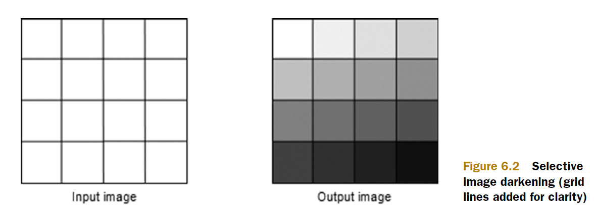
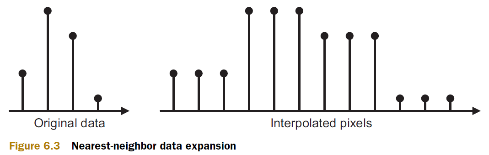
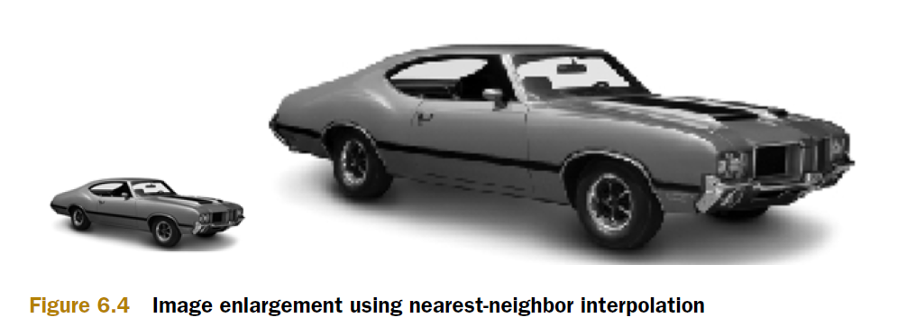
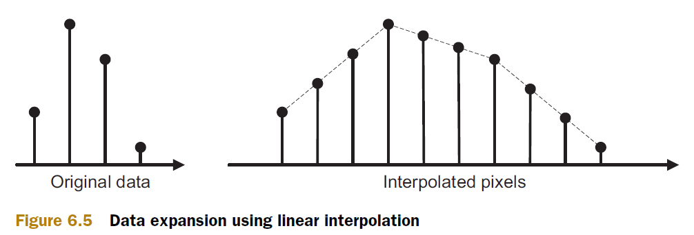
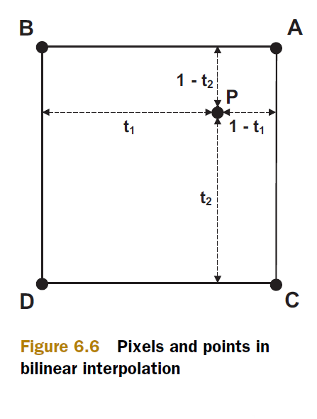
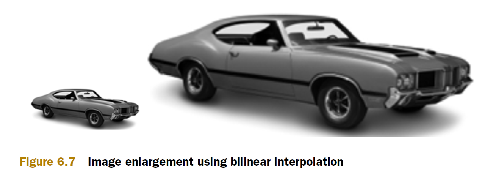

# Chapter 6: Image processing

- **Memory Objects in OpenCL: Buffers and Images**

    Memory objects in OpenCL serve as conduits for data exchange between a host and a device. They come in two primary types: **buffer objects** and **image objects**. While buffer objects are versatile and handle general-purpose data, this discussion will shift focus to the unique characteristics and advantages of image objects.

- **Why Use Image Objects?**

    1. **Optimized Memory Access on GPUs**:

        - Image data in OpenCL resides in specialized global memory known as texture memory on GPUs. Unlike regular global memory, texture memory is cached for rapid access, enhancing performance.

    2. **Simplified Data Handling**:

        - Functions for reading and writing image data in OpenCL abstract away the specifics of pixel data formatting, as long as the format is supported by OpenCL.

    3. **Samplers for Configuration**:

        - OpenCL introduces samplers, which allow developers to configure how color information is extracted from images, providing flexibility in image processing.

    4. **Image-Specific Information**:

        - Dedicated OpenCL functions provide essential details about images, including dimensions, pixel format, and bit depth, simplifying image manipulation tasks.

- **Using Image Objects in Practice**

    - The upcoming discussions will delve into image-related functions, detailing their usage and demonstrating their application in real-world scenarios, such as scaling image data.

- **Device Support for Image Processing**

    - It's important to note that not all OpenCL-compliant devices support image processing capabilities. To determine if a device supports images:
    - Use `clGetDeviceInfo` with the `CL_DEVICE_IMAGE_SUPPORT` option from the host.
    - Check the `__IMAGE_SUPPORT__` macro within kernel code.
    - If image support is indicated as `CL_FALSE`, the device does not support image processing.

    - This understanding of memory objects, specifically image objects, sets the stage for exploring advanced image processing techniques in OpenCL, leveraging optimized memory access and specialized functions tailored for image manipulation tasks.

## 6.1 Image objects and samplers

1. Image Processing in OpenCL: Structures and Processing Flow

    In OpenCL, image processing revolves around two primary data structures: **image objects** and **samplers**. These structures play crucial roles in facilitating efficient data transfer and manipulation between host applications and computing devices.

2. Image Objects

    - **Host Representation**: Image objects are represented as `cl_mem` structures on the host. These structures serve as the mechanism through which host applications manage and transfer pixel data to and from the computing device.

    - **Device Representation**: On the device side, image objects are typically represented as `image2d_t` or `image3d_t` structures, depending on whether they are two-dimensional or three-dimensional images. These structures are optimized for device-side image processing operations.

3. Samplers

    - **Host Representation**: Samplers are represented as `cl_sampler` structures on the host. These structures define how the device should interpret and read color values from image objects.

    - **Device Representation**: On the device, samplers are represented as `sampler_t` structures. They provide configuration options that dictate the filtering and addressing modes used during image sampling operations.

4. Processing Flow

    - **Host to Device Transfer**: Host applications use `cl_mem` structures to transfer pixel data (images) to the device.

    - **Device-Side Processing**: 

        - Image processing operations are performed using `image2d_t` or `image3d_t` structures on the device.

        - Samplers (`sampler_t` structures) guide how color values are accessed and interpreted during processing.

3. **Return to Host**: After processing, results or modified images are transferred back to the host using `cl_mem` structures.

4. Naming Conventions

    - OpenCL distinguishes between these structures based on their context:

        - **Host**: Uses `cl_mem` for image objects and `cl_sampler` for samplers.

        - **Device**: Uses `image2d_t` or `image3d_t` for image objects and `sampler_t` for samplers.

This framework enables efficient image processing workflows in OpenCL, leveraging optimized memory access and flexible configuration through samplers to achieve high-performance computing tasks related to image manipulation and analysis.

### 6.1.1 Image objects on the host: cl_mem

In OpenCL, memory objects play a pivotal role in data management between host applications and compute devices. These objects are represented by the `cl_mem` data type, encompassing both buffer objects and image objects. Here’s an overview of how they are utilized and distinguished:

1. Buffer Objects vs Image Objects

    - **Representation**: Both buffer objects and image objects are represented using the `cl_mem` data type. However, they serve different purposes:

        - **Buffer Objects**: Used for general-purpose data storage and processing.

        - **Image Objects**: Specifically designed for storing and manipulating image data.

2. Creating Memory Objects

    - **Buffer Objects**: Created using `clCreateBuffer` or `clCreateSubBuffer` functions. These functions allocate memory for general data storage and processing.
    
    - **Image Objects**: Created using specialized functions:

        - `clCreateImage2D`: Creates a two-dimensional image object.

        - `clCreateImage3D`: Creates a three-dimensional image object.

3. Parameters for Creating Image Objects

    - **Function Signatures**:

        ```c
        clCreateImage2D(cl_context context, cl_mem_flags opts,
                        const cl_image_format *format, size_t width, size_t height,
                        size_t row_pitch, void *data, cl_int *error)
        
        clCreateImage3D(cl_context context, cl_mem_flags opts,
                        const cl_image_format *format, size_t width, size_t height,
                        size_t depth, size_t row_pitch, size_t slice_pitch,
                        void *data, cl_int *error)
        ```

    - **Parameters**:

        - `context`: OpenCL context in which the image object will be created.

        - `opts`: Memory flags specifying usage options.

        - `format`: Format of the image data (channels, data type).

        - `width`, `height`, `depth`: Dimensions of the image.

        - `row_pitch`, `slice_pitch`: Memory layout parameters (for 2D and 3D images).

        - `data`: Pointer to the image data or `NULL` if initializing with `CL_MEM_USE_HOST_PTR`.

        - `error`: Pointer to an integer to hold error codes.

4. Example Code

    ```c
    cl_image_format format;
    format.image_channel_order = CL_RGBA;
    format.image_channel_data_type = CL_UNSIGNED_INT8;

    // Creating a 2D image object
    cl_mem image = clCreateImage2D(context, CL_MEM_READ_ONLY | CL_MEM_USE_HOST_PTR,
                                &format, width, height, 0, (void*)data, &err);
    ```

5. Using Image Objects

    - **Kernel Argument**: Image objects can be passed as arguments to kernel functions using `clSetKernelArg`.

    ```c
    clSetKernelArg(image_knl, 0, sizeof(cl_mem), &image);
    ```

6. Memory Deallocation

    - **Release**: Memory associated with a `cl_mem` object, including image objects, is released using `clReleaseMemObject`.

    ```c
    clReleaseMemObject(image);
    ```

7. Conclusion

    Understanding the distinctions and usage of buffer objects and image objects in OpenCL is crucial for efficient data processing and memory management, especially in contexts where specialized image processing capabilities and optimized memory access are required.

### 6.1.2 Samplers on the host: cl_sampler

In OpenCL, samplers are essential for specifying how kernels read image data. They provide crucial information such as coordinate normalization, addressing modes for out-of-range coordinates, and interpolation methods for image sampling. Here’s a comprehensive overview of samplers in OpenCL:

1. Creating Samplers

    Samplers are created using the `clCreateSampler` function, which has the following signature:

    ```c
    cl_sampler clCreateSampler(cl_context context, cl_bool normalized_coords,
                            cl_addressing_mode addressing_mode,
                            cl_filter_mode filter_mode,
                            cl_int *errcode_ret)
    ```

    - **Parameters**:

        - `context`: OpenCL context in which the sampler will be created.

        - `normalized_coords`: Specifies whether coordinates are normalized (`CL_TRUE`) or not (`CL_FALSE`).

        - `addressing_mode`: Specifies how out-of-range coordinates are handled.

        - `filter_mode`: Specifies the interpolation method for sampling.

        - `errcode_ret`: Pointer to an integer to hold error codes.

2. **Normalized Coordinates**:

    - Determines whether coordinates are given in normalized form (from 0.0 to 1.0). Useful when processing images with unknown dimensions or integrating with OpenGL textures.

3. **Addressing Mode**:

    - Defines how the sampler handles coordinates beyond the image’s dimensions:

        - `CL_ADDRESS_NONE`: Undefined behavior for out-of-range coordinates.

        - `CL_ADDRESS_CLAMP`: Colors set to a specified border color (default: black).

        - `CL_ADDRESS_CLAMP_TO_EDGE`: Colors set to the nearest edge pixel.

        - `CL_ADDRESS_REPEAT`: Coordinates wrap around within the image dimensions.

        - `CL_ADDRESS_MIRRORED_REPEAT`: Coordinates reflect within the image dimensions.

4. **Filter Mode**:

    - Specifies how colors are interpolated when coordinates are not exact pixel positions:

        - `CL_FILTER_NEAREST`: Nearest-neighbor interpolation.

        - `CL_FILTER_LINEAR`: Bilinear interpolation for 2D images and trilinear for 3D images.

5. Example of Sampler Creation

    ```c
    cl_sampler sampler = clCreateSampler(context, CL_TRUE, CL_ADDRESS_CLAMP_TO_EDGE,
                                        CL_FILTER_LINEAR, &err);
    ```

6. Using Samplers

    - **Setting Kernel Arguments**: Samplers are passed to kernel functions using `clSetKernelArg`:
    
    ```c
    clSetKernelArg(kernel, 0, sizeof(cl_sampler), &sampler);
    ```

7. Memory Management

    - **Release**: Samplers are released using `clReleaseSampler` when they are no longer needed:

    ```c
    clReleaseSampler(sampler);
    ```

    - **Reference Counting**: Samplers, like other OpenCL objects, can be retained and released using `clRetainSampler` to manage their lifetime and ensure proper cleanup.

8. Conclusion

    Understanding how to create, configure, and use samplers is crucial for efficient image processing in OpenCL. These structures ensure that kernels can accurately read and manipulate image data, offering flexibility in handling different coordinate systems, addressing modes, and interpolation methods.

### 6.1.3 Image objects on the device: image2d_t and image3d_t

In OpenCL, image objects are essential for storing and accessing pixel data on devices such as GPUs. Here’s a detailed look at image objects, their types (`image2d_t` and `image3d_t`), and how they are used in kernel functions:

1. Image Object Types

    Image objects are created on the host and transferred to the device for processing. The type of image object received by the kernel function depends on its dimensionality:

    - **image2d_t**: Represents a two-dimensional image object.

    - **image3d_t**: Represents a three-dimensional image object.

2. Access and Modifiers

    Image object parameters in kernel functions can have modifiers like `__read_only` or `__write_only`:

    - **Modifiers**:

        - `__read_only`: Indicates that the image can only be read from.

        - `__write_only`: Indicates that the image can only be written to.

    By default, image objects are `__read_only`, and the leading underscores in modifiers can be omitted.

3. Example Usage

    - **Creating Image Objects**: Image objects are created using functions like `clCreateImage2D` and `clCreateImage3D` on the host:

        ```c
        cl_mem my_mpeg = clCreateImage3D(context, CL_MEM_READ_ONLY, &format, width, height, depth, 0, 0, NULL, &err);
        cl_mem my_jpg = clCreateImage2D(context, CL_MEM_WRITE_ONLY, &format, width, height, 0, NULL, &err);
        ```

    - **Setting Kernel Arguments**: Image objects are passed to kernel functions using `clSetKernelArg`:

        ```c
        clSetKernelArg(kernel, 0, sizeof(cl_mem), &my_mpeg);
        clSetKernelArg(kernel, 1, sizeof(cl_mem), &my_jpg);
        ```

    - **Kernel Function Declaration**: In the kernel function declaration, image objects are specified as parameters of type `image2d_t` or `image3d_t`:

        ```c
        __kernel void image_proc(__read_only image3d_t mpeg,
                                    __write_only image2d_t jpg) {
            // Kernel function body
        }
        ```

        Note that these parameters are not pointers; instead, OpenCL provides specialized functions to read from and write to image data within kernels.

4. Conclusion

    Understanding image objects (`image2d_t` and `image3d_t`) and their usage in OpenCL kernels is crucial for efficient image processing. These objects allow kernels to access image data stored in device memory, facilitating operations such as image filtering, transformation, and analysis. By utilizing specialized image handling functions provided by OpenCL, developers can optimize performance and leverage hardware-specific features for image processing tasks.

### 6.1.4 Samplers on the device: sampler_t

1. **Creating Samplers on Host**:

    - Samplers are created on the host using `clCreateSampler` and transferred to kernels as `cl_sampler` structures.

2. **Using Samplers in Kernel Functions**:

    - Samplers are received in kernel functions as `sampler_t` structures.

    - They can be placed in global or constant memory using the `__global` or `__constant` modifier.

    Example kernel function declaration:

    ```c
    __kernel void image_proc(__global sampler_t smplr) {
        // Kernel function body
    }
    ```

3. **Setting Sampler Properties in Kernels**:

    - OpenCL allows setting sampler properties directly within kernels using the `const sampler_t` declaration.

    Example of setting sampler properties:

    ```c
    const sampler_t sampler = CLK_NORMALIZED_COORDS_TRUE |
                                CLK_ADDRESS_CLAMP_TO_EDGE |
                                CLK_FILTER_NEAREST;
    ```

    - **Properties**:

        - `CLK_NORMALIZED_COORDS_TRUE` or `CLK_NORMALIZED_COORDS_FALSE`: Specifies whether image coordinates are normalized (0.0–1.0).

        - `CLK_ADDRESS_CLAMP`, `CLK_ADDRESS_CLAMP_TO_EDGE`, `CLK_ADDRESS_REPEAT`, `CLK_ADDRESS_MIRRORED_REPEAT`, or `CLK_ADDRESS_NONE`: Defines behavior when coordinates exceed image boundaries.

        - `CLK_FILTER_NEAREST` or `CLK_FILTER_LINEAR`: Specifies interpolation method for color values between pixels.

4. **Direct Usage in Kernel Functions**:

    - Once defined, samplers can be used directly in OpenCL functions that read image data, simplifying the setup within kernels.

5. Example Usage

    - An example of creating and using a sampler within a kernel function:

    ```c
    __kernel void image_proc(__global sampler_t sampler) {
        // Kernel function body
        // Use sampler to read image data
    }
    ```

    By defining samplers directly within kernels, developers can streamline image processing operations without the need for additional setup steps in host code. Samplers provide flexibility in how image data is accessed and interpreted, enhancing the efficiency and performance of image processing tasks in OpenCL applications.

## 6.2 Image processing functions

In OpenCL, image processing functions are essential for manipulating image data efficiently within kernel functions. These functions are categorized into read functions, write functions, and information functions, each serving specific purposes related to image handling.

1. Categories of Image Processing Functions

    - **Read Functions**:

        - **Purpose**: Return color values at specified coordinates from image objects.

        - **Examples**: `read_imagef`, `read_imagei`, `read_imageui`

        - **Usage**: Typically used to fetch pixel data for further processing within kernels.

    - **Write Functions**:

        - **Purpose**: Set color values at specified coordinates in image objects.

        - **Examples**: `write_imagef`, `write_imagei`, `write_imageui`

        - **Usage**: Enables kernels to modify pixel values or write processed data back to image objects.

    - **Information Functions**:

        - **Purpose**: Retrieve metadata and properties of image objects.

        - **Examples**: `get_image_width`, `get_image_height`, `get_image_channel_data_type`

        - **Usage**: Provides essential information such as image dimensions and pixel format, aiding in image processing algorithms.

2. Example Application

    An example application might involve:

    - Reading pixel values from one image using read functions.

    - Modifying these values based on a specific algorithm or computation.

    - Writing the modified pixel values to another image using write functions.

3. Integration with Samplers

    - **Samplers**: Used to configure how image coordinates are interpreted (normalized or integer), how addressing beyond image boundaries is handled (clamp, repeat, etc.), and the method of color interpolation (nearest-neighbor or linear).

4. Summary

    Understanding and utilizing these image processing functions effectively allows developers to implement complex image algorithms efficiently using OpenCL. The combination of read, write, and information functions alongside samplers provides a powerful toolkit for image processing tasks in GPU-accelerated applications.

### 6.2.1 Image read functions

In OpenCL, image read functions are crucial for retrieving pixel data from image objects within kernel functions. These functions vary based on the type of image object (2D or 3D) and the type of data being read (float, int, uint). Here’s a detailed overview of these functions:

1. Function Overview

    | Function               | Purpose                                              |
    |------------------------|------------------------------------------------------|
    | `float4 read_imagef(image2d_t img, sampler_t sampler, int2/float2 coord)` | Reads a `float4` vector from a 2D image at specified coordinates. |
    | `int4 read_imagei(image2d_t img, sampler_t sampler, int2/float2 coord)`   | Reads an `int4` vector from a 2D image at specified coordinates.   |
    | `uint4 read_imageui(image2d_t img, sampler_t sampler, int2/float2 coord)` | Reads a `uint4` vector from a 2D image at specified coordinates.  |
    | `float4 read_imagef(image3d_t img, sampler_t sampler, int4/float4 coord)` | Reads a `float4` vector from a 3D image at specified coordinates. |
    | `int4 read_imagei(image3d_t img, sampler_t sampler, int4/float4 coord)`   | Reads an `int4` vector from a 3D image at specified coordinates.   |
    | `uint4 read_imageui(image3d_t img, sampler_t sampler, int4/float4 coord)` | Reads a `uint4` vector from a 3D image at specified coordinates.  |

2. Parameters

    - **Image Object (`img`)**: Represents the image from which data is read (`image2d_t` for 2D images, `image3d_t` for 3D images).

    - **Sampler (`sampler`)**: Defines how coordinates are interpreted and how color values are accessed beyond image boundaries.

    - **Coordinates (`coord`)**: Specifies the location within the image from which to read data. Coordinates can be integers (`int2` or `int4`) or floating-point values (`float2` or `float4`), depending on the image dimensionality.

3. Return Values

    - The return type (`float4`, `int4`, `uint4`) corresponds to the type of vector returned by the function.

    - The values returned depend on the pixel format of the image (`CL_UNORM_INT8`, `CL_SNORM_INT16`, `CL_FLOAT`, etc.), influencing the range and format of the returned data.

4. Color Vector Interpretation

    After reading a vector from an image object, it’s essential to understand how color components are stored within the returned vector. This interpretation depends on the channel order of the image, which dictates how color channels (R, G, B, A) or intensity/luminance values are mapped to vector components.

    **Table 6.2: Color Vector Interpretation**

    | Channel Order   | Vector Storage (integer)  |
    |-----------------|---------------------------|
    | `CL_R`, `CL_Rx` | (R, 0, 0, 1)              |
    | `CL_A`          | (0, 0, 0, A)              |
    | `CL_RG`, `CL_RGx`| (R, G, 0, 1)              |
    | `CL_RA`         | (R, 0, 0, A)              |
    | `CL_RGB`, `CL_RGBx` | (R, G, B, 1)           |
    | `CL_RGBA`, `CL_BGRA`, `CL_ARGB` | (R, G, B, A)     |
    | `CL_INTENSITY`  | (I, I, I, I)              |
    | `CL_LUMINANCE`  | (L, L, L, 1)              |

    - These mappings ensure clarity when accessing and manipulating pixel data within OpenCL kernels.

5. Conclusion

    Understanding how to effectively use read functions in OpenCL, along with the interpretation of color vectors based on channel order, is crucial for implementing efficient image processing algorithms. These functions enable kernels to access and manipulate image data seamlessly, leveraging GPU capabilities for high-performance computing tasks.

### 6.2.2 Image write functions

In OpenCL, image write functions allow kernels to modify and write pixel data to image objects directly. These functions vary based on the type of image object (2D or 3D) and the type of data being written (float, int, uint). Here’s an overview of these functions:

1. Function Overview

    | Function                        | Purpose                                                   |
    |---------------------------------|-----------------------------------------------------------|
    | `void write_imagef(image2d_t img, int2 coord, float4 color)` | Writes a `float4` color to a 2D image at specified coordinates. |
    | `void write_imagei(image2d_t img, int2 coord, int4 color)`     | Writes an `int4` color to a 2D image at specified coordinates.   |
    | `void write_imageui(image2d_t img, int2 coord, uint4 color)`   | Writes a `uint4` color to a 2D image at specified coordinates.  |
    | `void write_imagef(image3d_t img, int4 coord, float4 color)`   | Writes a `float4` color to a 3D image at specified coordinates. |
    | `void write_imagei(image3d_t img, int4 coord, int4 color)`     | Writes an `int4` color to a 3D image at specified coordinates.   |
    | `void write_imageui(image3d_t img, int4 coord, uint4 color)`   | Writes a `uint4` color to a 3D image at specified coordinates.  |

2. Parameters

    - **Image Object (`img`)**: Represents the image to which data is written (`image2d_t` for 2D images, `image3d_t` for 3D images).

    - **Coordinates (`coord`)**: Specifies the location within the image where data will be written. Coordinates must be given as signed integers (`int2` for 2D images, `int4` for 3D images).

    - **Color (`color`)**: Represents the color to be written to the image. The type (`float4`, `int4`, `uint4`) depends on the function name, indicating the data type of the color components.

3. Additional Notes

    - **Support for 3D Image Writes**: By default, writes to three-dimensional (`image3d_t`) image objects are not supported. This capability requires enabling the `cl_khr_3d_image_writes` extension. To enable this extension in your kernel, include the following pragma:

    ```
    #pragma OPENCL EXTENSION cl_khr_3d_image_writes: enable
    ```

    This enables writing operations to 3D image objects within your OpenCL kernel.

    - **Color Specification**: The color to be written must match the pixel format of the image. Refer to Table 6.2 for the appropriate vector format based on the image's channel order (`CL_R`, `CL_RG`, `CL_RGB`, etc.).

4. Example Usage

    To illustrate, if you have an image object `img` with RGB components `[132, 15, 44]`, and assuming `coord` represents the coordinates where you want to write the pixel data:

    ```c
    write_imageui(img, coord, (uint4)(132, 15, 44, 0));
    ```

    This code snippet writes the pixel data to a `CL_RGB` image (`img`) at the specified coordinates (`coord`).

5. Conclusion

    Understanding how to effectively use write functions in OpenCL is essential for implementing image processing algorithms that involve modifying pixel data directly within kernel functions. These functions provide the capability to update image content efficiently, leveraging GPU acceleration for computational tasks that involve image manipulation and processing.

### 6.2.3 Image information functions

In OpenCL, image information functions provide kernels with essential details about the structure and properties of image objects. These functions are crucial for understanding the dimensions, pixel format, and other characteristics of images used within kernel functions. Here’s an overview of these functions:

1. Function Overview

    | Function                                   | Purpose                                                                                     |
    |--------------------------------------------|---------------------------------------------------------------------------------------------|
    | `int get_image_width(image2d_t/image3d_t image)` | Returns the width of the specified image (`image2d_t` for 2D images, `image3d_t` for 3D images).        |
    | `int get_image_height(image2d_t/image3d_t image)` | Returns the height of the specified image (`image2d_t` for 2D images, `image3d_t` for 3D images).      |
    | `int get_image_depth(image3d_t image)`      | Returns the depth of the specified 3D image (`image3d_t`).                                   |
    | `int2 get_image_dim(image2d_t image)`       | Returns the width and height of the specified 2D image as an `int2` vector.                   |
    | `int4 get_image_dim(image3d_t image)`       | Returns the width, height, and depth of the specified 3D image as an `int4` vector.           |
    | `int get_image_channel_data_type(image2d_t/image3d_t image)` | Returns the channel data type of the specified image (`CLK_UNORM_INT8`, `CLK_SIGNED_INT32`, etc.). |
    | `int get_image_channel_order(image2d_t/image3d_t image)`    | Returns the channel order of the specified image (`CLK_A`, `CLK_RGB`, `CLK_INTENSITY`, etc.).   |

2. Parameters

    - **Image Object (`image`)**: Represents the image object from which information is queried. Functions expect either `image2d_t` for 2D images or `image3d_t` for 3D images.

3. Usage Notes

    - **Dimensions**: Functions like `get_image_width`, `get_image_height`, and `get_image_depth` (for 3D images) provide direct access to the dimensions of the image object.

    - **Dimension as Vector**: `get_image_dim` functions return the dimensions (`int2` for 2D images, `int4` for 3D images) packed into a vector for convenience.

    - **Channel Information**: `get_image_channel_data_type` and `get_image_channel_order` return information about the image's pixel format:

        - **Channel Data Type**: Specifies how the bits in each channel are formatted (`CLK_UNORM_INT8`, `CLK_SIGNED_INT32`, etc.).

        - **Channel Order**: Specifies which channels are present and their order (`CLK_A`, `CLK_RGB`, `CLK_INTENSITY`, etc.).

4. Example Usage

    - To illustrate, if you have an image object `image` and you need to retrieve its width and height:

    ```c
    int width = get_image_width(image);
    int height = get_image_height(image);
    ```

    Similarly, if you need to know the channel order of the image:

    ```c
    int channelOrder = get_image_channel_order(image);
    ```

5. Conclusion

    Understanding and utilizing these image information functions is essential for developing efficient and effective image processing algorithms in OpenCL. These functions empower kernels to dynamically adapt to different image dimensions and formats, ensuring accurate and optimized image manipulation within parallel computing environments.

### 6.2.4 A simple example

The provided example demonstrates basic image processing using OpenCL, specifically darkening an image by subtracting a value from each pixel. Here’s a detailed breakdown of the example and its components:

<p align="center">
    
    </p>


1. Kernel Explanation

    ```cl
    __constant sampler_t sampler = CLK_NORMALIZED_COORDS_FALSE | CLK_ADDRESS_CLAMP | CLK_FILTER_NEAREST;

    __kernel void simple_image(read_only image2d_t src_image, write_only image2d_t dst_image) {
        uint offset = get_global_id(1) * 0x4000 + get_global_id(0) * 0x1000;
        int2 coord = (int2)(get_global_id(0), get_global_id(1));
        
        uint4 pixel = read_imageui(src_image, sampler, coord);
        pixel.x -= offset;
        
        write_imageui(dst_image, coord, pixel);
    }
    ```

2. Breakdown of the Kernel:

    - **Sampler Definition**:

        - `__constant sampler_t sampler`: Declares a constant sampler `sampler` with specific properties:

            - `CLK_NORMALIZED_COORDS_FALSE`: Indicates that image coordinates are not normalized (0 to width/height).

            - `CLK_ADDRESS_CLAMP`: Specifies that out-of-range coordinates should be clamped.

            - `CLK_FILTER_NEAREST`: Specifies nearest-neighbor interpolation for reading image data.

    - **Kernel Function**:

        - `__kernel void simple_image(read_only image2d_t src_image, write_only image2d_t dst_image)`: Defines the kernel function named `simple_image` which takes two parameters:

            - `read_only image2d_t src_image`: Input image from which pixel values are read.

            - `write_only image2d_t dst_image`: Output image where modified pixel values will be written.

    - **Calculating Offset**:

        - `uint offset = get_global_id(1) * 0x4000 + get_global_id(0) * 0x1000;`: Computes an offset based on the global ID of the work-item. This offset is subtracted from the first component (`pixel.x`) of each pixel's color vector.

    - **Reading and Modifying Pixels**:

        - `int2 coord = (int2)(get_global_id(0), get_global_id(1));`: Retrieves the coordinates of the current work-item.

        - `uint4 pixel = read_imageui(src_image, sampler, coord);`: Reads the pixel color value from the source image using the defined sampler.

        - `pixel.x -= offset;`: Modifies the first component of the pixel's color vector by subtracting the computed offset.

    - **Writing Modified Pixels**:

        - `write_imageui(dst_image, coord, pixel);`: Writes the modified pixel color vector to the destination image at the same coordinates.

3. Explanation:

    - **Purpose**: The kernel darkens the image by progressively subtracting increasing values from the first component of each pixel's color vector, based on the work-item's global ID. This results in the image getting darker from the upper left to the lower right.
    
    - **Image Handling**: This example assumes the input image (`src_image`) is a 2D image (`image2d_t`) and the output image (`dst_image`) is also a 2D image where modified pixel values are written.

    - **Sampler Usage**: The sampler (`sampler`) ensures that coordinates are interpreted correctly and that the image operations respect defined addressing and filtering rules.

4. Additional Notes:

    - **PNG Image Handling**: The host application handles PNG images using the libpng library, allowing reading from `blank.png` and writing to `output.png`.

    - **Extensions**: For more advanced operations like image resizing with interpolation, further OpenCL functionalities and extensions are typically employed.

    - This example illustrates the fundamental concepts of reading from and writing to images in OpenCL kernels, as well as how to manipulate pixel data for basic image processing tasks.

## 6.3 Image scaling and interpolation

Image scaling, whether enlarging or reducing the size of an image, is a common task in image processing. OpenCL provides mechanisms to perform this task efficiently using interpolation methods. Let's explore the concepts and methods mentioned in your provided text:

- **Nearest-Neighbor Interpolation**

    - Nearest-neighbor interpolation is a simple method where each new pixel in the enlarged image is assigned the value of the nearest pixel from the original image. This method is straightforward but can result in blocky or pixelated images, especially when enlarging.

- **Bilinear Interpolation**

    - Bilinear interpolation is a more sophisticated method that takes into account the color values of the neighboring pixels to compute a weighted average, providing smoother transitions between pixels. This method tends to produce better-quality results than nearest-neighbor interpolation but requires more computational effort.

- OpenCL Support for Interpolation

    - OpenCL supports both nearest-neighbor and bilinear interpolation through samplers (`sampler_t`). The interpolation method can be specified in the sampler setup:

- **Nearest-Neighbor Interpolation**: Use `CLK_FILTER_NEAREST` in the sampler configuration.
  
- **Bilinear Interpolation**: Use `CLK_FILTER_LINEAR` in the sampler configuration.

### 6.3.1 Nearest-neighbor interpolation

Nearest-neighbor interpolation is a straightforward method used in image processing to scale images, especially for enlargement. Here are the key points to note from the provided text:

1. Principles of Nearest-Neighbor Interpolation

    Nearest-neighbor interpolation works by selecting the color value of the nearest pixel to the interpolated point. Here’s how it operates:

    - **Interpolation Process**: When enlarging an image using nearest-neighbor interpolation, each new pixel in the enlarged image is assigned the color of the nearest pixel from the original image.
    
    - **Resulting Image**: If an image is enlarged k-fold, each color from the original image will be repeated k times in the enlarged image. This results in blocky, pixelated images where the original pixel structure is preserved without any blending of colors between neighboring pixels.

2. Characteristics of Nearest-Neighbor Interpolation

    - **Speed**: Nearest-neighbor interpolation is computationally efficient because it involves simple lookup operations without complex mathematical computations.

    - **Visual Quality**: While suitable for preserving sharp edges and pixel details, nearest-neighbor interpolation often produces images that appear grainy and exhibit noticeable pixelation, especially when enlarging images significantly.

3. Example and Visual Representation

    - **Figure 6.3**: Illustrates how nearest-neighbor interpolation works by repeating adjacent pixels when enlarging an image. This method preserves the original pixel values without blending colors between neighboring pixels.

    <p align="center">
    
    </p>

    - **Figure 6.4**: Demonstrates the visual drawback of nearest-neighbor interpolation when used for image enlargement. The resulting image shows abrupt changes in pixel values, leading to a blocky appearance that can degrade visual quality.

    <p align="center">
    
    </p>

4. Practical Considerations

    - **Usage**: Nearest-neighbor interpolation is suitable when preserving sharp edges and details is more important than visual smoothness, such as in certain computer vision tasks or when dealing with pixel art.

    - **Alternative**: For applications requiring smoother transitions between pixels, such as image resizing for display or printing, bilinear interpolation or other more sophisticated methods are preferred despite their higher computational cost.

5. Conclusion

    Nearest-neighbor interpolation provides a basic yet efficient method for image scaling in OpenCL and other image processing frameworks. Understanding its characteristics and limitations helps in choosing the appropriate interpolation method based on the specific requirements of the application.

### 6.3.2 Bilinear interpolation

Bilinear interpolation is an enhanced method used in image processing for scaling images, particularly for enlargement. Here’s a detailed summary based on the provided text:

1. Principles of Bilinear Interpolation

    Bilinear interpolation improves upon nearest-neighbor interpolation by blending the colors of neighboring pixels when determining the color of a new pixel. Here are the key points:

    - **Interpolation Process**: When enlarging an image using bilinear interpolation with `CLK_FILTER_LINEAR`, each new pixel's color is computed as a weighted average of the colors of the four nearest pixels from the original image.

    - **Linear Interpolation in 1D**: In the one-dimensional case, given points A and B, and a point P between them with a parameter `t`, the color at P is calculated as:
        \[
        \text{Color}(P) = t \cdot \text{Color}(A) + (1 - t) \cdot \text{Color}(B)
        \]
    - Here, `t` ranges from 0 to 1, where `t = 0` corresponds to P being at B, and `t = 1` corresponds to P being at A.

    - **Bilinear Interpolation in 2D**: Extending to two dimensions, for points P between four adjacent pixels (A, B, C, D), with parameters `t1` and `t2`, the color at P is computed as:
        \[
        \text{Color}(P)_{t1, t2} = (1 - t1) \cdot (1 - t2) \cdot \text{Color}(D) + t1 \cdot (1 - t2) \cdot \text{Color}(C) + (1 - t1) \cdot t2 \cdot \text{Color}(B) + t1 \cdot t2 \cdot \text{Color}(A)
        \]
    - Here, `t1` and `t2` range from 0 to 1, where `(t1, t2) = (0, 0)` corresponds to P being at D, `(1, 1)` corresponds to P being at A, and `(0.5, 0.5)` corresponds to an average of all four colors.

    <p align="center">
    
    </p>


2. Characteristics of Bilinear Interpolation

    - **Visual Quality**: Bilinear interpolation produces smoother results compared to nearest-neighbor interpolation. It reduces the blocky appearance and pixelation seen with nearest-neighbor interpolation, resulting in images that appear more natural when enlarged.

    <p align="center">
    
    </p>

    - **Availability and Limitations**:

        - Bilinear interpolation (`CLK_FILTER_LINEAR`) is available when image coordinates are given as floating-point values.

        - It is supported for `read_imagef` functions but may not be supported for `read_imageui` or `read_imagei` functions on some OpenCL-compliant devices.

3. Example and Visual Representation

    - **Figure 6.7**: Illustrates the application of bilinear interpolation to enlarge an image of a sports car. Compared to nearest-neighbor interpolation (Figure 6.4), the resulting image appears smoother and less pixelated due to the interpolation between neighboring pixels.

    <p align="center">
    
    </p>


4. Practical Considerations

    - **Usage**: Bilinear interpolation is suitable for applications where smoother transitions between pixels are necessary, such as image resizing for high-quality display, printing, or computer vision tasks requiring enhanced image clarity.

    - **Performance**: While bilinear interpolation improves visual quality, it involves more computation than nearest-neighbor interpolation. Developers should consider performance implications, especially on devices where hardware support for bilinear interpolation may vary.

6. Conclusion

    Bilinear interpolation represents a significant advancement over nearest-neighbor interpolation in image processing. Understanding its computational principles and visual benefits helps in selecting the appropriate interpolation method based on the specific requirements and constraints of the application.

### 6.3.3 Image enlargement in OpenCL

1. Nearest-Neighbor Interpolation

    - **Principle**: Nearest-neighbor interpolation selects the color of the new pixels based on the color of the nearest original pixel. If an image is enlarged k times, each original pixel's color will be repeated k times in the enlarged image.

    - **Implementation in OpenCL**:

        - **Sampler Configuration**: In the OpenCL kernel (`interp_image.cl`), the `sampler_t` structure is configured with `CLK_FILTER_NEAREST`.

        - **Kernel Operation**: The kernel (`interp`) uses a nested loop (`SCALE x SCALE`) to read multiple values from the input image (`src_image`) and write corresponding values to the output image (`dst_image`).

    - **Example Kernel Code**:

    ```cl
    constant sampler_t sampler = CLK_NORMALIZED_COORDS_FALSE |
                                CLK_ADDRESS_CLAMP |
                                CLK_FILTER_NEAREST;

    __kernel void interp(read_only image2d_t src_image,
                        write_only image2d_t dst_image) {
        float4 pixel;
        float2 input_coord = (float2)(get_global_id(0) + (1.0f/(SCALE*2)),
                                        get_global_id(1) + (1.0f/(SCALE*2)));
        int2 output_coord = (int2)(SCALE * get_global_id(0),
                                    SCALE * get_global_id(1));

        for(int i = 0; i < SCALE; i++) {
            for(int j = 0; j < SCALE; j++) {
                pixel = read_imagef(src_image, sampler,
                                    (float2)(input_coord.x + 1.0f*i/SCALE,
                                            input_coord.y + 1.0f*j/SCALE));
                write_imagef(dst_image, output_coord + (int2)(i, j), pixel);
            }
        }
    }
    ```

2. Bilinear Interpolation

    - **Principle**: Bilinear interpolation computes the color of new pixels by averaging the colors of the four nearest original pixels. This method produces smoother results compared to nearest-neighbor interpolation, especially noticeable in image enlargements.

    - **Implementation Consideration**: While the provided code snippet uses nearest-neighbor interpolation (`CLK_FILTER_NEAREST`), switching to bilinear interpolation (`CLK_FILTER_LINEAR`) in the sampler configuration would require adjustments to use `read_imagef` instead of `read_imageui` or `read_imagei`.

3. Visual Representation

    - **Effect of Interpolation**: Figure 6.8 illustrates how the `interp` kernel processes 25 values within a pixel when `SCALE` is set to 5. With nearest-neighbor interpolation, all 25 read operations return the same pixel color. In contrast, bilinear interpolation would interpolate between neighboring pixels, resulting in smoother transitions and reduced pixelation.

4. Practical Application

    - **Performance and Quality**: The choice between interpolation methods (`CLK_FILTER_NEAREST` vs. `CLK_FILTER_LINEAR`) in OpenCL depends on the desired visual quality and the computational resources available on the target device. Bilinear interpolation generally provides better visual results but requires more computation than nearest-neighbor interpolation.

5. Conclusion

    Understanding the nuances of image interpolation methods in OpenCL is crucial for developers aiming to achieve optimal image quality and performance in applications involving image scaling and processing. By selecting the appropriate interpolation method and configuring samplers accordingly, developers can effectively manage trade-offs between computational efficiency and visual fidelity in image enlargement tasks.

## 6.4 Summary

1. **Image Object and Sampler Configuration**:

    - **Image Objects**: Kernels in OpenCL receive image data through `image2d_t` or `image3d_t` objects.

    - **Sampler**: Controls how kernel evaluates coordinates and interpolates data when reading from images.

2. **Categories of Image Processing Functions**:

    - **Read Functions**: Retrieve data from image objects using samplers. Supports integer or floating-point coordinates.

    - **Write Functions**: Set data in image objects using integer coordinates. Three-dimensional image writes require `cl_khr_3d_image_writes` extension support.

    - **Information Functions**: Provide details like dimensions and pixel properties of images.

3. **Interpolation Methods**:

    - **Nearest-Neighbor Interpolation**: Set with `CLK_FILTER_NEAREST`. Replicates nearest pixel color for enlarged images. Fast execution but can produce pixelated results.

    - **Bilinear Interpolation**: Set with `CLK_FILTER_LINEAR`. Computes colors between pixels using linear interpolation for smoother enlarged images. Requires coordinates and color values in floating-point format.

4. **Advanced Topics**:

    - Chapter 7 explores more advanced capabilities of OpenCL, including event handling for profiling kernel execution and synchronization mechanisms for coordinating work-items.

5. Practical Considerations

    - **Performance vs. Quality**: Choose between interpolation methods based on performance constraints and desired image quality.

    - **Extension Support**: Ensure device compatibility when working with three-dimensional image writes using the `cl_khr_3d_image_writes` extension.

    - **Sampler Configuration**: Configure samplers appropriately to optimize image processing tasks in OpenCL.

6. Conclusion

    Mastering OpenCL's image processing capabilities involves understanding how to efficiently read, write, and manipulate image data using kernels and samplers. By leveraging interpolation methods like nearest-neighbor and bilinear, developers can tailor their applications to achieve the desired balance between computational efficiency and visual fidelity in image processing tasks.
