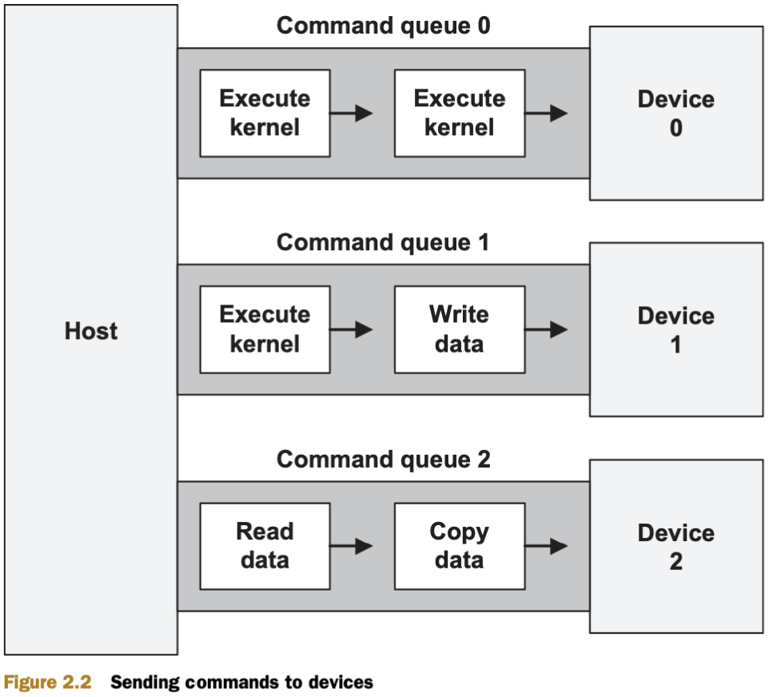

# Chapter 2: Hosting programming : fundamental data structures.

## 2.1. Primitive data types

- Redefinition of correspoding C / C++ types

|Scalar data type|Bit width|Purpose|
|:---:|:---:|---|
|`cl_char`|8|Signed two’s complement integer|
|`cl_uchar`|8|Unsigned two’s complement integer|
|`cl_short`|16|Signed two’s complement integer|
|`cl_ushort`|16|Unsigned two’s complement integer|
|`cl_int`|32|Signed two’s complement integer|
|`cl_uint`|32|Unsigned two’s complement integer|
|`cl_long`|64|Signed two’s complement integer|
|`cl_ulong`|64|Unsigned two’s complement integer|
|`cl_half`|16|Half-precision floating-point value|
|`cl_float`|32|Single-precision floating-point value|
|`cl_double`|64|Double-precision floating-point value|

## 2.2. Accessing platforms

### 2.2.1. Creating platform structures

- Từng platform là một structure biểu diễn một OpenCL implementation được cài đặt trên host.

- __Working with platform__ là một quá trình gồm 2 bước:
  - __Step 1:__ allocated for one or more `cl_platform_id`.
  - __Step 2:__ call `clGetPlatformIDs` để khởi tạo structures

- Hàm khởi tạo Platform.
```C++
cl_int clGetPlatformIDs(cl_uint num_entries, cl_platform_id *platforms, cl_uint *num_platforms)
```
where:
> `platforms`: tham chiếu của biến structure kiểu `cl_platform_id`.<br>
> `num_entries`: (`>0`) số lượng platform ta muốn detect. (số lượng tối đa `cl_platform_id` được thêm vào mảng `platform`).<br>
> `num_platforms`: số lượng platform mà host phát hiện ra trong quá trình hoạt động của nó.<br>
> `return`: `0` - indicates success, `<0` - indicates failure.

- `platforms` và `num_platforms` có thể được set bằng `NULL`. Thường sử dụng trong trường hợp: đầu tiên sẽ tìm "how many platforms are installed" (`platforms = NULL` và `num_platforms` sẽ lưu số platforms đã được cài đặt). Sau đó khởi tạo tất cả các platforms (`num_platforms = NULL`).

<details>
  <summary>The following code shows how this is accomplished!</summary>

```Cpp
cl_platform_id *platforms;
cl_uint num_platforms;

clGetPlatformIDs(5, NULL, &num_platforms);

platforms = (cl_platform_id*) malloc(sizeof(cl_platform_id) * num_platforms);

clGetPlatformIDs(num_platforms, platforms, NULL);
```

</details>

<a name="obtaining_platform_information"></a>
### 2.2.2. Obtaining platform information

- Muốn lấy một số thông tin ngoài luồng của các platforms (OpenCL version, vendor...) gọi hàm `clGetPlatformInfo`.

```C++
cl_int clGetPlatformInfo(cl_platform_id platform, cl_platform_info param_name, size_t param_value_size, void *param_value, size_t *param_value_size_ret)
```

where:
> `platform`<br>
> `param_name`: loại thông tin đang muốn tìm kiếm.<br>
> `param_value_size`: bao nhiêu ký tự muốn lưu lại.<br>
> `param_value`: chuỗi `char` trả về.<br>
> `param_value_size_ret`: kích thước chuỗi trả về.

|Parameter name|Purpose|
|:---:|---|
|`CL_PLATFORM_NAME`|Returns the name associated with the platform|
|`CL_PLATFORM_VENDOR`|Identifies the vendor associated with the platform|
|`CL_PLATFORM_VERSION`|Returns the maximum version of OpenCL supported by the platform|
|`CL_PLATFORM_PROFILE`|Identifies whether the platform supports the full OpenCL standard (`FULL_PROFILE`) or the embedded standard (`EMBEDDED_PROFILE`)|
|`CL_PLATFORM_EXTENSIONS`|Returns a list of extensions supported by the platform|

<details>
  <summary>The following code shows how this is accomplished!</summary>

```Cpp
char pform_vendor[40];
clGetPlatformInfo(platforms[0], CL_PLATFORM_VENDOR, sizeof(pform_vendor), &pform_vendor, NULL);
```

</details>

### 2.2.3. Code example: testing platform extensions

<details>
  <summary>EXAMPLE CODE!</summary>

`platform_ext_test.c`

```C++
#include <stdio.h>
#include <stdlib.h>
#include <string.h>

#ifdef MAC
#include <OpenCL/cl.h>
#else
#include <CL/cl.h>
#endif

int main() {

   /* Host data structures */
   cl_platform_id *platforms;
   cl_uint num_platforms;
   cl_int i, err, platform_index = -1;

   /* Extension data */
   char* ext_data;							
   size_t ext_size;
   const char icd_ext[] = "cl_khr_icd";

   /* Find number of platforms */
   err = clGetPlatformIDs(1, NULL, &num_platforms);		
   if(err < 0) {		
      perror("Couldn't find any platforms.");			
      exit(1);							
   }									

   /* Access all installed platforms */
   platforms = (cl_platform_id*) 					
      malloc(sizeof(cl_platform_id) * num_platforms);		
   clGetPlatformIDs(num_platforms, platforms, NULL);		

   /* Find extensions of all platforms */
   for(i=0; i<num_platforms; i++) {

      /* Find size of extension data */
      err = clGetPlatformInfo(platforms[i], 			
         CL_PLATFORM_EXTENSIONS, 0, NULL, &ext_size);		
      if(err < 0) {
         perror("Couldn't read extension data.");			
         exit(1);
      }								

      /* Access extension data */
      ext_data = (char*)malloc(ext_size);				
      clGetPlatformInfo(platforms[i], CL_PLATFORM_EXTENSIONS, 	
            ext_size, ext_data, NULL);				
      printf("Platform %d supports extensions: %s\n", i, ext_data);

      /* Look for ICD extension */
      if(strstr(ext_data, icd_ext) != NULL) {
         free(ext_data);
         platform_index = i;
         break;
      }
      free(ext_data);
   }

   /* Display whether ICD extension is supported */
   if(platform_index > -1)
      printf("Platform %d supports the %s extension.\n",
            platform_index, icd_ext);
   else
      printf("No platforms support the %s extension.\n", icd_ext);

   /* Deallocate resources */
   free(platforms);
   return 0;
}
```

`Makefile`

```Makefile
PROJ=platform_ext_test

CC=gcc

CFLAGS=-std=c99 -Wall -DUNIX -g -DDEBUG

# Check for 32-bit vs 64-bit
PROC_TYPE = $(strip $(shell uname -m | grep 64))

# Check for Mac OS
OS = $(shell uname -s 2>/dev/null | tr [:lower:] [:upper:])
DARWIN = $(strip $(findstring DARWIN, $(OS)))

# MacOS System
ifneq ($(DARWIN),)
	CFLAGS += -DMAC
	LIBS=-framework OpenCL

	ifeq ($(PROC_TYPE),)
		CFLAGS+=-arch i386
	else
		CFLAGS+=-arch x86_64
	endif
else

# Linux OS
LIBS=-lOpenCL
ifeq ($(PROC_TYPE),)
	CFLAGS+=-m32
else
	CFLAGS+=-m64
endif

# Check for Linux-AMD
ifdef AMDAPPSDKROOT
   INC_DIRS=. $(AMDAPPSDKROOT)/include
	ifeq ($(PROC_TYPE),)
		LIB_DIRS=$(AMDAPPSDKROOT)/lib/x86
	else
		LIB_DIRS=$(AMDAPPSDKROOT)/lib/x86_64
	endif
else

# Check for Linux-Nvidia
ifdef NVSDKCOMPUTE_ROOT
   INC_DIRS=. $(NVSDKCOMPUTE_ROOT)/OpenCL/common/inc
endif

endif
endif

$(PROJ): $(PROJ).c
	$(CC) $(CFLAGS) -o $@ $^ $(INC_DIRS:%=-I%) $(LIB_DIRS:%=-L%) $(LIBS)

.PHONY: clean

clean:
	rm $(PROJ)
```
</details>

## 2.3. Accessing installed devices

- Khi truy cập được vào `vendor's platform`, ta có thể truy cập vào từng thiết bị đã kết nối được cung cấp bởi vendor. Trong một ứng dụng OpenCL, các `devices` nhận các `tasks` và `data` từ `host`.

- Các `devices` được biểu diễn bằng structure `cl_device_id`.

### 2.3.1. Creating device structures

- Trước khi có thể gửi các `kernels` đến một `devices`, cần phải khởi tạo `cl_device_id` bằng hàm `clGetDeviceIDs`.

```cpp
cl_int clGetDeviceIDs(cl_platform_id platform, cl_device_type device_type, cl_uint num_entries, cl_device_id *devices, cl_uint *num_devices)
```
where:
> `platform`: <br>
> `device_type`: loại thiết bị kết nối.<br>
> `num_entries`: số thiết bị muốn kết nối.<br>
> `devices`: con trỏ chứa list thiết bị kết nối.<br>
> `num_devices`: số `devices` có kết nối.

|OpenCL device type|Meaning|
|:---:|---|
|`CL_DEVICE_TYPE_ALL`|Identifies all devices associated with the platform|
|`CL_DEVICE_TYPE_DEFAULT`|Identifies devices associated with the platform’s default type|
|`CL_DEVICE_TYPE_CPU`|Identifies the host processor|
|`CL_DEVICE_TYPE_GPU`|Identifies a device containing a graphics processor unit (GPU)|
|`CL_DEVICE_TYPE_ACCELERATOR`|Identifies an external device used to accelerate computation|

<details>
  <summary>EXAMPLE CODE!</summary>

```Cpp
cl_platform_id devs;
clGetDeviceIDs(plat, CL_DEVICE_TYPE_GPU, 3, devs, NULL);

cl_uint num_devices;
clGetDeviceIDs(plat, CL_DEVICE_TYPE_ACCELERATOR, 1, NULL, &num_devices);
```

</details>

### 2.3.2. Obtaining device information

- Xác định loại thông tin thiết bị đang tìm kiếm.

```cpp
cl_int clGetDeviceInfo(cl_device_id device, cl_device_info param_name, size_t param_value_size, void *param_value, size_t *param_value_size_ret)
```
Bản chất giống với hàm [`clGetDeviceInfo`](#obtaining_platform_information).

|`param_name`|Output type|Purpose|
|:---:|:---:|---|
|`CL_DEVICE_NAME`|`char[]`|Returns the name of the device|
|`CL_DEVICE_VENDOR`|`char[]`|Returns the device’s vendor|
|`CL_DEVICE_EXTENSIONS`|`char[]`|Returns the device’s supported OpenCL extensions|
|`CL_DEVICE_GLOBAL_MEM_SIZE`|`cl_ulong`|Returns the size of the device’s global memory|
|`CL_DEVICE_ADDRESS_BITS`|`cl_uint`|Returns the size of the device’s address space|
|`CL_DEVICE_AVAILABLE`|`cl_bool`|Returns whether the device is available|
|`CL_DEVICE_COMPILER_AVAILABLE`|`cl_bool`|Returns whether the implementation provides a compiler for the device|

<details>
  <summary>The following code shows how this is accomplished!</summary>

```Cpp
char pform_vendor[40];
clGetPlatformInfo(platforms[0], CL_PLATFORM_VENDOR, sizeof(pform_vendor), &pform_vendor, NULL);
```

</details>

### 2.3.3. Code example: testing device extensions

<details>
  <summary>EXAMPLE CODE!</summary>

`platform_ext_test.c`

```C++
#include <stdio.h>
#include <stdlib.h>
#include <string.h>

#ifdef MAC
#include <OpenCL/cl.h>
#else
#include <CL/cl.h>
#endif

int main() {

   /* Host/device data structures */
   cl_platform_id platform;
   cl_device_id dev;
   cl_uint addr_data;
   cl_int err;

   /* Extension data */
   char name_data[48], ext_data[4096];

   /* Identify a platform */
   err = clGetPlatformIDs(1, &platform, NULL);			
   if(err < 0) {			
      perror("Couldn't find any platforms");
      exit(1);
   }

   /* Access a device, preferably a GPU */
   /* Changed on 2/12 to fix the CL_INVALID_VALUE error */
   err = clGetDeviceIDs(platform, CL_DEVICE_TYPE_GPU, 1, &dev, NULL);
   if(err == CL_DEVICE_NOT_FOUND) {
      err = clGetDeviceIDs(platform, CL_DEVICE_TYPE_CPU, 1, &dev, NULL);
   }
   if(err < 0) {
      perror("Couldn't access any devices");
      exit(1);
   }

   /* Access device name */
   err = clGetDeviceInfo(dev, CL_DEVICE_NAME, 		
      48 * sizeof(char), name_data, NULL);			
   if(err < 0) {		
      perror("Couldn't read extension data");
      exit(1);
   }

   /* Access device address size */
   clGetDeviceInfo(dev, CL_DEVICE_ADDRESS_BITS, 	
      sizeof(addr_data), &addr_data, NULL);			

   /* Access device extensions */
   clGetDeviceInfo(dev, CL_DEVICE_EXTENSIONS, 		
      4096 * sizeof(char), ext_data, NULL);			

   printf("NAME: %s\nADDRESS_WIDTH: %u\nEXTENSIONS: %s\n",
      name_data, addr_data, ext_data);

   return 0;
}
```

`Makefile`

```Makefile
PROJ=device_ext_test

CC=gcc

CFLAGS=-std=c99 -Wall -DUNIX -g -DDEBUG

# Check for 32-bit vs 64-bit
PROC_TYPE = $(strip $(shell uname -m | grep 64))

# Check for Mac OS
OS = $(shell uname -s 2>/dev/null | tr [:lower:] [:upper:])
DARWIN = $(strip $(findstring DARWIN, $(OS)))

# MacOS System
ifneq ($(DARWIN),)
	CFLAGS += -DMAC
	LIBS=-framework OpenCL

	ifeq ($(PROC_TYPE),)
		CFLAGS+=-arch i386
	else
		CFLAGS+=-arch x86_64
	endif
else

# Linux OS
LIBS=-lOpenCL
ifeq ($(PROC_TYPE),)
	CFLAGS+=-m32
else
	CFLAGS+=-m64
endif

# Check for Linux-AMD
ifdef AMDAPPSDKROOT
   INC_DIRS=. $(AMDAPPSDKROOT)/include
	ifeq ($(PROC_TYPE),)
		LIB_DIRS=$(AMDAPPSDKROOT)/lib/x86
	else
		LIB_DIRS=$(AMDAPPSDKROOT)/lib/x86_64
	endif
else

# Check for Linux-Nvidia
ifdef NVSDKCOMPUTE_ROOT
   INC_DIRS=. $(NVSDKCOMPUTE_ROOT)/OpenCL/common/inc
endif

endif
endif

$(PROJ): $(PROJ).c
	$(CC) $(CFLAGS) -o $@ $^ $(INC_DIRS:%=-I%) $(LIB_DIRS:%=-L%) $(LIBS)

.PHONY: clean

clean:
	rm $(PROJ)
```
</details>


## 2.4. Managing devices with contexts

- Context xác định một tập các devices - không phải tất cả devices, mà chỉ những devices được chọn để làm việc cùng nhau.

- Context tạo ra các `command queues` - một structure cho phép host gửi các kernels tới devices.

- Các devices trong context phải cùng platform, nhưng host có thể tạo ra nhiều context từ các devices nằm trong cùng một platform.

- Tuy các devices không thể được đặt ở cùng một context, nhưng `host` vẫn có thể sử dụng nhiều context trong quá trình làm việc. Ứng dụng host có thể gửi các kernels và các lệnh tới các devices ở 2 platforms khác nhau nhưng các devices không thể chia sẻ tài nguyên liên kết giữa các contexts.

[]()

### 2.4.1. Creating contexts

- OpenCV `context` được biểu diễn bằng `cl_context` data structurem và được khởi tạo bằng một trong 2 hàm `clCreateContext` hoặc `clCreateContextFromType`:

   - `clCreateContext`: Tạo context từ các thiết bị xác định.
   - `clCreateContextFromType`: Tạo các thiết bị cùng loại. Hàm này hữu ích khi ta không muốn truy cập và platforms hoặc devices

```Cpp
cl_context clCreateContext(const cl_context_properties *properties, cl_uint num_devices, const cl_device_id *devices, (void CL_CALLBACK *notify_func)(...),  void *user_data, cl_int *error)
cl_context clCreateContextFromType(const cl_context_properties *properties, cl_device_type device_type, (void CL_CALLBACK *notify_func)(...), void *user_data, cl_int *error)
```
Where:
> `properties` (`cl_context_properties *`): xác định user data, nhưng kiểu dữ liệu phải là mảng các tên, và giá trị cuối cùng phải bằng 0 (có thể được set bằng `NULL`).<br>
> `user_data` (`void *`): xác định user data, nhưng có thể trỏ tới bất kỳ dữ liệu nào mình muốn (có thể được set bằng `NULL`).<br>
> `error` (`cl_int *`): con trỏ trả về một số nguyên: error code.


- The following code declares and initializes a cl_context_properties structure that will enable OpenCL-OpenGL interoperability.

```Cpp
cl_context_properties context_props[] = {CL_CONTEXT_PLATFORM, (cl_context_properties)platforms[0], CL_GL_CONTEXT_KHR, (cl_context_properties)glXGetCurrentContext(), CL_GLX_DISPLAY_KHR, (cl_context_properties)glXGetCurrentDisplay(), 0};

cl_context context = clCreateContextFromType(context_props, CL_DEVICE_TYPE_GPU, NULL, NULL, &err);
```

|Property|Property value|Meaning|
|:---:|:---:|---|
|`CL_CONTEXT_PLATFORM`|`cl_context_id`|Associates the context with the given platform|
|`CL_CONTEXT_D3D10_DEVICE_KH`|`ID3D10Device*`|Associates the context with the Direct3D device|
|`CL_GL_CONTEXT_KHR`|`OS-Dependent`|Identifies an OpenGL context|
|`CL_EGL_DISPLAY_KHR`|`EGLDisplay`|Displays the OpenGL-ES context on embedded devices|
|`CL_GLX_DISPLAY_KHR`|`GLXContext`|Displays the OpenGL context on Linux|
|`CL_WGL_HDC_KHR`|`HDC`|Serves as the device context for the OpenGL context on Windows|
|`CL_CGL_SHAREGROUP_KHR`|`CGLShareGroupObj`|Serves as the share group for the OpenGL context on Mac OS|

### 2.4.2. Obtaining context information

- Hàm `clGetContextInfo` đưa ra thông tin về một `context`, tương tự như `clGetPlatformInfo` hay `clGetDeviceInfo`.

```Cpp
clGetContextInfo(cl_context context, cl_context_info param_name, size_t param_value_size, void* param_value, size_t *param_value_size_ret)
```

|`param_name`|Output type|Purpose|
|:---:|:---:|---|
|`CL_CONTEXT_NUM_DEVICES`|`cl_uint`|Returns the number of devices in the context|
|`CL_CONTEXT_DEVICES`|`cl_device_id[]`|Returns the devices in the context|
|`CL_CONTEXT_PROPERTIES`|`cl_context_properties[]`|Returns the property array associated with the context|
|`CL_CONTEXT_REFERENCE_COUNT`|`cl_uint`|Returns the reference count of the context|
|`CL_CONTEXT_D3D10_PREFER_SHARED_RESOURCES_KHR`|`cl_bool`|Returns whether Direct3D shared resources will be accelerated more than unshared resources|

### 2.4.3. Contexts and the reference count

- Không giống như các hàm khởi tạo `platforms` hay `devices`, hai hàm `clCreateContextFromType` và `clCreateContext` trả về `cl_contexts` thay vì error code. Điều này nghĩ là ta không cần phải allocate hoặc deallocate memory cho các structure. Nếu `cl_context` được khai báo như một biến cục bộ, bộ nhớ của nọ sẽ tự động được giải phóng khi hàm bao đóng kết thúc.

- Nếu không muốn `structure` bị deallocated, có những thư viện từ bên thứ 3 có thể tiếp tục truy cập vào `cl_context` sau khi hàm bao đóng của nó kết thúc. Với lý do này, OpenCL keep track of how many times `cl_context` structure are accessed (called: __*retain count*__ or __*reference count*__).

- Reference count được gán bằng `1` khi context được khởi tạo. Khi nó bằng `0`, structure sẽ bị deallocated.

- Ta có thể thay đổi reference count bằng 2 cách:

   - `clRetainContext`: increments the count.
   - `clReleaseContext`: decrements the count.

- Nếu sử dụng hàm ngoài để truy cập vào context đã tồn tại, hãy chắc chắn là phải gọi `clRetainContext` trước khi processing bắt đầu, và gọi `clReleaseContext` sau đó.

- Nếu ta tự viết một hàm cái mà tạo ra một `cl_context` thì cần phải giảm reference count bằng cách gọi `clReleaseContext` trước khi kết thúc hàm.

### 2.4.4. Code example: checking a context’s reference count

<details>
  <summary>EXAMPLE CODE!</summary>

`context_count.c`

```C++
#include <stdio.h>
#include <stdlib.h>
#include <string.h>

#ifdef MAC
#include <OpenCL/cl.h>
#else
#include <CL/cl.h>
#endif

int main() {

   /* Host/device data structures */
   cl_platform_id platform;
   cl_device_id device;
   cl_context context;
   cl_int err;
   cl_uint ref_count;

   /* Access the first installed platform */
   err = clGetPlatformIDs(1, &platform, NULL);
   if(err < 0) {
      perror("Couldn't find any platforms");
      exit(1);
   }

   /* Access the first available device */
   err = clGetDeviceIDs(platform, CL_DEVICE_TYPE_GPU, 1, &device, NULL);
   if(err == CL_DEVICE_NOT_FOUND) {
      err = clGetDeviceIDs(platform, CL_DEVICE_TYPE_CPU, 1, &device, NULL);
   }
   if(err < 0) {
      perror("Couldn't find any devices");
      exit(1);
   }

   /* Create the context */
   context = clCreateContext(NULL, 1, &device, NULL, NULL, &err);
   if(err < 0) {
      perror("Couldn't create a context");
      exit(1);
   }

   /* Determine the reference count */
   err = clGetContextInfo(context, CL_CONTEXT_REFERENCE_COUNT, 	
         sizeof(ref_count), &ref_count, NULL);			
   if(err < 0) {		
      perror("Couldn't read the reference count.");
      exit(1);
   }
   printf("Initial reference count: %u\n", ref_count);

   /* Update and display the reference count */
   clRetainContext(context);						
   clGetContextInfo(context, CL_CONTEXT_REFERENCE_COUNT, 		
         sizeof(ref_count), &ref_count, NULL);			
   printf("Reference count: %u\n", ref_count);			

   clReleaseContext(context);						
   clGetContextInfo(context, CL_CONTEXT_REFERENCE_COUNT, 		
         sizeof(ref_count), &ref_count, NULL);			
   printf("Reference count: %u\n", ref_count);			

   clReleaseContext(context);						
   return 0;
}
```

`Makefile`

```C++
PROJ=context_count

CC=gcc

CFLAGS=-std=c99 -Wall -DUNIX -g -DDEBUG

# Check for 32-bit vs 64-bit
PROC_TYPE = $(strip $(shell uname -m | grep 64))

# Check for Mac OS
OS = $(shell uname -s 2>/dev/null | tr [:lower:] [:upper:])
DARWIN = $(strip $(findstring DARWIN, $(OS)))

# MacOS System
ifneq ($(DARWIN),)
	CFLAGS += -DMAC
	LIBS=-framework OpenCL

	ifeq ($(PROC_TYPE),)
		CFLAGS+=-arch i386
	else
		CFLAGS+=-arch x86_64
	endif
else

# Linux OS
LIBS=-lOpenCL
ifeq ($(PROC_TYPE),)
	CFLAGS+=-m32
else
	CFLAGS+=-m64
endif

# Check for Linux-AMD
ifdef AMDAPPSDKROOT
   INC_DIRS=. $(AMDAPPSDKROOT)/include
	ifeq ($(PROC_TYPE),)
		LIB_DIRS=$(AMDAPPSDKROOT)/lib/x86
	else
		LIB_DIRS=$(AMDAPPSDKROOT)/lib/x86_64
	endif
else

# Check for Linux-Nvidia
ifdef NVSDKCOMPUTE_ROOT
   INC_DIRS=. $(NVSDKCOMPUTE_ROOT)/OpenCL/common/inc
endif

endif
endif

$(PROJ): $(PROJ).c
	$(CC) $(CFLAGS) -o $@ $^ $(INC_DIRS:%=-I%) $(LIB_DIRS:%=-L%) $(LIBS)

.PHONY: clean

clean:
	rm $(PROJ)
```

</details>

## 2.5. Storing device code in programs

- Trong OpenCL, một `kernel` được biểu diễn bởi cho một hàm được thực thi ở `device`, còn `program` như một kho chứa các `kernel`.

- `Program` được biểu diễn bằng `cl_program`.

[]()

### 2.5.1. Creating programs

- OpenCL cung cấp 2 hàm để tạo một `program` mới: `clCreateProgramWithSource` với đầu vào là một filename; `clCreateProgramWithBinary` chấp nhận đầu vào là một con trỏ file.

- Nếu code của kernel nằng trong file, ta cần phải đọc nội dung file vào buffer trước khi gọi các hàm của nó.

- Nếu ta muốn tạo một `program` từ code nằm trong nhiều files: tạo ra một `array of buffers`.

```C++
clCreateProgramWithSource(cl_context context, cl_uint src_num, const char **src_strings, const size_t *src_sizes, cl_int *err_code)
```

where:
> `context`: openCL context.<br>
> `src_num`: số chuỗi string.<br>
> `src_strings`: chuỗi source string.<br>
> `src_sizes`: độ dài của từng chuỗi string.

<details>
  <summary>EXAMPLE CODE!</summary>

```cpp
// Determine size of source file.
program_handle = fopen("kernel.cl", "r");
fseek(program_handle, 0, SEEK_END);
program_size = ftell(program_handle);
rewind(program_handle);

// Read file content into buffer.
program_buffer = (char*)malloc(program_size+1);
program_buffer[program_size] = '\0';
fread(program_buffer, sizeof(char), program_size, program_handle);
fclose(program_handle);

// Create program from buffer.
cl_program program;
program = clCreateProgramWithSource(context, 1, (const char**)program_buffer, program_size, &err);
```
</details>

### 2.5.2. Building programs

- Các `function` bên trong một `program` đều dựa vào `OpenCL-specific functions` and `data structure`, cho nên mỗi `program` phải được biên dịch bằng một `OpenCL-specific compiler`.

- OpenCL tiêu chuẩn không rằng buộc nhiều requirements với OpenCL compilers, but có một điều quan trọng: "Mỗi compiler phải được cấp quyền truy cập thông qua `clBuildProgram`". Hàm này biên dịch và link một `cl_program` với các thiết bị liên kết với platform. Nó không return `cl_program` mới, mà thay vào đó nó thay đổi `input data structure`.

```cpp
clBuildProgram(cl_program program, cl_uint num_devices, const cl_device_id *devices, const char *options, (void CL_CALLBACK *notify_func)(...), void *user_data)
```

- Example:
```C++
const char options[] = "-cl-std=CL1.1 -cl-mad-enable -Werror";
clBuildProgram(program, 1, &device, options, NULL, NULL);
```

|Program compilation options|Purpose|
|---|---|
|`-cl-std=VERSION`|Tells the compiler which version of OpenCL to use|
|`-DNAME`|Sets the macro NAME equal to 1|
|`-DNAME=VALUE`|Sets the macro NAME equal to VALUE|
|`-Idir`|Identifies a directory containing header files|
|`-w`|Suppresses warnings|
|`-Werror`|Responds to all warnings as if they were errors|
|`-cl-single-precision-constant`|Processes all double-precision floating-point constants as single-precision constants|
|`-cl-denorms-are-zero`|Treats all numbers less than the smallest representable number as 0|
|`-cl-opt-disable`|Disables all optimizations|
|`-cl-mad-enable`|Processes operations involving multiplication and addition `(a * b + x)` as atomic multiply-and-add (MAD) operations; this may cause a reduction in accuracy|
|`-cl-no-signed-zero`|Prevents usage of the positive/negative 0 values defined by `IEEE-754`|
|`-cl-unsafe-math-optimizations`|Optimizes processing by removing error checking, thereby allowing noncompliant operations to occur|
|`-cl-finite-math-only`|Assumes that all results and arguments are finite—no operation will accept or produce infinite values or NaN (not a number) values|
|`-cl-fast-relaxed-math`|Combines the `-cl-unsafe-math-optimizations` and `-cl-finitemath-only `options|

### 2.5.3. Obtaining program information

- Hàm `clGetProgramInfo` có tác dụng trả về thông tin của `data structure` liên quan tới program như: `context`, `target device`.

```C++
clGetProgramInfo(cl_program program, cl_program_info param_name, size_t param_value_size, void *param_value, size_t *param_value_size_ret)
```

|OpenCL program information|Output type|Purpose|
|:---:|:---:|---|
|`CL_PROGRAM_CONTEXT`|`cl_context`|Returns the context used to create the program|
|`CL_PROGRAM_DEVICES`|`cl_device_id[]`|Returns the devices targeted by the program|
|`CL_PROGRAM_NUM_DEVICES`|`cl_uint`|Returns the number of devices targeted by the program|
|`CL_PROGRAM_SOURCE`|`char[]`|Returns the program’s source code concatenated into a single string|
|`CL_PROGRAM_BINARIES`|`unsigned_char**`|Returns the array of binary buffers associated with the program|
|`CL_PROGRAM_BINARY_SIZES`|`size_t[]`|Returns the size of each of the program’s binary buffers|

- Hàm `clGetProgramBuildInfo` là một hàm quan trọng, đây là cách duy nhất để biết điều gì đã xảy ra trong quá trình build `program`.

```C++
clGetProgramBuildInfo(cl_program program, cl_device_id device, cl_program_build_info param_name, size_t param_value_size, void *param_value, size_t *param_value_size_ret)
```

|Program build information parameters|Output type|Purpose|
|:---:|:---:|---|
|`CL_PROGRAM_BUILD_STATUS`|`cl_build_status`|Identifies whether the build succeeded, failed, or is continuing|
|`CL_PROGRAM_BUILD_OPTIONS`|`char[]`|Returns the options used to configure the build|
|`CL_PROGRAM_BUILD_LOG`|`char[]`|Returns the build log—the compiler’s output|

- Example:

```C++
err = clBuildProgram(program, 1, &device, options, NULL, NULL);
if(err < 0)
{
   size_t log_size;
   clGetProgramBuildInfo(program, device, CL_PROGRAM_BUILD_LOG, 0, NULL, &log_size);
   program_log = (char*) calloc(log_size+1, sizeof(char));
   clGetProgramBuildInfo(program, device, CL_PROGRAM_BUILD_LOG, log_size+1, program_log, NULL);
   printf("%s\n", program_log);
   free(program_log);
}
```

### 2.5.4. Code example: building a program from multiple source files

<details>
  <summary>EXAMPLE CODE!</summary>

`program_build.c`

```cpp
#define _CRT_SECURE_NO_WARNINGS
#define NUM_FILES 2
#define PROGRAM_FILE_1 "good.cl"
#define PROGRAM_FILE_2 "bad.cl"

#include <stdio.h>
#include <stdlib.h>
#include <sys/types.h>

#ifdef MAC
#include <OpenCL/cl.h>
#else
#include <CL/cl.h>
#endif

int main() {

   /* Host/device data structures */
   cl_platform_id platform;
   cl_device_id device;
   cl_context context;
   cl_int i, err;

   /* Program data structures */
   cl_program program;
   FILE *program_handle;
   char *program_buffer[NUM_FILES];
   char *program_log;
   const char *file_name[] = {PROGRAM_FILE_1, PROGRAM_FILE_2};
   const char options[] = "-cl-finite-math-only -cl-no-signed-zeros";
   size_t program_size[NUM_FILES];
   size_t log_size;

   /* Access the first installed platform */
   err = clGetPlatformIDs(1, &platform, NULL);
   if(err < 0) {
      perror("Couldn't find any platforms");
      exit(1);
   }

   /* Access the first GPU/CPU */
   err = clGetDeviceIDs(platform, CL_DEVICE_TYPE_GPU, 1, &device, NULL);
   if(err == CL_DEVICE_NOT_FOUND) {
      err = clGetDeviceIDs(platform, CL_DEVICE_TYPE_CPU, 1, &device, NULL);
   }
   if(err < 0) {
      perror("Couldn't find any devices");
      exit(1);
   }

   /* Create a context */
   context = clCreateContext(NULL, 1, &device, NULL, NULL, &err);
   if(err < 0) {
      perror("Couldn't create a context");
      exit(1);
   }

   /* Read each program file and place content into buffer array */
   for(i=0; i<NUM_FILES; i++) {

      program_handle = fopen(file_name[i], "r");
      if(program_handle == NULL) {
         perror("Couldn't find the program file");
         exit(1);
      }
      fseek(program_handle, 0, SEEK_END);
      program_size[i] = ftell(program_handle);
      rewind(program_handle);
      program_buffer[i] = (char*)malloc(program_size[i]+1);
      program_buffer[i][program_size[i]] = '\0';
      fread(program_buffer[i], sizeof(char), program_size[i],
            program_handle);
      fclose(program_handle);
   }

   /* Create a program containing all program content */
   program = clCreateProgramWithSource(context, NUM_FILES, 			
         (const char**)program_buffer, program_size, &err);				
   if(err < 0) {
      perror("Couldn't create the program");
      exit(1);
   }

   /* Build program */
   err = clBuildProgram(program, 1, &device, options, NULL, NULL);		
   if(err < 0) {

      /* Find size of log and print to std output */
      clGetProgramBuildInfo(program, device, CL_PROGRAM_BUILD_LOG,
            0, NULL, &log_size);
      program_log = (char*) malloc(log_size+1);
      program_log[log_size] = '\0';
      clGetProgramBuildInfo(program, device, CL_PROGRAM_BUILD_LOG,
            log_size+1, program_log, NULL);
      printf("%s\n", program_log);
      free(program_log);
      exit(1);
   }

   /* Deallocate resources */
   for(i=0; i<NUM_FILES; i++) {
      free(program_buffer[i]);
   }
   clReleaseProgram(program);
   clReleaseContext(context);
}
```

`Makefile`

```Makefile
PROJ=program_build

CC=gcc

CFLAGS=-std=c99 -Wall -DUNIX -g -DDEBUG

# Check for 32-bit vs 64-bit
PROC_TYPE = $(strip $(shell uname -m | grep 64))

# Check for Mac OS
OS = $(shell uname -s 2>/dev/null | tr [:lower:] [:upper:])
DARWIN = $(strip $(findstring DARWIN, $(OS)))

# MacOS System
ifneq ($(DARWIN),)
	CFLAGS += -DMAC
	LIBS=-framework OpenCL

	ifeq ($(PROC_TYPE),)
		CFLAGS+=-arch i386
	else
		CFLAGS+=-arch x86_64
	endif
else

# Linux OS
LIBS=-lOpenCL
ifeq ($(PROC_TYPE),)
	CFLAGS+=-m32
else
	CFLAGS+=-m64
endif

# Check for Linux-AMD
ifdef AMDAPPSDKROOT
   INC_DIRS=. $(AMDAPPSDKROOT)/include
	ifeq ($(PROC_TYPE),)
		LIB_DIRS=$(AMDAPPSDKROOT)/lib/x86
	else
		LIB_DIRS=$(AMDAPPSDKROOT)/lib/x86_64
	endif
else

# Check for Linux-Nvidia
ifdef NVSDKCOMPUTE_ROOT
   INC_DIRS=. $(NVSDKCOMPUTE_ROOT)/OpenCL/common/inc
endif

endif
endif

$(PROJ): $(PROJ).c
	$(CC) $(CFLAGS) -o $@ $^ $(INC_DIRS:%=-I%) $(LIB_DIRS:%=-L%) $(LIBS)

.PHONY: clean

clean:
	rm $(PROJ)

```

</details>

## 2.6. Packaging functions in kernels

- Sau khi compile và link một `program`, ta có thể gói các hàm vào một data structure gọi là `kernels`. Mỗi `kernel` được biểu diễn bằng `cl_kernel`.ư

### 2.6.1. Creating kernels

- Có hai cách để khởi tạo `cl_kernel`: `clCreateKernelsInProgram` và `clCreateKernel`.

- `clCreateKernelsInProgram`: tạo ra các kernels với từng hàm trong một `program`.

```cpp
clCreateKernelsInProgram(cl_program program, cl_uint num_kernels, cl_kernel *kernels, cl_uint *num_kernels_ret);
```

where:

> `kernels *`: mảng chứa `cl_kernel`s trả về.<br>
> `num_kernels_ret`: số `cl_kernel` trả về.

- `clCreateKernel`: tạo một `kernel` từ tên của hàm trong `program`.

```cpp
clCreateKernel(cl_program program, const char *kernel_name, cl_int *error);
```

- Example:
```cpp
char kernel_name[] = "convolve";
kernel = clCreateKernel(program, kernel_name, &error);
```

### 2.6.2. Obtaining kernel information

- `clGetKernelInfo`: là hàm được sử dụng để biết hàm nào mà `cl_kernel` đang biểu diễn, cũng như `program` mà nó thuộc về.

```cpp
clGetKernelInfo(cl_kernel kernel, cl_kernel_info param_name, size_t param_value_size, void *param_value, size_t *param_value_size_ret);
```

|Parameter name|Output type|Purpose|
|:---:|:---:|---|
|`CL_KERNEL_FUNCTION_NAME`|`char[]`|Returns the name of the function from which the kernel was formed|
|`CL_KERNEL_NUM_ARGS`|`cl_uint`|Returns the number of input arguments accepted by the kernel’s associated function|
|`CL_KERNEL_REFERENCE_COUNT`|`cl_uint`|Returns the number of times the kernel has been referenced in code|
|`CL_KERNEL_CONTEXT`|`cl_context`|Returns the context associated with the kernel|
|`CL_KERNEL_PROGRAM`|`cl_program`|Returns the program from which the kernel was created|

### 2.6.3. Code example: obtaining kernel information

<details>
  <summary>EXAMPLE CODE!</summary>

`kernel_search.c`

```cpp
#define _CRT_SECURE_NO_WARNINGS
#define PROGRAM_FILE "test.cl"

#include <stdio.h>
#include <stdlib.h>
#include <string.h>
#include <sys/types.h>

#ifdef MAC
#include <OpenCL/cl.h>
#else
#include <CL/cl.h>
#endif

int main() {

   /* Host/device data structures */
   cl_platform_id platform;
   cl_device_id device;
   cl_context context;
   cl_program program;
   cl_int err;

   /* Program/kernel data structures */
   FILE *program_handle;   
   char *program_buffer, *program_log;
   size_t program_size, log_size;
   cl_kernel *kernels, found_kernel;
   char kernel_name[20];
   cl_uint i, num_kernels;

   /* Access the first installed platform */
   err = clGetPlatformIDs(1, &platform, NULL);
   if(err < 0) {
      perror("Couldn't find any platforms");
      exit(1);
   }

   /* Access the first available device */
   err = clGetDeviceIDs(platform, CL_DEVICE_TYPE_GPU, 1, &device, NULL);
   if(err == CL_DEVICE_NOT_FOUND) {
      err = clGetDeviceIDs(platform, CL_DEVICE_TYPE_CPU, 1, &device, NULL);
   }
   if(err < 0) {
      perror("Couldn't find any devices");
      exit(1);
   }

   /* Create a context */
   context = clCreateContext(NULL, 1, &device, NULL, NULL, &err);
   if(err < 0) {
      perror("Couldn't create a context");
      exit(1);   
   }

   /* Read program file and place content into buffer */
   program_handle = fopen(PROGRAM_FILE, "r");
   if(program_handle == NULL) {
      perror("Couldn't find the program file");
      exit(1);
   }
   fseek(program_handle, 0, SEEK_END);
   program_size = ftell(program_handle);
   rewind(program_handle);
   program_buffer = (char*)malloc(program_size+1);
   program_buffer[program_size] = '\0';
   fread(program_buffer, sizeof(char), program_size, program_handle);
   fclose(program_handle);

   /* Create program from file */
   program = clCreateProgramWithSource(context, 1, 
      (const char**)&program_buffer, &program_size, &err);
   if(err < 0) {
      perror("Couldn't create the program");
      exit(1);   
   }
   free(program_buffer);


   /* Build program */
   err = clBuildProgram(program, 0, NULL, NULL, NULL, NULL);
   if(err < 0) {

      /* Find size of log and print to std output */
      clGetProgramBuildInfo(program, device, CL_PROGRAM_BUILD_LOG, 
            0, NULL, &log_size);
      program_log = (char*) malloc(log_size+1);
      program_log[log_size] = '\0';
      clGetProgramBuildInfo(program, device, CL_PROGRAM_BUILD_LOG, 
            log_size+1, program_log, NULL);
      printf("%s\n", program_log);
      free(program_log);
      exit(1);
   }

   /* Find out how many kernels are in the source file */
   err = clCreateKernelsInProgram(program, 0, NULL, &num_kernels);	
   if(err < 0) {
      perror("Couldn't find any kernels");
      exit(1);  
   }

   /* Create a kernel for each function */
   kernels = (cl_kernel*) malloc(num_kernels * sizeof(cl_kernel));
   clCreateKernelsInProgram(program, num_kernels, kernels, NULL);	

   /* Search for the named kernel */
   for(i=0; i<num_kernels; i++) {					
      clGetKernelInfo(kernels[i], CL_KERNEL_FUNCTION_NAME, 		
            sizeof(kernel_name), kernel_name, NULL);				
      if(strcmp(kernel_name, "mult") == 0) {
         found_kernel = kernels[i];
         printf("Found mult kernel at index %u.\n", i);
         break;
      }
   }

   for(i=0; i<num_kernels; i++)
      clReleaseKernel(kernels[i]);
   free(kernels);
   clReleaseProgram(program);
   clReleaseContext(context);
}
```

`Make file`

```cpp
PROJ=kernel_search

CC=gcc

CFLAGS=-std=c99 -Wall -DUNIX -g -DDEBUG

# Check for 32-bit vs 64-bit
PROC_TYPE = $(strip $(shell uname -m | grep 64))
 
# Check for Mac OS
OS = $(shell uname -s 2>/dev/null | tr [:lower:] [:upper:])
DARWIN = $(strip $(findstring DARWIN, $(OS)))

# MacOS System
ifneq ($(DARWIN),)
	CFLAGS += -DMAC
	LIBS=-framework OpenCL

	ifeq ($(PROC_TYPE),)
		CFLAGS+=-arch i386
	else
		CFLAGS+=-arch x86_64
	endif
else

# Linux OS
LIBS=-lOpenCL
ifeq ($(PROC_TYPE),)
	CFLAGS+=-m32
else
	CFLAGS+=-m64
endif

# Check for Linux-AMD
ifdef AMDAPPSDKROOT
   INC_DIRS=. $(AMDAPPSDKROOT)/include
	ifeq ($(PROC_TYPE),)
		LIB_DIRS=$(AMDAPPSDKROOT)/lib/x86
	else
		LIB_DIRS=$(AMDAPPSDKROOT)/lib/x86_64
	endif
else

# Check for Linux-Nvidia
ifdef NVSDKCOMPUTE_ROOT
   INC_DIRS=. $(NVSDKCOMPUTE_ROOT)/OpenCL/common/inc
endif

endif
endif

$(PROJ): $(PROJ).c
	$(CC) $(CFLAGS) -o $@ $^ $(INC_DIRS:%=-I%) $(LIB_DIRS:%=-L%) $(LIBS)

.PHONY: clean

clean:
	rm $(PROJ)
```

`test.cl`

```opencl
__kernel void add(__global float *a,
                  __global float *b,
                  __global float *c) {
   
   *c = *a + *b;
}

__kernel void sub(__global float *a,
                  __global float *b,
                  __global float *c) {
   
   *c = *a - *b;
}

__kernel void mult(__global float *a,
                   __global float *b,
                   __global float *c) {
   
   *c = *a * *b;
}

__kernel void div(__global float *a,
                  __global float *b,
                  __global float *c) {
   
   *c = *a / *b;
}
```


</details>


## 2.7. Collecting kernels in a command queue

- Khi tạo một `kernel`, ta không cần phải xác định `target device` - vì `kernel` có thể được gửi tới bất kỳ `device` nào trong `context`. Thay vào đó, ta cần xác định `target device` khi ta tạo một `command queue`. Khi đó, ta gửi `kernel` tới `queue`, thì cũng sẽ được gửi tới `device` liên kết với `queue`.

- `kernel execution` là một loại `command` cái mà được nạp vào `command queue`. Một `command` như là một bản tin được gửi từ `host` tới một `device` để thực hiện một `operation`. Bên cạnh `kernel execution`, OpenCL còn có các `command` khác như là: `data transfer` - đọc data từ `device` vào `host`, cũng như viết đata từ `host` vào `device`, cũng như sao chép dữ liệu giữa các `devices`.

- `data transfer` là lệnh có thể chuyển data tới hoặc từ các `device`. Nhưng `kernel execution` trong `command queue` chỉ đi theo một hướng duy nhất, từ `host` tới `device`.

- Mặc định thì `command queue` xử lý `command` theo thứ tự nó nhận được, nhưng ta có thể thay đổi default behavior khi khởi tạo `command queue`.

### 2.7.1. Creating command queues

- Trong OpenCL, `command queue` được biểu diễn bằng cấu trúc `cl_command_queue`. Không giống như các structure khác, `command queue` không có hàm tra cứu thông tin, và chỉ có một hàm `clCreateCommandQueue` để tạo một queues mới.

```cpp
clCreateCommandQueue(cl_context context, cl_device_id device, cl_command_queue_properties properties, cl_int *err)
```
> Hàm trả về một `cl_command_queue` cũng có `reference count` giống `context`, và có thể tăng `count` bằng hàm `clRetainCommandQueue`, và giảm bằng `clReleaseCommandQueue`.

|`cl_command_queue_properties`|Description|
|:---:|---|
|`CL_QUEUE_PROFILING_ENABLE`|Enables profiling events|
|`CL_QUEUE_OUT_OF_ORDER_EXEC_MODE_ENABLE`|Enables out-of-order execution of queue commands|

- `CL_QUEUE_PROFILING_ENABLE`: với property này, ta có thể nhận được các `timing events` khi `queue` xử lý các `commands` của nó.

- Mặc định thì `command queue` thực hiện lệnh theo cơ chế `FIFO`. Tuy nhiên ta có thể tạo một `queue` với property `CL_QUEUE_OUT_OF_ORDER_EXEC_MODE_ENABLE`, `target device` có thể xử lý các `kernels` __*out of order*__ - `queue` có thể bắt đầu thực thi một `kernel` khác trước khi hoàn thành `kernels` trước đó.

```cpp
clCreateCommandQueue(context, device, CL_QUEUE_OUT_OF_ORDER_EXEC_MODE_ENABLE, &err)
```

### 2.7.2. Enqueuing kernel execution commands

- `clEnqueueTask`: là hàm đơn giản nhất để ta nạp từng kernel vào `command queue`.

- Một vấn đề với hàm `clEnqueueTask` đó làm ta không thể truyền tham số đầu vào cho `kernel`.

```cpp
clEnqueueTask(cl_command_queue queue, cl_kernel kernel, cl_uint num_events, const cl_event *wait_list, cl_event *event)
```

- Example:
```cpp
...
cl_command_queue queue;
...
queue = clCreateCommandQueue(context, device, 0, &err);
if(err < 0) {
   perror("Couldn't create the command queue");
   exit(1);
}

err = clEnqueueTask(queue, kernel, 0, NULL, NULL); 
if(err < 0) {
   perror("Couldn't enqueue the kernel execution command");
   exit(1);
}

clReleaseCommandQueue(queue); 
...
```

### 2.7.3


<details>
  <summary>EXAMPLE CODE!</summary>

`queue_kernel.c`

```cpp
#define _CRT_SECURE_NO_WARNINGS
#define PROGRAM_FILE "blank.cl"
#define KERNEL_NAME "blank"

#include <stdio.h>
#include <stdlib.h>
#include <string.h>
#include <sys/types.h>

#ifdef MAC
#include <OpenCL/cl.h>
#else
#include <CL/cl.h>
#endif

int main() {

   /* Host/device data structures */
   cl_platform_id platform;
   cl_device_id device;
   cl_context context;
   cl_command_queue queue;   
   cl_int err;

   /* Program/kernel data structures */
   cl_program program;
   FILE *program_handle;
   char *program_buffer, *program_log;
   size_t program_size, log_size;
   cl_kernel kernel;

   /* Access the first installed platform */
   err = clGetPlatformIDs(1, &platform, NULL);
   if(err < 0) {
      perror("Couldn't find any platforms");
      exit(1);
   }

   /* Access the first GPU/CPU */
   err = clGetDeviceIDs(platform, CL_DEVICE_TYPE_GPU, 1, &device, NULL);
   if(err == CL_DEVICE_NOT_FOUND) {
      err = clGetDeviceIDs(platform, CL_DEVICE_TYPE_CPU, 1, &device, NULL);
   }
   if(err < 0) {
      perror("Couldn't find any devices");
      exit(1);
   }

   /* Create a context */
   context = clCreateContext(NULL, 1, &device, NULL, NULL, &err);
   if(err < 0) {
      perror("Couldn't create a context");
      exit(1);   
   }

   /* Read program file and place content into buffer */
   program_handle = fopen(PROGRAM_FILE, "r");
   if(program_handle == NULL) {
      perror("Couldn't find the program file");
      exit(1);   
   }
   fseek(program_handle, 0, SEEK_END);
   program_size = ftell(program_handle);
   rewind(program_handle);
   program_buffer = (char*)malloc(program_size+1);
   program_buffer[program_size] = '\0';
   fread(program_buffer, sizeof(char), program_size, program_handle);
   fclose(program_handle);

   /* Create program from file */
   program = clCreateProgramWithSource(context, 1, 
      (const char**)&program_buffer, &program_size, &err);
   if(err < 0) {
      perror("Couldn't create the program");
      exit(1);   
   }
   free(program_buffer);

   /* Build program */
   err = clBuildProgram(program, 1, &device, NULL, NULL, NULL);
   if(err < 0) {
   
      /* Find size of log and print to std output */
      clGetProgramBuildInfo(program, device, CL_PROGRAM_BUILD_LOG, 
            0, NULL, &log_size);
      program_log = (char*) malloc(log_size+1);
      program_log[log_size] = '\0';
      clGetProgramBuildInfo(program, device, CL_PROGRAM_BUILD_LOG, 
            log_size+1, program_log, NULL);
      printf("%s\n", program_log);
      free(program_log);
      exit(1);
   }
   
   /* Create the kernel */
   kernel = clCreateKernel(program, KERNEL_NAME, &err);
   if(err < 0) {
      perror("Couldn't create the kernel");
      exit(1);   
   }
   
   /* Create the command queue */
   queue = clCreateCommandQueue(context, device, 0, &err);
   if(err < 0) {
      perror("Couldn't create the command queue");
      exit(1);   
   }

   /* Enqueue the kernel execution command */
   err = clEnqueueTask(queue, kernel, 0, NULL, NULL);
   if(err < 0) {
      perror("Couldn't enqueue the kernel execution command");
      exit(1);   
   }
   else 
      printf("Successfully queued kernel.\n");
   
   /* Deallocate resources */
   clReleaseCommandQueue(queue);   
   clReleaseKernel(kernel);
   clReleaseProgram(program);
   clReleaseContext(context);   
}
```

`Makefile`

```Makefile
PROJ=queue_kernel

CC=gcc

CFLAGS=-std=c99 -Wall -DUNIX -g -DDEBUG

# Check for 32-bit vs 64-bit
PROC_TYPE = $(strip $(shell uname -m | grep 64))
 
# Check for Mac OS
OS = $(shell uname -s 2>/dev/null | tr [:lower:] [:upper:])
DARWIN = $(strip $(findstring DARWIN, $(OS)))

# MacOS System
ifneq ($(DARWIN),)
	CFLAGS += -DMAC
	LIBS=-framework OpenCL

	ifeq ($(PROC_TYPE),)
		CFLAGS+=-arch i386
	else
		CFLAGS+=-arch x86_64
	endif
else

# Linux OS
LIBS=-lOpenCL
ifeq ($(PROC_TYPE),)
	CFLAGS+=-m32
else
	CFLAGS+=-m64
endif

# Check for Linux-AMD
ifdef AMDAPPSDKROOT
   INC_DIRS=. $(AMDAPPSDKROOT)/include
	ifeq ($(PROC_TYPE),)
		LIB_DIRS=$(AMDAPPSDKROOT)/lib/x86
	else
		LIB_DIRS=$(AMDAPPSDKROOT)/lib/x86_64
	endif
else

# Check for Linux-Nvidia
ifdef NVSDKCOMPUTE_ROOT
   INC_DIRS=. $(NVSDKCOMPUTE_ROOT)/OpenCL/common/inc
endif

endif
endif

$(PROJ): $(PROJ).c
	$(CC) $(CFLAGS) -o $@ $^ $(INC_DIRS:%=-I%) $(LIB_DIRS:%=-L%) $(LIBS)

.PHONY: clean

clean:
	rm $(PROJ)
```

`blank.cl`

```
__kernel void blank() {
}
```

</details>

## 2.8. Summary

- You need a solid grasp of `platforms`, `devices`, `contexts`, `programs`, `kernels`, and `command queues`.

- This chapter has focused on `host` applications, whose primary function involves sending `commands` to `devices`. `Host` applications usually start by creating one or more `cl_platform_id` data structures, each of which represents a vendor’s implementation of OpenCL. Then, using the platform or platforms, the application finds connected `devices`, which are represented by `cl_device_id` structures. The application can find information about these devices by calling `clGetDeviceInfo`, and once it has __*determined which devices to target*__, it combines them within a `cl_context`.

- Next, the application reads in source code or binary code that contains specifically marked functions called `kernel functions`. It uses this code to form a `cl_program` and then builds the `program` with `clBuildProgram`. This compiles the code for every device in the context, and once the program is built successfully, the host application creates `cl_kernels` for the functions contained inside.

- To enable communication with a device, the host application creates a `cl_command_queue`. It dispatches `commands` into this `queue`, and each `command` tells the `target device` to perform an operation. For example, `clEnqueueTask` sends a `kernel function` to the `device` for execution. Other commands tell the `device` to `transfer data` to and from the host.

- `Host` development is a complicated topic, and don’t be concerned if the discussion doesn't make sense just yet. As you examine more code and start writing your own, dealing with these data structures will become second nature.

- This chapter has explained how to write host applications that dispatch kernel functions to devices. But in practical applications, you need to deliver data to the connected devices. It takes an entire chapter to explain OpenCL data transfer and partitioning, and we’ll look at this next.

_cited: [OpenCL in Action How to Accelerate Graphics and Computations](https://www.manning.com/books/opencl-in-action) - Chapter 2 Host programming: fundamental data structures._
