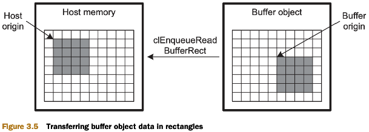

# Chapter 3: Host programming : data transfer and partitioning

## 3.1 Setting kernel arguments

- Tại chương 2, ta đã biết cách tạo ra các `kernels` từ các `functions`, nhưng chưa đề cập tới việc set `arguments` cho các hàm. Hàm `clSetKernelArg` cho phép thực hiện điều đó.

<a name="clSetKernelArg"></a>
```cpp
clSetKernelArg (cl_kernel kernel, cl_uint index, size_t size, const void *value);
```
where:
> `index`: xác định thứ tự của kernel argument trong danh sách các tham số của kernel function.<br>
> Nếu `index = 0` - first argument, `index = 1` - second argument.<br>
> `value`: con trỏ trỏ tới `data` sẽ được truyền vào kernel function. Con trỏ có thể trỏ tới các dạng dữ liệu sau:

|Pointer to|Description|
|---|---|
|Pointer to primitive data|Transfers simple primitives to the device|
|Pointer to a memory object|Transfers significant or complex data|
|Pointer to a sampler object|Transfers an object that defines how images are read|
|`NULL`|Transfers no data from the host; the device will just reserve memory in its local address space for the kernel argument|

- Example

```cpp
clSetKernelArg(proc, 0, sizeof(num), &num);
clSetKernelArg(proc, 1, sizeof(mem_obj), &mem_obj);
```

- Trong OpenCL, `memory objects` được biểu diễn bằng structure `cl_mem`, và chúng được chia thành 2 loại: `buffer objects` và `image objects`. Nếu `Memory objects` để lưu pixel data -> sử dụng `image objects`. Còn trong các trường hợp khác, ta nên lưu data trong `buffer objects`.

## 3.2 Buffer objects

- `Buffer objects` có thể gói bất kỳ loại dữ liệu nào mà không liên quan tới images. Khởi tạo bằng hàm `clCreateBuffer`:

```cpp
clCreateBuffer(cl_context context, cl_mem_flags options, size_t size, void *host_ptr, cl_int *error)
```
where:
> `@return`: trả về một `cl_mem`, cái mà chứ data được trỏ bở `host_ptr *`

<a name="table_memory_object_properties"></a>
|`cl_mem_flags`|Meaning|
|:---:|---|
|`CL_MEM_READ_WRITE`|The memory object can be read from and written to.|
|`CL_MEM_WRITE_ONLY`|The memory object can only be written to.|
|`CL_MEM_READ_ONLY`|The memory object can only be read from.|
|`CL_MEM_USE_HOST_PTR`|The memory object will access the memory region specified by the host pointer.|
|`CL_MEM_COPY_HOST_PTR`|The memory object will set the memory region specified by the host pointer.|
|`CL_MEM_ALLOC_HOST_PTR`|A region in host-accessible memory will be allocated for use in data transfer.|

- Ba properties đầu tiên xác định khả năng truy cập của `buffer object` - rằng buộc khả năng `devices` truy cập vào `buffer object`, không phải `host`.

- Ba properties tiếp theo, xác định cách mà một `buffer object` được allocated trong `host memory`.

- Khi set tham sô thứ 2 của hàm `clCreateBuffer`, ta thường tổ hợp của 2 flag. Một là một trong bộ 3 đầu - giúp cài đặt khả năng truy cập của `buffer object`, còn flag thứ 2 là một trong bộ 3 thứ 2 - xác định nơi `buffer object` được allocated.

### 3.2.1 Allocating buffer objects

- Với ví dụ dưới đây, một `buffer object` tên là `vec_buff` được tạo as `read-only`. `Buffer` này sẽ gói data được tham chiếu bởi `vec` và data bản đầu được allocated ở `host`, nên `vec` được gọi là `host pointer`.

```cpp
vec_buff = clCreateBuffer(context, CL_MEM_READ_ONLY | CL_MEM_COPY_HOST_PTR, sizeof(float)*32, vec, &error);
```

- "Tạo một `buffer object` để nắm dữ liệu đầu ra của `kernel`":
  - Sử dụng cờ `CL_MEM_WRITE_ONLY` để tạo một `buffer` chỉ `device` có thể viết vào nó.
  - Vì `device` allocate memory chứ không phải `host`, có nên ta set tham số `host pointer` là `NULL`.

- "Truyền data từ `host` sang `device`":
  - `host pointer` khác `NULL`.
  - Trong trường hợp này, cần xác định nơi mà `buffer object` cần được allocated.
    - Nếu `buffer object` truy cập vào vùng nhớ được tham chiếu bởi `host pointer`, dùng cờ `CL_MEM_USE_HOST_PTR`. Cách này tối ưu bộ nhớ, nhưng có một nhược điểm là việc truyền nhận dữ liệu giữa `host` và `devices` không thể dự đoán được.
    - Bên cạnh đó, ta có thể allocate memory ở một nơi khác và copy data từ `host pointer` sang nơi mới - sử dụng cờ `CL_MEM_COPY_HOST_PTR`. Các này không tối ưu bộ nhớ, nhưng nó cho phép ta có thể thay đổi `host pointer memory` ngay cả khi `host` đang trao đổi dữ liệu với `devices`.
    - Cờ `CL_MEM_ALLOC_HOST_PTR` có thể được sử dụng tổ hợp với `CL_MEM_COPY_HOST_PTR`, giúp rằng buộc new memory region là `host-accessible`.

- Example code:

```cpp
input_buffer = clCreateBuffer(context, CL_MEM_READ_ONLY | CL_MEM_COPY_HOST_PTR, sizeof(input_vector), input_vector, &error);
output_buffer = clCreateBuffer(context, CL_MEM_WRITE_ONLY, sizeof(input_vector), NULL, &error);

clSetKernelArg(kernel, 0, sizeof(cl_mem), &input_buffer);
clSetKernelArg(kernel, 1, sizeof(cl_mem), &output_buffer);
```

### 3.2.2 Creating subbuffer objects

- Giống như ta có thể tạo ra một `substring` từ một `string`, thì ta có thể tạo ra một `subbuffer object` từ một `buffer object`.

```cpp
clCreateSubBuffer(cl_mem buffer, cl_mem_flags flags, cl_buffer_create_type type, const void *info, cl_int *error)
```
where:
> `flags`: giống như [bảng](#table_memory_object_properties).<br>
> `type`: luôn luôn là `CL_BUFFER_CREATE_TYPE_REGION`.<br>
> `info`: con trỏ tới một `_cl_buffer_region` structure.

- Structure `_cl_buffer_region` được định nghĩa như sau :

```cpp
typedef struct _cl_buffer_region {
  size_t origin;  // the start of the subbuffer's data inside the buffer.
  size_t size;    // the size of the subbuffer.
} cl_buffer_region;
```

- Example code:

```cpp
cl_buffer_region region;
region.size = 40*sizeof(float);
region.origin = 50*sizeof(float);

sub_buffer = clCreateSubBuffer(main_buffer, CL_MEM_READ_ONLY, CL_BUFFER_CREATE_TYPE_REGION, &region, &err);
```

- `subbuffer` không allocate vùng nhớ riêng của nó để giữ data. Thay vào đó, nó truy cập vào cùng cùng nhớ của `main buffer`. Không cần thêm cờ `CL_MEM_COPY_HOST_PTR`.

## 3.3 Image objects

- `OpenCL` cung cấp một loại `memory objects` xác định để lưu `pixel data`.

- `Image objects` cũng được biểu diễn bằng một structure `cl_mem`.

### 3.3.1 Creating image objects

- `Image objects` bao gồm 2 loại: `2-d` và `3-d`.
  - `Two dimensional image objects`: được tạo bởi hàm `clCreateImage2D`.
  - `Three dimensional image objects`: được tạo bởi hàm `clCreateImage3D`.
  - Cả 2 hàm đều trả về một `cl_mem`.

```cpp
clCreateImage2D (cl_context context, cl_mem_flags opts, const cl_image_format *format, size_t width, size_t height, size_t row_pitch, void *data, cl_int *error)
clCreateImage3D (cl_context context, cl_mem_flags opts, const cl_image_format *format, size_t width, size_t height, size_t depth, size_t row_pitch, size_t slice_pitch, void *data, cl_int *error)
```
where:
> `context`, `opts`: được sử dụng để tạo `buffer objects`.<br>
> `format` (`const` [`cl_image_format`](#image_object_format)): xác định format của image data.<br>
> Các tham số còn lại (ngoại từ `error`): xác định `dimensions` và `pitches` của pixels trong ảnh.

#### IMAGE OBJECT FORMATS

- `format`: xác định cách mà các pixel của ảnh được lưu trữ trong memory.
<a name="image_object_format"></a>
```cpp
typedef struct _cl_image_format {
  cl_channel_order image_channel_order;
  cl_channel_type image_channel_data_type;
} cl_image_format;
```
where:
> `cl_channel_order`: định nghĩa cách biểu diễn các kênh theo từng pixel:
red, green, blue, and alpha channels: `CL_RGB`, `CL_RGBA`, `CL_ARGB`, `CL_BGRA`, `CL_RG`, `CL_RA`, `CL_R`, `CL_A`. Add bit padding: `CL_RGBx`, `CL_RGx`, and `CL_Rx`. `CL_INTENSITY` measures alpha independent of color. `CL_LUMINANCE` is used for grayscale images.<br>
> `cl_channel_type`: xác định cách các image's channel biểu diễn từng bit. Bao gồm: định dạng số từng kênh, số bit mỗi kênh.

|Image channel types|Meaning|
|:---:|---|
|`CL_HALF_FLOAT`|Each component is floating-point (16 bits).|
|`CL_FLOAT`|Each component is floating-point (32 bits).|
|`CL_UNSIGNED_INT8`|Each component is an unsigned integer (8 bits).|
|`CL_UNSIGNED_INT16`|Each component is an unsigned integer (16 bits).|
|`CL_UNSIGNED_INT32`|Each component is an unsigned integer (32 bits).|
|`CL_SIGNED_INT8`|Each component is a signed integer (8 bits).|
|`CL_SIGNED_INT16`|Each component is a signed integer (16 bits).|
|`CL_SIGNED_INT32`|Each component is a signed integer (32 bits).|
|`CL_UNORM_INT8`|Each component is a normalized unsigned integer (8 bits).|
|`CL_UNORM_INT16`|Each component is a normalized unsigned integer (16 bits).|
|`CL_SNORM_INT8`|Each component is a normalized signed integer (8 bits).|
|`CL_SNORM_INT16`|Each component is a normalized signed integer (16 bits).|
|`CL_UNORM_SHORT_565`|The RGB components are combined into a normalized 16-bit format (5-6-5).|
|`CL_UNORM_SHORT_555`|The xRGB components are combined into a normalized 16-bit format (x-5-5-5).|
|`CL_UNORM_INT_101010`|The xRGB components are combined into a normalized 32-bit format (x-10-10-10).|

- Thông thường 24-bit RGB color model được biểu diễn bởi `CL_UNSIGNED_INT8`, với mỗi 8-bit để lưu từng kênh. High-Color formats sử dụng `CL_UNORM_SHORT_565` thêm 1 extra bit ở kênh green. Định dạng ảnh 30-bit Deeo Color sử dụng `CL_UNORM_INT_101010` flag.

- Example code: Khởi tạo một `cl_image_format` structure chứa các pixels được định dạng theo 24-bit RGB.

```cpp
cl_image_format rgb_format;
rgb_format.image_channel_order = CL_RGB;
rgb_format.image_channel_data_type = CL_UNSIGNED_INT8;
```

#### IMAGE OBJECT DIMENSIONS AND PITCH

- Các tham số còn lại trong hàm `clCreateImage2D` và `clCreateImage3D` quy định chiều của `image object` và số bytes mỗi chiều (`pitch`). Mỗi chiều được tính theo `pixel`.

- `row_pitch`: xác định có bao nhiêu bytes trên từng hàng.

- `slice_pitch`: số bytes trên mỗi ảnh 2-d (mỗi `slice`).

- "If row_pitch is set to 0, OpenCL will assume its value equals width * (pixel size). If slice_pitch is set to 0, its value will be set to row_pitch * height. In this book's example code, row_pitch and slice_pitch will always be set to 0." (_cited: [OpenCL in Action How to Accelerate Graphics and Computations](https://www.manning.com/books/opencl-in-action) - Chapter 3 Host programming: data transfer and partitioning._
)

[]()

- Example code: tạo một ảnh 3-d chứa 4 slices, mỗi slice có kích thước `64x80` pixels, định dạng màu `rgb`, đây là một `read-only image object`. Trong trường hợp set cờ `CL_MEM_WRITE_ONLY`, `object data` bằng `NULL`.

```cpp
#define NUM_ROWS 64
#define NUM_COLS 80
#define NUM_SLICES 4

unsigned char image_data[NUM_SLICES][NUM_ROWS][NUM_COLS];
cl_image_format rgb_format;
rgb_format.image_channel_order = CL_RGB;
rgb_format.image_channel_data_type = CL_UNSIGNED_INT8;

cl_mem image_object = clCreateImage3D (context, CL_MEM_READ_ONLY | CL_MEM_COPY_HOST_PTR, rgb_format, NUM_COLS, NUM_ROWS, NUM_SLICES, NULL, NULL, image_data, &error);
```

### 3.3.2 Obtaining information about image objects

- Hàm `getImageInfo` cung cấp thông tin của `image object` về chiều và định dạng pixel.

```cpp
clGetImageInfo (cl_mem image, cl_image_info param_name, size_t param_value_size, void *param_value, size_t *param_value_size_ret)
```

|`cl_image_info`|Parameter value|Purpose|
|:---:|:---:|---|
|`CL_IMAGE_ELEMENT_SIZE`|`size_t`|Returns the bit size of the elements (pixels) that make up the image|
|`CL_IMAGE_WIDTH`|`size_t`|Returns the pixel width|
|`CL_IMAGE_HEIGHT`|`size_t`|Returns the pixel height|
|`CL_IMAGE_DEPTH`|`size_t`|Returns the depth of a 3-D image (the number of 2-D components)|
|`CL_IMAGE_ROW_PITCH`|`size_t`|Returns the row pitch (the number of bytes per row)|
|`CL_IMAGE_SLICE_PITCH`|`size_t`|Returns the slice pitch of a 3-D image (the number of bytes per 2-D component)|
|`CL_IMAGE_FORMAT`|`cl_image_format`|Returns the data structure that sets the image’s channel/pixel format|
|`CL_IMAGE_D3D10_SUBRESOURCE_KHR`|`ID3D10 Resource*`|Returns a pointer to the Direct3D subresource used to create the image object|

## 3.4 Obtaining information about buffer objects

- Trong khi `clGetImageInfo` chỉ cung cấp thông tin về `image objects`, ta có thể lấy thông tin của cả `image objects` và `buffer objects` bằng `clGetMemObjectInfo`:

```cpp
clGetMemObjectInfo(cl_mem object, cl_mem_info param_name, size_t param_value_size, void *param_value, size_t *param_value_size_ret);
```
where:
> 3 tham số đầu tiên: lần lượt là `memory objects`, tên xác định loại thông tin cần tìm, số lượng data yêu cầu.<br>
> 2 tham số cuối là tham số đầu ra

|`cl_mem_info`|`Parameter value`|Purpose|
|:---:|:---:|---|
|`CL_MEM_TYPE`|`cl_mem_object_type`|Returns the type of the memory object (`CL_MEM_OBJECT_BUFFER`, `CL_MEM_OBJECT_IMAGE2D`, or `CL_MEM_OBJECT_IMAGE3D`)|
|`CL_MEM_FLAGS`|`cl_mem_flags`|Returns the flags used to configure the memory object’s accessibility and allocation|
|`CL_MEM_HOST_PTR`|`void*`|Returns the host pointer that references the memory object’s data|
|`CL_MEM_SIZE`|`size_t`|Returns the size of the memory object’s data|
|`CL_MEM_CONTEXT`|`cl_context`|Returns the context associated with the memory object|
|`CL_MEM_ASSOCIATED_MEMOBJECT`|`cl_mem`|Returns the memory object from which this memory object was created (only valid for subbuffer objects)|
|`CL_MEM_OFFSET`|`size_t`|Returns the offset used to create the subbuffer object (only valid for subbuffer objects)|
|`CL_MEM_REFERENCE_COUNT`|`cl_uint`|Returns the memory object’s reference count (the number of times the object has been accessed)|
|`CL_MEM_D3D10_RESOURCE_KHR`|`ID3D10Resource*`|Returns a pointer to the OpenCL-Direct3D interface|

- Hàm này đặt biệt hữu ích khi ta muốn kiểm tra kích thước và địa chỉ của `memory object's data`.

<details>
  <summary>EXAMPLE CODE!</summary>

`buffer_check.c`

```cpp
#include <stdio.h>
#include <stdlib.h>
#include <sys/types.h>

#ifdef MAC
#include <OpenCL/cl.h>
#else
#include <CL/cl.h>
#endif

/* Find a GPU or CPU associated with the first available platform */
cl_device_id create_device() {

   cl_platform_id platform;
   cl_device_id dev;
   int err;

   /* Identify a platform */
   err = clGetPlatformIDs(1, &platform, NULL);
   if(err < 0) {
      perror("Couldn't identify a platform");
      exit(1);
   }

   /* Access a device */
   err = clGetDeviceIDs(platform, CL_DEVICE_TYPE_GPU, 1, &dev, NULL);
   if(err == CL_DEVICE_NOT_FOUND) {
      err = clGetDeviceIDs(platform, CL_DEVICE_TYPE_CPU, 1, &dev, NULL);
   }
   if(err < 0) {
      perror("Couldn't access any devices");
      exit(1);   }

   return dev;
}

int main() {

   /* Host/device data structures */
   cl_device_id device;
   cl_context context;
   cl_int err;

   /* Data and buffers */
   float main_data[100];
   cl_mem main_buffer, sub_buffer;
   void *main_buffer_mem = NULL, *sub_buffer_mem = NULL;
   size_t main_buffer_size, sub_buffer_size;
   cl_buffer_region region;
  
   /* Create device and context */
   device = create_device();
   context = clCreateContext(NULL, 1, &device, NULL, NULL, &err);
   if(err < 0) {
      perror("Couldn't create a context");
      exit(1);  
   }

   /* Create a buffer to hold 100 floating-point values */
   main_buffer = clCreateBuffer(context, CL_MEM_READ_ONLY |
      CL_MEM_COPY_HOST_PTR, sizeof(main_data), main_data, &err);
   if(err < 0) {
      perror("Couldn't create a buffer");
      exit(1);  
   }

   /* Create a sub-buffer */
   /* Modified on 2/12/2014 to account for unaligned memory error */
   region.origin = 5*sizeof(float);
   region.size = 30*sizeof(float);
   sub_buffer = clCreateSubBuffer(main_buffer, CL_MEM_READ_ONLY, CL_BUFFER_CREATE_TYPE_REGION, &region, &err);
   if(err < 0) {
      perror("Couldn't create a sub-buffer");
      printf("\n\t%i\n", err);
      exit(1);  
   }

   /* Obtain size information about the buffers */
   clGetMemObjectInfo(main_buffer, CL_MEM_SIZE,
         sizeof(main_buffer_size), &main_buffer_size, NULL);
   clGetMemObjectInfo(sub_buffer, CL_MEM_SIZE,
         sizeof(sub_buffer_size), &sub_buffer_size, NULL);
   printf("Main buffer size: %lu\n", main_buffer_size);
   printf("Sub-buffer size:  %lu\n", sub_buffer_size);
  
   /* Obtain the host pointers */
   clGetMemObjectInfo(main_buffer, CL_MEM_HOST_PTR, sizeof(main_buffer_mem),
  	      &main_buffer_mem, NULL);
   clGetMemObjectInfo(sub_buffer, CL_MEM_HOST_PTR, sizeof(sub_buffer_mem),
  	      &sub_buffer_mem, NULL);
   printf("Main buffer memory address: %p\n", main_buffer_mem);
   printf("Sub-buffer memory address:  %p\n", sub_buffer_mem);

   /* Print the address of the main data */
   printf("Main array address: %p\n", main_data);

   /* Deallocate resources */
   clReleaseMemObject(main_buffer);
   clReleaseMemObject(sub_buffer);
   clReleaseContext(context);

   return 0;
}
```

`Makefile`

```Makefile
PROJ=buffer_check

CC=gcc

CFLAGS=-std=c99 -Wall -DUNIX -g -DDEBUG

# Check for 32-bit vs 64-bit
PROC_TYPE = $(strip $(shell uname -m | grep 64))

# Check for Mac OS
OS = $(shell uname -s 2>/dev/null | tr [:lower:] [:upper:])
DARWIN = $(strip $(findstring DARWIN, $(OS)))

# MacOS System
ifneq ($(DARWIN),)
	CFLAGS += -DMAC
	LIBS=-framework OpenCL

	ifeq ($(PROC_TYPE),)
		CFLAGS+=-arch i386
	else
		CFLAGS+=-arch x86_64
	endif
else

# Linux OS
LIBS=-lOpenCL
ifeq ($(PROC_TYPE),)
	CFLAGS+=-m32
else
	CFLAGS+=-m64
endif

# Check for Linux-AMD
ifdef AMDAPPSDKROOT
	INC_DIRS=. $(AMDAPPSDKROOT)/include
	ifeq ($(PROC_TYPE),)
		LIB_DIRS=$(AMDAPPSDKROOT)/lib/x86
	else
		LIB_DIRS=$(AMDAPPSDKROOT)/lib/x86_64
	endif
else

# Check for Linux-Nvidia
ifdef NVSDKCOMPUTE_ROOT
	INC_DIRS=. $(NVSDKCOMPUTE_ROOT)/OpenCL/common/inc
endif

endif
endif

$(PROJ): $(PROJ).c
	$(CC) $(CFLAGS) -o $@ $^ $(INC_DIRS:%=-I%) $(LIB_DIRS:%=-L%) $(LIBS)

.PHONY: clean

clean:
	rm $(PROJ)
```

</details>

## 3.5 Memory object transfer commands

- OpenCL cung cấp nhiều hàm để `enqueue data transfer commands` chia ra làm 3 loại:
  - Các hàm để khởi tạo `read/write data transfer`.
  - Các hàm để `map/unmap memory`.
  - Các hàm để `copy data` giữa các `memory objects`.

- Các hàm này không tạo ra `memory objects` mới, mà chúng truy cập data từ `memory objecst` đã được truyền tới `devices` như một `kernel arguments`.

### 3.5.1 Read/write data transfer

- Ta đã biết: để gửi một `memory objects` tới `devices` thì sử dụng [`clSetKernelArg`](#clSetKernelArg). Nhưng khi ta tạo ra một `write-only buffer object` để chứa `device's output`, sau khi kernel hoàn thành task vụ, làm thế nào để lấy buffer data trở lại `host`.

- Có 6 hàm cho phép đọc và viết vào `memory objects`. `read` operation chuyển data từ `memory object` tới `host memory`. `write` operation chuyển data từ `host memory` tới `memory object`.


|Functions that read and write memory objects|Purpose|
|:---|---|
|`clEnqueueReadBuffer(cl_command_queue queue, cl_mem buffer, cl_bool blocking, size_t offset, size_t data_size, void *ptr, cl_uint num_events, const cl_event *wait_list, cl_event *event)`|Reads data from a buffer object to host memory|
|`clEnqueueWriteBuffer(cl_command_queue_queue, cl_mem buffer, cl_bool blocking, size_t offset, size_t data_size, const void *ptr, cl_uint num_events, const cl_event *wait_list, cl_event *event)`|Writes data from host memory to a buffer object|
|`clEnqueueReadImage(cl_command_queue queue, cl_mem image, cl_bool blocking, const size_t origin[3], const size_t region[3], size_t row_pitch, size_t slice_pitch, void *ptr, cl_uint num_events, const cl_event *wait_list, cl_event *event)`|Reads data from an image object to host memory|
|`clEnqueueWriteImage(cl_command_queue queue, cl_mem image, cl_bool blocking, const size_t origin[3], const size_t region[3], size_t row_pitch, size_t slice_pitch, const void * ptr, cl_uint num_events, const cl_event *event_wait_list, cl_event *event)`|Writes data from host memory to an image object|
|`clEnqueueReadBufferRect(cl_command_queue_queue, cl_mem buffer, cl_bool blocking, const size_t buffer_origin[3], const size_t host_origin[3], const size_t region[3], size_t buffer_row_pitch, size_t buffer_slice_pitch, size_t host_row_pitch, size_t host_slice_pitch, void *ptr, cl_uint num_events, const cl_event *wait_list, cl_event *event)`|Reads a rectangular portion of data from a buffer  object to host memory|
|`clEnqueueWriteBufferRect(cl_command_queue queue, cl_mem buffer, cl_bool blocking, const size_t buffer_origin[3], const size_t host_origin[3], const size_t region[3], size_t buffer_row_pitch, size_t buffer_slice_pitch, size_t host_row_pitch, size_t host_slice_pitch, void *ptr, cl_uint num_events, const cl_event *wait_list, cl_event *event)`|Writes a rectangular portion of data from host memory to a buffer object|

- Trong từng hàm trên, hai argument quan trọng gồm: tham số `cl_mem` - xác định `memory objects` trên `device`, và `void` pointer tham chiếu tới `host memory`. Tham số boolean `blocking = CL_TRUE`, hàm sẽ không return nếu quá trình `read/write` chưa kết thúc. Còn nếu `blocking = CL_FALSE`, hàm sẽ enqueue lệnh `read/write` nhưng sẽ không chờ quá trình data transfer kết thúc. Các tham số còn lại xác định phần nào của `memory object` có thể được truy cập. `offset`: điểm bắt đầu của `buffer data` để `read/write`. `data_size`: số lượng dữ liệu tính từ `offset` cần được truyền.

[]()

- Các hàm `clEnqueueReadImage` và `clEnqueueWriteImage` có thêm 2 tham số là `orgin[3]` và `region[3]`. Hai mảng này xác định vùng hình chữ nhật của `image data` được truyền vào hoặc truyền ra `image object`. Trong đó: `origin[3] = [column, row, slice]` xác định vị trí của tọa độ điểm pixel đầu tiên, `region[3] = [width, height, depth]` xác định kích thước của vùng truy cập. (Đối với ảnh `2-d`: `origin = [column, row, 0]` và `region = [width, height, 0]`)

<p align="center">
  
</p>

- Hai hàm cuối cùng: `clEnqueueReadBufferRect` và `clEnqueueWriteBufferRect` giúp chuyển dữ liệu vào ra `buffer objects`, nhưng chúng truy cập dữ liệu theo `rectangular regions` tương tự chuyển `image data`. Bên cạnh `region[3]`, `buffer_origin[3]` xác định điểm bắt đầu của `buffer object data` và `host_origin[3]` là điểm bắt đầu của dữ liệu trong `host memory`. Ngoài ra, ta còn phải xác định `row pitch` và `slide pitch` cho cả `host objects` và `buffer objects`, nhưng các tham số này có thể đặt bằng `0`.

- `clEnqueueReadBufferRect` và `clEnqueueWriteBufferRect` thích hợp để chuyển dữ liệu nhiều chiều nhưng không liên quan tới ảnh. _Ví dụ: giả sử ta lưu một ma trận trong một `buffer object`, và ta muốn đọc một ma trận con vào `host memory`, khi đó `clEnqueueReadBufferRect` được sử dụng_.

<p align="center">
  
</p>

### 3.5.2 Mapping memory objects

- Với `C/C++` thông thường, khi cần truy cập vào 1 file, ta thường đặt `file's content` vào một `process memory` và đọc hoặc sửa sử dụng `memory operations` - đây gọi là `memory-mapping`, nó thường cải thiện hiệu năng hơn so với `file I/O` thông thường.

- OpenCL cung cấp một cơ chế tương tự để truy cập `memory objects`, thay cho phép `read/write` ở phần trước, ta có thể map một `memory object` trên device lên một `memory region` trên `host`.

- Các hàm `enqueue commands` để `map/unmap memory objects`, Nhưng ta không nhất thiết phải map toàn bộ `memory object`. Đối với `buffer objects`, ta có thể truy cập bất kỳ `1-d region`. Với `image objects`, ta truy cập một `rectangular region`.

- Đối với 2 hàm `clEnqueueMapBuffer` và `clEnqueueMapImage`, các hàm trả về một con trỏ `void *` - con trỏ này phục vụ 2 mục đích: nó xác định điểm bắt đầu của `mapped memory` ở trên `host`, bên cạnh đó nó để `clEnqueueUnmapMemObject` biết vùng nào để `unmap`.

- 2 hàm map có một tham số `map_flags`: nó được sử dụng để cấu hình khả năng truy cập vào `mapped memory` trên `host`.
   - `map_flags = CL_MAP_READ`: mapped-memory read-only.
   - `map_flags = CL_MAP_WRITE`: mapped-memory read-only.
   - `map_flags = CL_MAP_READ | CL_MAP_WRITE`: mapped-memory readable and writeable.

- Làm việc với `memory-mapped` trong OpenCL bao gồm 3 bước: enqueue một `memory map operation` bằng cách gọi một trong 2 hàm: `clEnqueueMapBuffer` hoặc `clEnqueueMapImage`. Sau đó truyền data qua lại với `mapped memory` với hàm `memcpy`. Cuối cùng, unmap bằng hàm `clEnqueueUnmapMemObject`.

|Functions that map and unmap memory objects|Purpose|
|---|---|
|`void* clEnqueueMapBuffer(cl_command_queue queue, cl_mem buffer, cl_bool blocking, cl_map_flags map_flags, size_t offset, size_t data_size, cl_uint num_events, const cl_event *wait_list, cl_event *event, cl_int *errcode_ret)`|Maps a region of a buffer object to host memory|
|`void* clEnqueueMapImage(cl_command_queue queue, cl_mem image, cl_bool blocking, cl_map_flags map_flags, const size_t origin[3], const size_t region[3], size_t *row_pitch, size_t *slice_pitch, cl_uint num_events, const cl_event *wait_list, cl_event *event, cl_int *errcode_ret)`|Maps a rectangular region of an image object to host memory|
|`int clEnqueueUnmapMemObject(cl_command_queue queue, cl_mem memobj, void *mapped_ptr, cl_uint num_events, const cl_event *wait_list, cl_event *event)`|Unmaps an existing memory object from host memory|

### 3.5.3 Copying data between memory objects

- Ngoài các hàm giúp chuyển dữ liệu giữa `host memory` và `memory object`, thì OpenCL cung cấp các hàm trao đổi dữ liệu giữa các `memory objects`. Những hàm này cho phép ta copy dữ liệu giữa 2 `memory objects` trên một `device` cũng như giữa các `memory objects` trên các `devices` khác nhau.

|Functions that copy data between memory object|Purpose|
|---|---|
|`clEnqueueCopyBuffer(cl_command_queue queue, cl_mem src_buffer, cl_mem dst_buffer, size_t src_offset, size_t dst_offset, size_t data_size, cl_uint num_events, const cl_event *wait_list, cl_event *event)`|Copies data from a source buffer object to a destination buffer object|
|`clEnqueueCopyImage(cl_command_queue queue, cl_mem src_image, cl_mem dst_image, const size_t src_origin[3], const size_t dst_origin[3], const size_t region[3], cl_uint num_events, const cl_event *wait_list, cl_event *event)`|Copies data from a source image object to a destination image object|
|`clEnqueueCopyBufferToImage(cl_command_queue queue, cl_mem src_buffer, cl_mem dst_image, size_t src_offset, const size_t dst_origin[3], const size_t region[3], cl_uint num_events, const cl_event *wait_list, cl_event *event)`|Copies data from a source buffer object to a destination image object|
|`clEnqueueCopyImageToBuffer(cl_command_queue queue, cl_mem src_image, cl_mem dst_buffer, const size_t src_origin[3], const size_t region[3], size_t dst_offset, cl_uint num_events, const cl_event *wait_list, cl_event *event)`|Copies data from a source image object to a destination buffer object|
|`clEnqueueCopyBufferRect(cl_command_queue queue, cl_mem src_buffer, cl_mem dst_buffer, const size_t src_origin[3], const size_t dst_origin[3], const size_t region[3], size_t src_row_pitch, size_t src_slice_pitch, size_t dst_row_pitch, size_t dst_slice_pitch, cl_uint num_events, const cl_event *wait_list, cl_event *event) `|Copies data from a rectangular region in a source buffer object to a rectangular region in a destination buffer object|

- Hình 3.6 là một ví dụ minh hoạ cách map và copy các `memory objects`. Mục đích là tạo ra 2 `buffer objects` và copy nội dung của `Buffer 1` sang `Buffer 2` với `clEnqueueCopyBuffer`. Sau đó `clEnqueueMapBuffer` để map nội dung của `Buffer 2` và `host memory`. Và hàm `memcpy` giúp chuyển `mapped memory` thành một array.

[]()

## 3.6 Data partitioning

- Khi triển khai một thuật toán với `OpenCL`, ta có thể phải xử lý một lượng lớn data. Điều này khiển việc phân vùng trở nên ưu tiên - vì phân phối `processing load` các tốt thì `computational tasks` càng kết thúc nhanh.

- Ta đã biết cách phân chia dữ liệu giữa nhiều thiết bị, nhưng ta còn có thể phân vùng dữ liệu của mình hơn nữa. Hầu hết các thiết bị OpenCL đều chứa một số `processing element` và với mã phù hợp, ta có thể kiểm soát lượng dữ liệu mà mỗi `processing element` nhận được.

- `clEnqueueNDRangeKernel` giống như `clEnqueueTask`: đặt một `kernel` trong một `command queue` để thực thi. Nhưng không giống như `clEnqueueTask`, `clEnqueueNDRangeKernel` cho phép ta kiểm soát cách `kernel execution` được phân phối giữa các tài nguyên xử lý của thiết bị.

```cpp
clEnqueueNDRangeKernel(cl_command_queue queue, cl_kernel kernel, cl_uint work_dims, const size_t *global_work_offset, const size_t *global_work_size, const size_t *local_work_size, cl_uint numevents, const cl_event *waitlist, cl_event *event)
```
where:
> `work_dims`: số chiều của dữ liệu.<br>
> `global_work_offset`: `global ID offsets` trong từng chiều.<br>
> `global_work_size`: số lương `work-items` trong từng chiều.<br>
> `local_work_size`: số lương `work-items` trong `work-group` trong từng chiều.

### 3.6.1 Loops and work-items

- Đối với `C/C++` truyền thống, khi ta xử lý một lượng lớn dữ liệu, ta thường phải sử dụng vòng lặp để lặp qua data (thậm chí là nested-loop). Qua từng vòng lặp, yêu cầu một phép cộng và một phép so sánh. Các phép so sánh là cực kỳ chậm đối với các thiết bị như GPU.

```cpp
for(i=0; i<Z; i++)
{
   for(j=0; j<Y; j++)
   {
      for(k=0; k<X; k++)
      {
         process(point[i][j][k]);
      }
   }
}
```

- Một khía cạnh hấp dẫn của OpenCL là ta không cần phải cấu hình những vòng lặp này ở trong kernel, thay vào đó `kernel` chỉ cần thực thi code nằm trong vòng lặp trong cùn. Ta gọi từng `individual kernel execution` này là một `work-item`. Đối với ví dụ trên, `work item` chỉ bao gồm một hàm: `process(point[i][j][k])`.

- Sự khác nhau giữa `kernel` và `work-item` là: `kernel` là một tập các `task` được thực thi trên dữ liệu. Còn `work-item` là một phép triển khai của một `kernel` trên một tập dữ liệu nhất định. Mỗi `kernel` có thể là nhiều `work-item`. Trong ví dụ trên `process(point[i][j][k])` là một `kernel`, còn `process(point[1][2][3])` là một `work-item`.

- Mảng `{i, j k}` được gọi là `global ID` của `work-item`. Nó xác định `work-item` duy nhất cho phép truy cập dữ liệu phải xử lý. Sau khi một `work-item` thực thi xong, một `work-item` mới sẽ được thực thi với `global ID` khác.

- Số  phần tử của `global ID` tương ứng với số chiều của dữ liệu - tham số truyền vào `work_dims` của `clEnqueueNDRangeKernel`. Số chiều bé là `1` và lớn nhất phụ thuộc vào thiết bị. Có thể truy vấn bằng cách gọi hàm `clGetDeviceInfo` với tham số `CL_DEVICE_MAX_WORK_ITEM_DIMENSIONS`

```cpp
int i = get_global_id(0);
int j = get_global_id(1);
int k = get_global_id(2);
process(point[i][j][k]);
```

### 3.6.2 Work sizes and offsets

- Phần bên phải của `hình 3.7` biểu diễn `index space`.
- `index space` bao gồm tất cả các tổ hợp của các chỉ số, nếu có `N` chỉ số khác nhau trong vòng lặp, thì ta có `index space` N-d.

- Tham số `global_work_size` của hàm `clEnqueueNDRangeKernel` xác định số lượng `work-items` cần được xử lý theo từng chiều. Trong `hình 3.7`, vòng lặp trong cùng chạy từ `k=3` đến `k=11`, nên có `9 work-items` trên `k-direction`. Tương tự, có `6 work-items` theo trục `j-direction` và `4 work-items` theo trục `i-direction`. Do đó, ta sẽ đặt `global_work_sizes = {4, 6, 9}`.

[]()

### 3.6.3 A simple one-dimensional example

- Xét ví dụ `hình 3.8`, ứng dụng OpenCL thực hiện nhân một vector với một matrix và tạo ra một vector. `hình 3.8` mô tả một `buffer object` chứa data và cách dữ liệu của nó được phân vùng thành `4 work-items`.

- Phép nhân `matrix-vector` bao gồm 4 `dot products`: và thực hiện phép nhân với `4 work-items`.

```cpp
work_items_per_kernel = 4;
clEnqueueNDRangeKernel(queue, kernel, 1, NULL, &workitemsperkernel, NULL, 0, NULL, NULL);
```

- Điều này thông báo cho OpenCL rằng, dữ liệu được phân vùng thành từng `single dimension` và `4 work-items` cần được tạo để thực hiện trong kernel.

- Bên phía `kernel`, từng `work-item` kiểm tra `global ID` và truy cập từng dòng của matrix. thực hiện nhân một hàng `1x4`) với một vector `4x1` sử dụng hàm `dot`.

```cpp
int i = get_global_id(0);
result[i] = dot(matrix[i], vector[0]);
```

[]()

### 3.6.4 Work-groups and compute units

- `work-group` là một tổ hợp của các `work-items` - cái mà truy cập vào cùng `processing resources`. Trong lập trình, `work-groups` cung cấp 2 ưu điểm:
   - Các `work-items` trong một `work-groups` có thể truy cập vào cùng một `block of high-speed memory` (được gọi là `local memory`).
   - Các `work-items` trong một `work-groups` có thể được đồng bộ sử dụng `fences` và `barriers`.

- Bên cạnh `global ID`, từng `work-item` có một `local ID` để phân biệt nó với các `work-items` khác trong `work-group`. Số `work-items` trong `work-group` được đặt thông qua tham số `local_work_size` của hàm `clEnqueueNDRangeKernel`.

- Ví dụ với `hình 3.7`, ta sẽ tạo các `work-groups` từ các `2-d slices`. Có `4-slices` nên ta có `4 work-groups`. Và từng `work-groups` bao gồm `6 work-items` theo trục `j-direction` và `9 work-items` theo trục `k-direction`. Do đó, ta sẽ đặt tham số `local_work_size={0, 6, 9}`

- Trong `OpenCL`, `processing resources` có khả năng hỗ trợ `work-group` được gọi là `compute unit`. Mỗi `work-group` thực thi trên một `compute unit` và mỗi `compute unit` chỉ thực thi `work-group` tại một thời điểm.

- Ta không cần phải tạo `work-group`. Nếu đặt `local_work_size=NULL`, `OpenCL` sẽ quyết định cách tốt nhất để phân phối các `work-items` giữa các `processing elements` của thiết bị.

[]()

## 3.7 Summary

- _OpenCL provides a memory object (`cl_mem`) data structure as a standard mechanism for transferring data between a `host` and a `device`. The process of transferring memory objects is simple: create a `memory object` from existing data, and call `clSetKernelArg` to make the object into a `kernel argument`. When the kernel executes, the kernel will be able to access its data as a regular function parameter. Then, as the host sends further commands, the `device` may transfer data to the `host` or copy the data to another `buffer object`._

- _There are two types of `memory objects`. `Buffer objects` store general data in a single dimension, and `image objects store` formatted pixel data in two or three dimensions. For both types, OpenCL provides functions that enqueue data transfer commands. `Read/ write` functions transfer data between a `memory object` and a `host`, but you can usually improve performance by `mapping` the memory object’s memory to host memory._

- _The last part of this chapter discussed data partitioning, which is crucial for any OpenCL application that demands high performance. The basic unit of work is the `work-item`, which corresponds to the code executed within a traditional C/C++ loop. Each `work-item` receives a global ID that allows it to access data specifically intended for it. If `work-items` require synchronization, they can be placed into `work-groups`. Each `work-group` executes on a single `compute unit` on the `device`._

- _This chapter, in conjunction with chapter 2, has explained almost everything you need to know about host applications. The only topics that remain to be covered are synchronization, event-processing, and threads, which will be discussed in chapter 7. In the next chapter, we’ll depart from host programming and launch our discussion of kernel development_

_cited: [OpenCL in Action How to Accelerate Graphics and Computations](https://www.manning.com/books/opencl-in-action) - Chapter 2 Host programming: fundamental data structures._
