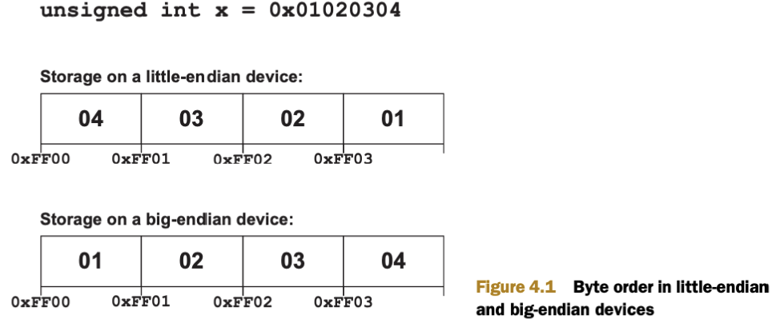

# Chapter 4: Kernel programming: data types and device memory

## 4.1 Introducing kernel coding

```c++
__kernel void hello_kernel(__global char16 *msg)
{
    *msg = (char16)('H', 'e', 'l', 'l', 'o', ' ', 'k', 'e', 'r', 'n', 'e', 'l', '!', '!', '!', '\0'); 
}
```

- Trong ví dụ của ứng dụng `Hello World` bên trên, ta thấy chương trình OpenCL khá giống một hàm C thông thường với: tên hàm, các tham số truyền vào nằm trong `()`, các câu lệnh nằm trong `{}`.

- Tuy nhiên vẫn có sự khác biệt:
  
  - Mỗi `kernel` được khai báo phải bắt đầu bằng `__kernel`.
  - Mỗi `kernel` pải return `void`.
  - Một số `platform` sẽ không biên dịch `kernel` không có `arguments`.

- Các `kernels` được lưu trong file `.cl`, nhưng không cần thiết phải lưu riêng biệt. Keyword `__kernel` xuất hiện, trình biên dịch sẽ biết rằng hàm đó sẽ chạy trên `device` chứ không phải `host`.

- Hàm `clSetKernelArg` dùng để truyền các `arguments` vào `kernels`, nhưng không có hàm nào có chức năng truy cập vào `kernel` để lấy giá trị trả về. Đó là lý do tại sao, mỗi `kernel` return `void`.

- Giống như một chương trình `C`, `kernel` chấp nhận tham số là tham trị hoặc tham chiếu. Khi truyền `pass data by value`, ta đưa dữ liệu gốc như một `char`, `int`, `float`. `Kernel` không hỗ trợ các cấu trúc tổng hợp. Nếu truyền `pass data by reference`, là ta truyền một con trỏ tham chiếu tới dữ liệu trong `device memory` (thường là `memory object`).

- *__All pointers passed to a kernel must be preceded by an `address space qualifier`. This tells the device what address space the argument should be stored in. There are four possible `qualifiers`: `__global`, `__constant`, `__local`, and `__private`.__*

## 4.2 Scalar data types

|`Scalar data type`|Purpose|
|---|---|
|`bool`|A Boolean condition: `true` `1` or `false` `0`|
|`char`|Signed two’s complement 8-bit integer|
|`unsigned char` `uchar`|Unsigned two’s complement 8-bit integer|
|`short`|Signed two’s complement 16-bit integer|
|`unsigned short` `ushort`|Unsigned two’s complement 16-bit integer|
|`int`|Signed two’s complement 32-bit integer|
|`unsigned int` `uint`|Unsigned two’s complement 32-bit integer|
|`long`|Signed two’s complement 64-bit integer|
|`unsigned long` `ulong`|Unsigned two’s complement 64-bit integer|
|`half`|16-bit floating-point value, IEEE-754-2008 conformant|
|`float`|32-bit floating-point value, IEEE-754 conformant|
|`intptr_t`|Signed integer to which a void pointer can be converted|
|`uintptr_t`|Unsigned integer to which a void pointer can be converted|
|`ptrdiff_t`|Signed integer produced by pointer subtraction |
|`size_t`|Unsigned integer produced by the size of operator|
|`void`|Untyped data|

- Các kiểu dữ liệu tương tự như `C/C++`, một câu hỏi đặt ra `double` ở đâu?.

### 4.2.1 Accessing the `double` data type

- Dữ liệu kiểu `double` có thể được accessed nếu `device` hỗ trợ `cl_khr_fp64` extension. Sử dung hàm `clGetDeviceInfo` từ host để xác định có hỗ trợ `fp64` không. Nếu extension đượcc hỗ trợ, ta có thể cho bật khả năng này bằng dòng lệnh `pragma` sau:

```c++
#pragma OPENCL EXTENSION cl_khr_fp64 : enable
```
- Nếu muốn kích hoạt tất cả các extension, thay `cl_khr_fp64` bằng `all`. Để disable extension, thay `enable` bằng `disable`.

- Nếu `cl_khr_fp64` được hỗ trợ, `host` phải thêm một option `-DFP_64` vào `clBuildProgram`.

- `host` code cũng cầng kiếm tra độ động địa chỉ của `target device`. Nếu cần xử lý với `size_t` và `ptrdiff_t` ở mức `bit`, cần chú ý là `size_t` và `ptrdiff_t` có độ rộng 64-bit nếu OS-64bit, và rộng 32-bit với OS 32-bit.

<p align="center">
  
</p>

### 4.2.2 Byte order

- There are two ways to determine whether a device is `little-endian` or `big-endian`. From the `host`, you can call `clGetDeviceInfo` with `CL_DEVICE_ENDIAN_LITTLE` as the parameter. If this returns `CL_TRUE`, the device is `little-endian`. If it returns `CL_FALSE`, the device is `big-endian`.

- Within the `kernel`, you can use `#ifdef` to determine whether the `__ENDIAN_LITTLE__` macro is defined. If this `macro` is defined, the device is `littleendian`. If not, the device is `big-endian`.

## 4.3 Floating-point computing

### 4.3.1 The float data type

### 4.3.2 The `double` data type

### 4.3.3 The half data type

### 4.3.4 Checking IEEE-754 compliance

## 4.4 Vector data types

|Vector data type|Purpose|
|:---:|---|
|`charn`|Vector containing n 8-bit signed two’s complement integers|
|`ucharn`|Vector containing n 8-bit unsigned two’s complement integers|
|`shortn`|Vector containing n 16-bit signed two’s complement integers|
|`ushortn`|Vector containing n 16-bit unsigned two’s complement integers|
|`intn`|Vector containing n 32-bit signed two’s complement integers|
|`uintn`|Vector containing n 32-bit unsigned two’s complement integers|
|`longn`|Vector containing n 64-bit signed two’s complement integers|
|`floatn`|Vector containing n 32-bit single-precision floating-point values|
|`ulongn`|Vector containing n 64-bit unsigned two’s complement integers|

`n` represents a number, and OpenCL accepts `2`, `3`, `4`, `8`, and `16` as valid
values of n.

### 4.4.1 Preferred vector widths

- OpenCL tiêu chuẩn yêu cầu trình biên dịch của `device` biết giới hạn tính toán và chia một vector lớn thành các kích thước nhỏ hơn. Kích thước này có thể hiểu là kích thước vector mà `device` tính toán không gặp lỗi - `preferred vector width`.

- Để xác định `vector width`:

```C++
cl_uint char_width;
clGetDeviceInfo(device, CL_DEVICE_PREFERRED_VECTOR_WIDTH_CHAR, sizeof(char_width), &char_width, NULL);
```

### 4.4.2 Initializing vectors

```c++
float4 data_vec = (float4)(1.0, 1.0, 1.0, 1.0);

float2 a_vector = (float2)(1.0, 1.0);
float2 b_vector = (float2)(2.0, 2.0);
float4 c_vector = (float4)(a_vector, b_vector);

float3 rgb = (float3)(0.25, 0.5, 0.75);
float4 rgba = (float4)(rgb, 1.0);
```

### 4.4.3 Reading and modifying vector components

- OpenCL có 3 cách để select components của một vector:
  - `numberindexing` : phù hợp cho truy cập các phần tử trong các ứng dụng thông thường.
  - `letter-indexing` : phù hợp cho các ứng dụng graphic.
  - `hi/lo/even/odd` : phù hợp khi muốn truy cập một nửa vector cùng lúc.

1. __NUMBER-INDEXING__

- Truy cập phần tử vector bằng các cho thêm `.sN` hoặc `.SN` phía sau tên `vector` (`N` là vị trí truy cập).

```C++
char16 msg = (char16)('H', 'e', 'l', 'l', 'o', 'P', 'r', 'o', 'g', 'r', 'a', 'm', 'm', 'e', 'r', '!');
```

|Code|Result|
|:---:|---|
|`char a = msg.s0;`|Sets `a` to `'H'`|
|`char b = msg.s4;`|Sets `b` to `'o'`|
|`char c = msg.s8;`|Sets `c` to `'g'`|
|`char d = msg.sC;`|Sets `d` to `'m'`|

- *Ví dụ cuối: `sC` là truy cập phần tử `0x0C`*. Vì số lượng phần tử tối đa của 1 vector là `16`, nên sử dụng `hexadecimal` đảm bảo các index sử dụng 1 ký tự.

- Ta có thể truy cập nhiều phần tử cùng lúc với nhiều indices.

|Code|Result|
|---|---|
|`char8 e = msg.s01234567;`|Sets `e` to `'HelloPro'`|
|`char4 f = msg.s5431;`|Sets `f` to `'Pole'`|
|`char16 h = msg.sFEDCBA9876543210;`|Sets `h` to `'!remmargorPolleH'`|
|`char8 g = (char8)(msg.0ABB, msg.sE9, msg.sE9)`|Sets `g` to `'Hammerer'`|

- Để modify các phần tử trong vector:

|Code|Result|
|---|---|
|`msg.s5 = 'O';`|Sets sixth character to `'O'`|
|`msg.sB986 = (char4)('c', 'C', 'n', 'P');`|Sets characters to `'c'`, `'C'`, `'n'`, and `'P'`|
|`msg.s7E = (char2)(msg.s1);`|Sets eighth, sixteenth characters to `'e'`|
|`msg.sACDF = (char4)((char2)('L', 'o'), (char2)('d', 'r'));`|Sets characters to `'L'`, `'o'`, `'d'`, and `'r'`|

2. __LETTER-INDEXING__

- Xử lý đồ họa thường sử dụng hệ tọa độ homogeneus gồm 4 trục: `x`, `y`, `z` và `scaling factor`. OpenCL cho phép sử dụng các chữ cái `x`, `y`, `z`, `w` để truy cập, giống như truy cập vector 4 phần tử: `.s0`, `.s1`, `.s2`, `.s3`.

```C++
float4 coord = (float4)(3.0, 5.0, 7.0, 9.0);
```

|Code|Result|
|---|---|
|`float a = coord.x;`|Sets `a` to `3.0`|
|`float b = coord.y;`|Sets `b` to `5.0`|
|`float c = coord.z;`|Sets `c` to `7.0`|
|`float d = coord.w;`|Sets `d` to `9.0`|

- Creating subvectors from a vector using letters

```C++
float4 coord = (float4)(5.0, 7.0, 9.0, 11.0);
```

|Code|Result|
|---|---|
|`float2 e = coord.xy;`|Sets `e` to `(5.0, 7.0)`|
|`float2 f = coord.zx;`|Sets `f` to `(9.0, 5.0)`|
|`float3 g = coord.yyx;`|Sets `g` to `(7.0, 7.0, 5.0)`|
|`float4 h = coord.wwwx;`|Sets `h` to `(11.0, 11.0, 11.0, 5.0)`|

- Modifying elements of a vector using letters

```C++
float4 coord = (float4)(7.0, 9.0, 11.0, 13.0);
```

|Code|Result|
|---|---|
|`coord.x = 2.0;`|Sets first element to `2.0`|
|`coord.zy = (float2)(4.0, 3.0);`|Sets third, second elements to `(4.0, 3.0)`|
|`coord.wzx = (float3)((float2)(4.0, 3.0), 2.0)`|Sets fourth, first, second elements to `(4.0, 3.0, 2.0)`|
|`coord.wzyx = coord.s3210`|Leaves the vector unchanged|

2. __`HI`, `LO`, `EVEN`, `ODD`__

|Code|Result|
|:---:|---|
|`hi`|Components in the upper half (indices equal to `N/2, N/2 + 1 ... N–1`)|
|`lo`|Components in the lower half (indices equal to `0, 1, ... N/2–1`)|
|`even`|Even elements|
|`odd`|Odd elements|

```C++
ushort8 shorts = (ushort8)(0, 10, 20, 30, 40, 50, 60, 70);
```

|Code|Result|
|---|---|
|`ushort4 a = shorts.hi;`|Sets `a` to `(40, 50, 60, 70)`|
|`ushort4 b = shorts.lo;`|Sets `b` to `(0, 10, 20, 30)`|
|`ushort4 c = shorts.even;`|Sets `c` to `(0, 20, 40, 60)`|
|`ushort4 d = shorts.odd;`|Sets `d` to `(10, 30, 50, 70)`|
|`ushort8 e = (ushort8)(a, b);`|Sets `e` to `(40, 50, 60, 70, 0, 10, 20, 30)`|
|`shorts.odd = (ushort4)(shorts.s2);`|Sets odd elements to `20`|
|`shorts.hi = (ushort4)(5, 15, 25, 35);`|Sets upper half to `(5, 15, 25, 35)`|
|`shorts.even = shorts.odd;`|Sets even elements to odd elements|

### 4.4.4 Endianness and memory access

## 4.5 The OpenCL device model

- `Address space modifier` chỉ định nơi lưu dữ liệu. Trong `OpenCL`, mỗi `kernel argument` tham chiếu memory, phải có một `address space modifier`.

### 4.5.1 Device model analogy part 1: math students in school

### 4.5.2 Device model analogy part 2: work-items in a device

- `OpenCL device` xác định 4 `address spaces`:

  - `Global memory` - Nơi lưu trữ data để toàn bộ device có thể đọc và ghi vào.
  - `Constant memory` - Tương tự như global memory nhưng chỉ đọc.
  - `Local memory` - Lưu trữ data cho các `work-items` trong `work-group`.
  - `Private memory` - Lưu trữ data cho từng `work-item`.

- Một số `devices` cung cấp vùng nhớ cho `constant data`, nhưng nhiều trường hợp khác `constant address space` cùng vùng nhớ với `global address space`. Vì lý do này, 2 vùng nhớ này thường được gộp chung với nhau.

- Khi chương trình `host` chuyển `buffer objects` tới `device`, dữ liệu của `buffer` được lưu trữ ở `global/constant memory`. Khi `host` đọc `buffer objects` từ `device`, dữ liệu cũng lấy từ `device's global memory`.

- `Global/constant memory` thường là vùng nhớ lớn nhất trong thiết bị OpenCL, nhưng nó cũng có tốc độ chậm nhất khi `work-items` truy cập.

- Tốc độ truy cập của `local memory` nhanh hơn `~100x` so với khi truy cập vào `global/constant memory`. Tuy `local memory` không lớn như `global/constant memory`, nhưng vì tốc độ truy cập nhanh, nên nó là nơi tốt nhất để `work-items` lưu trữ kết quả tạm thời trong quá trình thực hiện `kernel`.

- Mỗi `work-item` có quyền truy cập độc quyền tới một `private memory` của nó, và tốc độ nó truy cập vào `private memory` nhanh hơn các bộ nhớ khác rất nhiều. Nhưng kích thước vùng nhớ nhỏ hơn rất nhiều, nên không sử dùng nhiều.

- Để xác định kích thước của các `memory spaces`, gọi hàm `clGetDeviceInfo` với `CL_DEVICE_GLOBAL_MEM_SIZE`, `CL_DEVICE_GLOBAL_MEM_CACHE_SIZE`, `CL_DEVICE_MAX_CONSTANT_BUFFER_SIZE`, hoặc `CL_DEVICE_LOCAL_MEM_SIZE`.

### 4.5.3 Address spaces in code

- Mỗi `kernel argument` phải có một `qualifier`. Tương ứng có 4 `qualifier`:

  - `__global` - The argument’s data will be placed in global memory
  - `__constant` - The argument’s data will be stored in global, read-only memory (if available)
  - `__local` - The argument’s data will be stored in local memory
  - `__private` - The argument’s data will be stored in private memory (default)

- Việc hiểu rõ về `qualifiers` không chỉ vì tốc độ truy cập vùng nhớ. Nếu ta không sử dụng chúng hợp lý, code sẽ không thể biên dịch được. Ví dụ, nếu hai pointer tham chiếu 2 `memory spaces` khác nhau, ta không thể thực hiện lệnh `cast`.

1. `THE __GLOBAL QUALIFIER`

```c++
__kernel void kernel_func(__global float *f)
{
    __global uint *x = 5;
    f = (global float*)x;
}
```

- `f` và `x` có thể cast vì đều tham chiếu tới `global memory`.

2. `THE __CONSTANT QUALIFIER`

- `constant data` is `global` to the entire program, not just a single `kernel`.

- It must be initialized before use.

3. `THE __LOCAL QUALIFIER`

- If data needs to be shared among `work-items` in a `work-group`, but not shared with other `work-groups`, it should be declared with the `__local` qualifier.

- This data will be allocated once for each `work-group` processing the `kernel`.

- It’s deallocated as each `work-group` completes its processing.

4. `THE __PRIVATE QUALIFIER`

- If a kernel argument or variable doesn’t have an address space qualifier, it’s stored in `private memory`.

- This includes all variables and arguments of non-kernel functions.

- Private data is allocated for each work-item processing a kernel.

- If a `pointer variable` doesn’t have a qualifier, it will be set to reference `private memory`. But `image2d_t` and `image3d_t` `pointers` are always `global`.

### 4.5.4 Memory alignment

- Khi lưu dữ liệu trong 1 vùng nhớ, ta có thể thấy dữ liệu cấu trúc `32-bit` (`int`, `float`) thường được lưu dưới bội của `0x4` như `0xFFF0`, `0xFFF4`, `0xFFF8`, `0xFFFC`. Tương tự vậy: dữ liệu cấu trúc `64-bit` thường được lưu dưới bội của `0x8`.

- when a data structure is stored, its `memory alignment` is set to the smallest power of two that’s greater than or equal to the data’s size. For example, a `float3` contains `12 bytes`. This vector will be stored on a `16-byte` boundary because `16` is the smallest power of `2` greater than or equal to `12`.

- You can control data alignment with the `aligned` attribute, which can only be used when the data is declared. The aligned keyword must be preceded by `__attribute__`,

```c++
short x __attribute__ ((aligned(4)));
```

- Hàm này nói rằng, biến `x` bình thường được aligned với `2-byte boundary`, và bây giờ sẽ được aligned trên `4-byte boundary`.

## 4.6 Local and private kernel arguments

- Mỗi kernel argument thường được khai báo là `__global` và được truyền từ `host` dưới dạng `memory object`.

- Ta có thể cấu hình các `arguments` trong `local space` hoặc `private space`.

```c++
clSetKernelArg (cl_kernel kernel, cl_uint index, size_t size, const void *value)
```

### 4.6.1 Local arguments

### 4.6.2 Private arguments

## 4.7 Summary
